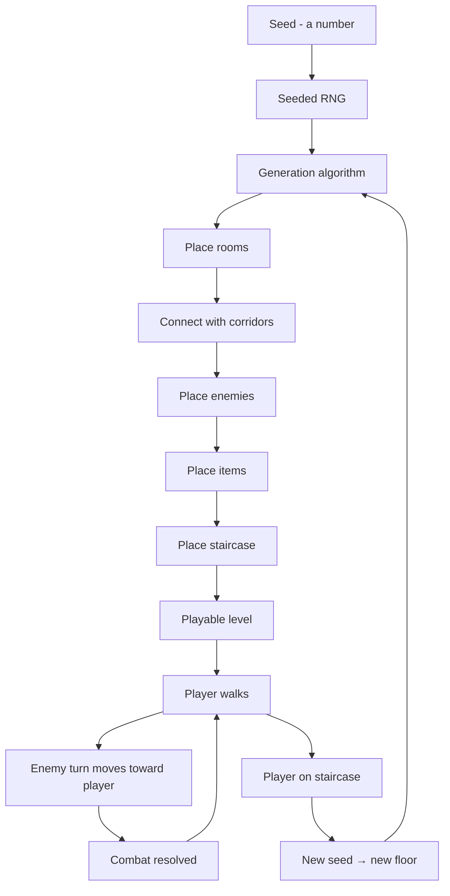

# Lab 26 — A World That Builds Itself: A Procedural Roguelike

> "Make a world from a seed. Press a button. Get a world no one has seen before."

**Time budget:** ~2 weeks for the core lab, with extension challenges that grow it to 3–5 weeks.
**Preferred engines:** Godot, Unity, or any 2D framework you're comfortable in. JavaScript/TypeScript with HTML5 Canvas works beautifully here.
**Working style:** solo, or in a team of up to 3 people.

---

## The hook

In 1980, two grad students wrote a game called **Rogue.** It was an ASCII dungeon crawler — `@` was you, `&` was a dragon, `#` was a wall. Every time you started a new game, the dungeon was different. *They couldn't fit hand-designed levels in memory*, so they made the computer generate them. Forty-five years later that constraint became a genre. **Spelunky, The Binding of Isaac, Hades, Slay the Spire, Vampire Survivors, Dead Cells, Noita** — all descendants. The roguelike is one of the few genres where a *single programmer* can compete with billion-dollar studios, because the secret weapon is *the algorithm doing the design work.*

In this lab, you'll build a **small procedural roguelike** — a top-down dungeon crawler where every run generates a *new world*. Rooms connected by corridors. Enemies in those rooms. A staircase down to the next level. Maybe a boss at the bottom. The most important part of the lab: **press 'new game' a hundred times and never see the same map twice.**

You'll learn one of the most fun corners of programming — **procedural content generation**: random number generators, seeds, walker algorithms, BSP trees, cellular automata, Wave Function Collapse, Perlin noise. These are the same algorithms used by **Minecraft** to generate its terrain, by **No Man's Sky** to generate its galaxies, by **Dwarf Fortress** to generate its world history. Once you understand them, you can build infinite anything.

If you want a perfect appetizer, watch [**The Coding Train's *Procedural Generation* series**](https://www.youtube.com/watch?v=8Tn2OqMDtGU&list=PLRqwX-V7Uu6byRbyvL0V2Hu5jWt6BJEHL) and [**Game Maker's Toolkit's *How (and Why) Spelunky Makes its Own Levels***](https://www.youtube.com/watch?v=Uqk5Zf0tw3o) — 18 minutes that change how you think about level design forever. For depth, [**Red Blob Games' procedural generation articles**](https://www.redblobgames.com/) are the most beautifully illustrated technical writing on this topic, free.

---

## Why this is worth your time

- **Infinite content from finite code** is one of the most magical sensations in programming. You will press a button and watch your computer build a world.
- The skills (**seeded RNG, deterministic generation, BSP / cellular automata / random walks, pathfinding for NPCs**) are heavily used in **AAA games, simulation, ML data generation, and graphics**.
- A procedural project is **portfolio gold**: each run produces a different screenshot, so your README never looks repetitive — it looks like a living thing.
- Connects beautifully to other labs: the graph algorithms from **[Lab 7](lab-07-graph-route-finder.md)/10**, the platformer from **[Lab 25](lab-25-platformer-game.md)**, the multiplayer from **[Lab 27](lab-27-multiplayer-browser-game.md)**, the AI from **[Lab 32](lab-32-neural-net-from-scratch.md)–34**. A roguelike is a melting pot.

---

## The target

> **Instructor TODO:** add reference screenshots / GIF of a polished early build to `docs/`.

**Basic — "It Generates"**
A 2D top-down dungeon. **Each new run produces a different layout** (rooms, corridors, walls). The player walks around with arrow keys / WASD. There's a `>` staircase that takes you to a new generated floor. At least 5 floors are reachable. Rendering can be ASCII or simple sprites.

**Standard — "It's a Real Roguelike"**
Everything from Basic, plus: **enemies** in rooms (at least 2 types) that move toward the player, **simple combat** (bump-to-attack, like classic Rogue), **HP** for player and enemies, **items** to pick up (potions, weapons), a **win condition** (reach floor 10, or kill the final boss). **Seeded** generation — given the same seed, the same dungeon. Played and beaten by at least one human besides yourself.

**Advanced — "It Has Depth"**
You've added something distinctive: a richer combat system (multiple weapon types, magic, dodging), **field of view / fog of war** (you only see what your character can see), enemies with **A\*** pathfinding (connects to [Lab 7](lab-07-graph-route-finder.md)!), procedural item generation (random stat combinations, like Diablo), a richer generation algorithm (Wave Function Collapse, BSP trees, drunkard's walk), a final boss with phases, sound effects + music, a "share your seed" feature so two players can play the same dungeon.

---

## The big idea, in one diagram



A roguelike is a **finite-state machine** running on top of a **procedural generator** running on top of a **seeded random source.** The seed is the soul of the run; everything else is determined.

---

## Two-week plan with milestones

**Week 1 — Make a world**

- **Day 1 — Pick a stack and visual style.** Godot? Unity? TypeScript + canvas? ASCII or sprites? Pick *now*. *Recommendation:* TypeScript + canvas with simple sprites is the most lightweight and ships to web easily. Godot is excellent for sprites + audio. *Avoid Unity if you want a small build.*
- **Day 2 — Render a grid.** A 2D grid of tiles displayed on screen. Each cell is a wall or a floor. Render with sprites or characters.
- **Day 3 — A walker.** A character `@` placed on the grid that moves with WASD or arrow keys. Can't walk through walls.
- **Day 4 — Generation v1.** Pick **one** algorithm (the simplest is "drunkard's walk": start at a position, walk randomly, carve out floor as you go, stop after N steps). Generate a level. *Milestone: every reload is a new level.*
- **Day 5 — Multi-floor.** A staircase tile (`>`). Step on it → generate a new floor. Track the current floor number.
- **Day 6 — Seeded generation.** A "Press R for new seed" or input box. Same seed → same dungeon. *This is critical for debugging.*
- **Day 7 — Polish + first deploy.** Title screen → game → game over. Deploy a web build.

**At this point you've completed the Basic level.**

**Week 2 — Make a game out of it**

- **Day 8 — Enemies.** A simple enemy (e.g., a slime) placed in rooms. Each "turn" (each player move), all enemies move one tile. Bumping into one damages you. Bumping into one with HP > 0 attacks them.
- **Day 9 — Combat + HP.** Player and enemy HP. Damage. Enemy dies → disappears.
- **Day 10 — Items.** Picked up by walking over them. Health potions, a weapon that does more damage.
- **Day 11 — A goal.** Reach floor 10. Or beat a final boss on floor 10. Win screen.
- **Day 12 — Pick a side quest.**
- **Day 13 — Audio, polish, README.**
- **Day 14 — Buffer.**

---

## Levels

### Basic — "It Generates" (~14–18 hours)
- 2D grid renderer
- procedural dungeon generation (any algorithm)
- player movement, blocked by walls
- staircase that triggers a new generation
- 5+ different floors reachable
- exported as a runnable build

### Standard — "It's a Real Roguelike" (~18–28 hours)
- everything from Basic
- 2+ enemy types with simple AI
- bump-to-attack combat with HP
- items (health potion, weapon)
- a winnable final floor
- seeded generation (same seed → same dungeon)
- deployed to web

### Advanced — "Side Quests" (each ~3–10h)

- **Field of View / Fog of War.** You only see what your character can see. Use shadowcasting or recursive shadowcasting. *Beautifully atmospheric.*
- **A\* Pathfinding for Enemies.** Enemies don't just walk randomly; they path-find to the player. Connects to [Lab 7](lab-07-graph-route-finder.md).
- **Wave Function Collapse.** Use WFC to generate dungeons by combining hand-designed tile patterns. (Watch [Martin Donald's WFC video](https://www.youtube.com/watch?v=2SuvO4Gi7uY) — the best intro on YouTube.)
- **Procedural Items.** Items with randomly combined stats ("Sword of Burning Vengeance: +5 Damage, +1 Fire").
- **Boss Fight.** Final boss on floor 10 with multiple attack patterns.
- **Permadeath + Score.** Death is permanent. Each run is scored. A scoreboard.
- **Daily Challenge.** Same seed for everyone, every day. (Like Spelunky's daily.) Connects to [Lab 21](lab-21-rest-api-auth.md) for a leaderboard backend.
- **Save / Resume.** Save state to localStorage, resume next visit.
- **Original Sprites.** Yours or a friend's.
- **Music + SFX.** Footsteps, attack, hit, level transition, victory.

---

## Extension challenges (3–5 weeks)

- **A Real Tiny Game.** 5+ enemy types, item rarities, status effects, a classes/character system, multiple biomes (cave, dungeon, forest, ice). Spend the third week tuning balance.
- **Combine With [Lab 7](lab-07-graph-route-finder.md) (Pathfinding).** Use proper A\* for enemies, prove that the algorithm gives different (and better) AI than random walks. Document the difference in your README with GIFs.
- **Combine With [Lab 27](lab-27-multiplayer-browser-game.md) (Multiplayer).** Two players in the same procedurally generated dungeon. Cooperative. *This is a huge ambition; only attempt if you have a strong team.*

---

## Make it yours (required)

The bones are universal. The *theme* is wide open:

- **Classic ASCII Rogue.** Simple, fast, focuses you on systems over visuals.
- **Aviation Rogue.** Underground bunkers, abandoned hangars; the player is a pilot navigating wreckage. *Ukrainian aviation flavor.*
- **Space Roguelike.** Each "floor" is a randomly generated space station section. (FTL flavor.)
- **Cute Roguelike.** A cat exploring an enchanted forest. Soft palette, no death — fainting → wake up at start.
- **Reverse Roguelike.** You're the dungeon master placing enemies; an AI hero tries to clear it. (Genre-bending.)
- **One-Room Roguelike.** Each level is a single room with combat and a door. Quick, intense.
- **Time-Limit Roguelike.** Ticking timer; stand still → take damage. *Vampire Survivors* energy.

You'll defend why you chose your theme.

---

## Working solo or in a team

Solo: feasible but ambitious. Tight scope is your friend.

Team:
- *By system:* one person owns generation (rooms, corridors, FOV, item placement); the other owns gameplay (combat, enemies, items, UI).
- *By layer:* one person owns engine/rendering; the other owns game logic.
- *By tier:* one person hits Standard solid; the other hunts Advanced side quests.

Two team rules: **git from day one** and **list who did what.** Every team member must be able to demo end-to-end.

---

## Tooling and engine tips

**TypeScript + HTML5 Canvas (recommended for fast web deployment)**
- Tiny build, ships to itch.io / your own URL. Easy to share.
- Use **rot.js** if you want a roguelike-specific JS library (handles ASCII rendering, FOV, pathfinding out of the box).
- Or write everything yourself; it's a great exercise.

**Godot 4**
- Excellent if you want sprites + audio + polish.
- Built-in tilemap node, collision, audio. Web export works.
- GDScript or C#.

**Unity**
- Heavy. Web build is large. Skip unless you're already deep in Unity.

**Python + tcod (libtcod)**
- The classic roguelike toolchain. Many tutorials. Fast prototyping.
- Hard to ship to the web; great for offline learning.

**Anyone**
- **Always seed your RNG explicitly.** *Never* use `Math.random()` directly in generation code. Have a single PRNG (e.g., `mulberry32`) initialized from a seed. This is the only way to debug procedural bugs.
- **Render the seed on screen.** "Floor 3 — Seed 8819273." When something looks wrong, you can reproduce it.
- **Generate, then walk.** First generate the entire floor; then make sure the player can actually walk to the staircase. If not, regenerate. (Use a flood-fill check.)
- **Start with one algorithm.** Don't try to combine BSP + WFC + cellular automata in week 1. Master one, add others as side quests.

---

## Suggested project structure (TypeScript)

```txt
roguelike/
  README.md
  src/
    main.ts
    game/
      GameState.ts
      Player.ts
      Enemy.ts
      Item.ts
      Combat.ts
    generation/
      DrunkardsWalk.ts
      BSP.ts
      ConnectivityCheck.ts
    render/
      Renderer.ts
      sprites/
    rng/
      Mulberry32.ts          # seedable PRNG
    fov/
      Shadowcast.ts
    ui/
      HUD.ts
      Inventory.ts
  public/
    assets/
  index.html
  vite.config.ts
  docs/
    screenshots/
```

---

## When you get stuck

- **Player spawned in a wall.** Your generator placed the player on a non-floor tile. After generation, find a *known* floor tile and place the player there.
- **Staircase is unreachable.** No path from spawn to staircase. Run a flood-fill from the spawn position; only place the staircase on a reachable tile. If staircase placement fails, regenerate.
- **Same seed gives different results across runs.** You're using a non-seeded RNG somewhere. Audit *every* random call.
- **Performance dies on large maps.** You're re-rendering every tile every frame. Only re-render dirty tiles, or use a single canvas with cached rendering.
- **Enemy AI feels stupid.** Random movement is fine for slimes; for "smart" enemies, use BFS to the player instead of random.
- **My dungeon all looks the same.** Vary your parameters. Make some floors big and sparse, others small and dense. Mix algorithms across floors.

If stuck for 30+ minutes: **screenshot the broken dungeon, log the seed, and reproduce it deterministically.** Procedural bugs only fix when you can replay them.

---

## Deployment checklist

- [ ] Web build runs in latest Chrome and Firefox.
- [ ] Loads in <5 seconds.
- [ ] No console errors.
- [ ] Seed displayed on screen.
- [ ] "New game" button generates a different floor every time.
- [ ] Same seed → same dungeon (try it twice).
- [ ] Player can always reach the staircase (no soft-locks).
- [ ] **Live URL** (itch.io, GitHub Pages, your own domain).
- [ ] Mobile: at least readable, ideally playable with on-screen buttons.

---

## What recruiters look at

- **They click play.** Same as the platformer — the first 30 seconds matter most.
- **They press 'new game' three times.** They want to see meaningfully different dungeons. If yours all look the same, your generator isn't working hard enough.
- **They look at the seed feature.** "Same seed → same dungeon" is a deep technical signal — it tells the recruiter you understand determinism, debuggability, and reproducibility.
- **They look at your README's algorithm section.** Procedural generation is famous for inviting *writeups*. A good algorithm explanation = strong technical writing signal.
- **They check the source.** Procedural generators are infamously messy if rushed. Clean, modular generation = engineering signal.

---

## What to put in your README

1. Game title + tagline.
2. **The play link.**
3. A 15-second GIF showing 3 different dungeons.
4. Controls.
5. **An algorithm explanation:** what generation algorithm you chose, *why*, and a diagram.
6. Tech stack.
7. How to run locally.
8. Side quests + extensions.
9. Known limitations / TODOs.
10. If team: who did what.

---

## Reflection

Be ready to:

1. **Live demo:** generate three dungeons in front of the panel.
2. **Demonstrate seeding:** "Seed 1234 every time produces *this* dungeon. Watch."
3. **Walk through your generation algorithm** — what happens from "press new game" to "first frame visible"?
4. **Show a softlock case** (where your generator can fail) and explain how you handle it.
5. **What was the hardest bug** — generation, AI, combat, or rendering?
6. **What algorithm would you use** to generate not a dungeon but a continent? A solar system? A city?
7. **What's the difference** between *random* and *random-feeling*? When you click 'new game,' what makes it actually feel novel?

---

## Showcase

End-of-semester gallery — anonymous voting for **most fun in 30 seconds**, **best procedural variety**, and **most distinctive theme**. Bring your laptop. Players will run new dungeons over and over.

---

## Going further

- *Procedural Generation* by Daniel Shiffman (The Coding Train, YouTube).
- *Procedural Content Generation in Games* — free online book by Togelius et al.
- *Roguelike Celebration* talks on YouTube — devs of *Hades*, *Spelunky*, *Caves of Qud* explaining their generators.
- *Wave Function Collapse* — Maxim Gumin's original paper + the [GitHub repo](https://github.com/mxgmn/WaveFunctionCollapse).
- *RogueBasin* — a wiki of every algorithm and trick used in roguelike development.
- *Brian "Psychochild" Green's notes on procedural balance.*

---

## A final word

The first time you press "new game" and see something *neither of your hands placed there*, something none of your code lines explicitly built — there's a strange feeling. It's the closest thing programming has to gardening. You build the rules; the world grows.
