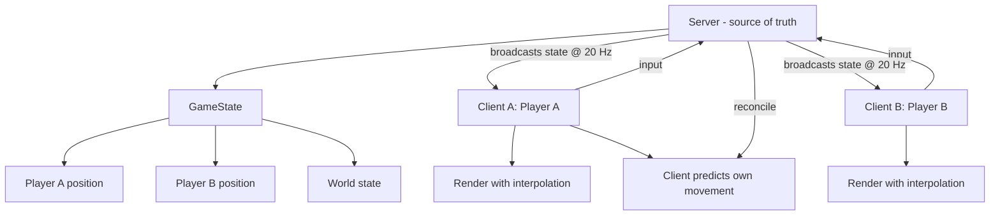

# Lab 27 — A Game Where Other Humans Are The Enemy: A Multiplayer Browser Game

> "The single most fun moment in game development is the first time someone *else's* character moves on your screen."

**Time budget:** ~2 weeks for the core lab, with extension challenges that grow it to 3–5 weeks.
**Preferred language:** TypeScript end-to-end (server with Node.js + Socket.IO; client with HTML5 Canvas or PixiJS or Phaser). C# (ASP.NET Core SignalR + Unity WebGL) is also valid.
**Working style:** solo, or in a team of up to 3 people.

---

## The hook

In 1996 a small online game called **QuakeWorld** invented one of the most important architectures in software: **client prediction with server reconciliation.** The server is the authority. Each client predicts what's going to happen next, and when the server's reality arrives a fraction of a second later, the client smoothly corrects. That trick is why a 100ms ping doesn't feel like 100ms. It's why **Counter-Strike**, **Fortnite**, **Valorant**, **Rocket League**, and every modern multiplayer game *feels* responsive even though every player is sitting on a network with delay. Once you understand it, you understand a quiet half of the modern internet.

In this lab, you'll build a **multiplayer browser game**. Real people. Different computers. Same world. Two friends sit on opposite sides of campus, open the same URL, and see each other's characters move in real time. They can shoot, race, chase, draw, or just bump into each other — *but they share a world.*

This is the lab that combines almost everything: networking ([Lab 23](lab-23-realtime-multiplayer.md)), real-time UI, game loops ([Lab 9](lab-09-console-paddle-game.md) / 25), state management, debugging the hardest class of bug there is (race conditions across machines), and *the social magic*. The games you'll be most proud of in your career will probably be multiplayer.

If you want a perfect appetizer, read [**Gabriel Gambetta's *Fast-Paced Multiplayer*** series](https://www.gabrielgambetta.com/client-server-game-architecture.html) — five short articles, the canonical reference, free. Pair it with [**Glenn Fiedler's *Networking for Game Programmers***](https://gafferongames.com/) — and watch [**The Cherno's *Multiplayer Game Programming***](https://www.youtube.com/watch?v=Q5DVqjVSf-0) introduction.

---

## Why this is worth your time

- **The network is the hardest part of any game.** Multiplayer is the thing AAA studios staff entire teams for. A working multiplayer browser game in your portfolio is *rare* and *visible*.
- **Demo-friendly.** Two laptops, one URL, instant magic. Recruiters won't forget the moment they see their character move.
- The skills (**authoritative server, lockstep vs. snapshot interpolation, lag compensation, anti-cheat basics**) are real and asked-about.
- This lab is a **direct extension of [Lab 23](lab-23-realtime-multiplayer.md).** You can absolutely re-use that codebase and grow it into a game.

---

## The target

> **Reference build:** [Coding Challenge #32.1: Agar.io — Part 1 (Basic Game Mechanics) — The Coding Train](https://www.youtube.com/watch?v=JXuxYMGe4KI) — multi-part .io-game build with WebSockets and a real multiplayer server. The Standard target lives here.

**Basic — "Two People Move Together"**
Two browser tabs (on the same machine or different machines) connect to your game's URL. Each shows a character at a position. **Moving in one tab visibly moves the character in the other tab within a second.** A simple "world" — top-down or side-view. No combat necessary. Players see each other.

**Standard — "It's a Real Mini-Game"**
A game with a goal — race, capture-the-flag, last-player-standing, an `.io`-style food-eating game (think Agar.io / Slither.io), a co-op survival, a chase. Up to 4–8 players in one room. Player names + colors. Shareable lobby URL. Per-frame state synchronization. Win condition. Lobby → game → results loop. Played by at least 5 humans simultaneously.

**Advanced — "It Handles Real Networks"**
You've added: **client-side prediction** (your character moves immediately, server confirms later), **interpolation** (other players move smoothly, not in jitters), **lag compensation** (a 100ms ping doesn't ruin the game), an **anti-cheat sanity check** (server rejects "I teleported" or "I shot 1000x faster than possible"), **persistent stats** (kills/deaths/wins backed by [Lab 21](lab-21-rest-api-auth.md)'s API), **reconnection** (drop your Wi-Fi, come back to the same game), or **spectator mode**.

---

## The big idea, in one diagram



The mantra: **server-authoritative, client-predictive, interpolated for others.**

---

## Two-week plan with milestones

**Week 1 — Make the world shared**

- **Day 1 — Pick the game and the stack.** *One game, one mechanic.* See ideas below. Stack: TypeScript + Socket.IO + canvas (recommended) or Phaser. *If you did [Lab 23](lab-23-realtime-multiplayer.md), build directly on that.*
- **Day 2 — Hello world.** Server and client connect via WebSockets; "hello" message round-trip works. Deploy a hello-world version *immediately* (Render / Fly.io). *Milestone: deployed real-time scaffold.*
- **Day 3 — A character on screen.** Server tracks a single player's `(x, y)`. Client receives, renders. Move with WASD: client sends inputs; server moves the player; broadcasts position; client renders.
- **Day 4 — Multiplayer.** Server tracks *all* connected players. On each connection, broadcasts the new player to everyone. Each client renders all players. Open two tabs, both characters move. *Milestone: the magic.* Take a video.
- **Day 5 — World boundaries + collision.** Walls, edges. Server validates movement (player can't walk through walls).
- **Day 6 — Game-specific action.** Whatever your game's *one* main mechanic is — implement it. Shooting? Eating food pellets? Picking up flags? Racing? Wire it through.
- **Day 7 — Polish + deploy.** Title screen, name input, deploy. *Milestone: shareable URL where 4 players can play.*

**At this point you've completed the Basic level.**

**Week 2 — Make it a game**

- **Day 8 — Lobby + win condition.** Lobby UI; "start game" button. End-of-game screen with results.
- **Day 9 — Names, colors, scoreboard.** Each player has a name and color. Live scoreboard.
- **Day 10 — Interpolation.** Other players don't teleport every state update — they smoothly interpolate between server snapshots. *Massive game-feel improvement.*
- **Day 11 — Disconnect handling.** Player leaves → others see them disappear. Player joins mid-game → they spectate or get inserted.
- **Day 12 — Pick a side quest.**
- **Day 13 — Audio, polish, README, demo video.**
- **Day 14 — Buffer.**

---

## Levels

### Basic — "Two People Move Together" (~14–18 hours)
- WebSockets server with player tracking
- 2+ clients see each other
- top-down or side-view world
- server-authoritative movement
- deployed to a public URL
- shareable: friend with the URL can join

### Standard — "It's a Real Mini-Game" (~18–28 hours)
- everything from Basic
- a real game with a goal and win condition
- 4–8 player support
- lobby → game → results loop
- player names + colors
- interpolation (no jittery rendering)
- played by at least 5 humans simultaneously

### Advanced — "Side Quests" (each ~3–10h)

- **Client-Side Prediction.** Local player moves immediately. Server reconciles. Massively reduces perceived lag.
- **Lag Compensation.** Server "rewinds" by ping when validating shots. Famous Counter-Strike trick.
- **Anti-Cheat.** Server rejects impossible inputs (teleport, fire-rate violations, walls).
- **Persistent Stats.** K/D, wins, MVP — saved per user via [Lab 21](lab-21-rest-api-auth.md)'s auth + DB.
- **Spectator Mode.** Players who join late watch the rest of the game.
- **Reconnection.** Drop Wi-Fi; come back; same game.
- **Mobile Touch Controls.** Joystick + buttons for phones.
- **Bots.** When fewer than N humans, bots fill the game so it's never empty.
- **Custom Maps.** Players upload or pick from multiple maps.
- **Voice / Text Chat.** Add a chat input. Optional voice via WebRTC.

---

## Extension challenges (3–5 weeks)

- **Build A Real `.io` Game.** Polish to *agar.io / slither.io* level. Onboard players in 5 seconds. Make it embarrassingly addictive.
- **Combine [Lab 23](lab-23-realtime-multiplayer.md) + Lab 27.** Use the same WebSocket spine for both projects. Two products, one architecture. Document extensively.
- **Take It To A Game Jam.** GMTK Jam, Ludum Dare, etc. — but multiplayer. Cult-favorite type of submission.

---

## Make it yours (required)

The mechanics are universal; the *game* is what makes it memorable.

- **`.io`-Style Food Eater.** Move around eating food pellets, get bigger, eat smaller players. (Agar.io)
- **Top-Down Shooter.** WASD + mouse aim. Shoot. Last alive wins. (.io shooter genre)
- **Racing.** Top-down racing through a track. Lap counter.
- **Tag.** One player is "it." Touch someone → they're it. The new "it" is slow for 3 seconds.
- **Capture the Flag.** Two teams. Bring the flag home.
- **Co-op survival.** Waves of zombies. Players cooperate.
- **Drawing party game.** One player draws, others guess. (Skribbl-style — overlaps with [Lab 23](lab-23-realtime-multiplayer.md).)
- **Aviation flavor.** Top-down dogfight: each player a small plane, simple physics, aim and shoot.
- **Asymmetric.** One player is the "big bad" (a giant monster); the rest are villagers trying to escape. (Dead by Daylight, Among Us flavor.)

You'll defend why you chose your game.

---

## Working solo or in a team

Solo: extremely ambitious; tight scope is critical.

Team:
- *By layer:* one person owns the server (game state, validation, broadcasting); the other owns the client (rendering, input, UX).
- *By feature:* one person owns Basic; the other owns Standard. Then both attack Advanced.
- *Across labs:* if your team also builds [Lab 23](lab-23-realtime-multiplayer.md), share the WebSocket spine.

Two team rules: **git from day one** and **list who did what.** Every team member must be able to demo, deploy, and explain the prediction/interpolation step.

---

## Tooling and engine tips

**TypeScript + Socket.IO + HTML5 Canvas (recommended)**
- The lightweight, rocket-fast path. Tiny bundle, instant deploy.
- Use **Pixi.js** if you want polished sprite rendering and effects.
- Use **Phaser** if you want a full game framework with physics + scenes.

**ASP.NET Core SignalR + Unity WebGL**
- C# end to end. Polished if you already know Unity.
- Larger build sizes; harder web deployment.

**Anyone**
- **Server-authoritative or you have nothing.** Never trust the client. Validate every move and action on the server.
- **Tick rate ≠ render rate.** Server runs at 20–30 Hz (state updates per second). Client renders at 60 Hz (interpolating between server states).
- **Bandwidth matters.** Don't broadcast 60 times a second. 20 is plenty for most games.
- **Don't broadcast everything to everyone.** A player in one game shouldn't get state from another game. Use rooms.
- **Latency is the enemy.** Test with real network latency (Chrome DevTools' "Slow 3G" throttling, or open the game on a friend's machine across a city).

---

## Suggested project structure

```txt
multiplayer-game/
  README.md
  server/
    src/
      main.ts
      Game.ts
      Player.ts
      Lobby.ts
      tick.ts                 # the 20Hz authoritative loop
      validation.ts
    package.json
  client/
    src/
      main.ts
      net.ts                  # socket connection
      input.ts
      render/
        Renderer.ts
        sprites/
      prediction.ts           # advanced
      interpolation.ts
    index.html
    package.json
  shared/
    types.ts                  # shared message shapes
  docs/
    architecture.png
    screenshots/
    demo.gif
```

---

## When you get stuck

- **Other players move in jittery jumps.** You're rendering raw server state. Add **interpolation:** keep the last 2–3 server snapshots and lerp between them on the client.
- **My player feels laggy.** You're waiting for server confirmation before moving. Add **client-side prediction:** the local player moves *immediately,* and reconciles with the server when correction arrives.
- **Two players shooting at the same instant — only one registers.** Race condition on the server's update loop. Use a single tick that processes all inputs received during the tick.
- **Game is fine with 2 players, dies with 8.** You're broadcasting full state to everyone, every tick — quadratic bandwidth. Either use **delta updates** (only what changed) or scope updates (only nearby state).
- **One bad client crashes the server.** A malformed message threw and your handler isn't wrapped in `try/catch`. Wrap. Log. Drop the bad client.
- **Players see each other in different positions.** Two clients are slightly out of sync because their local clocks differ. Always render the *server's* time, not the client's.

If stuck for 30+ minutes: **open three tabs side-by-side, log every send/receive on each, and watch the timing.** Multiplayer bugs are visible if you can see the wire.

---

## Deployment checklist

- [ ] Public URL works on someone else's machine.
- [ ] Two players from different cities can connect and see each other.
- [ ] WebSockets confirmed in dev tools.
- [ ] Lobby → game → results loop is unbroken.
- [ ] Player disconnect doesn't crash the game.
- [ ] Reconnection works (or fails gracefully with a "the game has ended" screen).
- [ ] Mobile: at least playable, ideally touch-optimized.
- [ ] No console errors on either client or server.
- [ ] Bandwidth: server doesn't melt under 8 simultaneous players.
- [ ] Anti-cheat sanity check (movement speed cap, fire-rate limit) for the Advanced level.

---

## What recruiters look at

- **They open two tabs and play themselves.** *This is the demo.* The first 30 seconds matter.
- **They look at the network tab.** They want to see the WebSocket connection and the rate of messages.
- **They look at "what happens when I disconnect Wi-Fi mid-match."**
- **They look at your README's architecture section.** Multiplayer is famous for being hard; explaining your architecture (tick rate, interpolation, prediction) signals depth.
- **They look at the source.** A clean separation between *game state* and *networking* is a big-league signal.

---

## What to put in your README

1. Game name + tagline.
2. **The play link.**
3. A 30-second GIF showing two players playing.
4. Architecture diagram (server tick, client render, message flow).
5. Tech stack.
6. Features completed.
7. **A networking writeup**: tick rate, what's broadcast, interpolation/prediction status. (This is the "engineering writing" portion recruiters look for.)
8. How to run locally.
9. Side quests + extensions.
10. Known limitations / TODOs.
11. If team: who did what.

---

## Reflection

Be ready to:

1. **Live demo:** play with the panel, two players, on different machines.
2. **Disconnect Wi-Fi mid-action.** Show recovery.
3. **Walk through one tick.** What does the server do 20 times a second?
4. **Walk through one render frame** on the client. What's interpolated, what's predicted, what's authoritative?
5. **Why is the server the source of truth?** What goes wrong if it isn't?
6. **What would you add to scale to 100 players?** 1000? 10,000?
7. **What was the hardest bug** — networking, prediction, sync, or rendering?

---

## Showcase

End-of-semester gallery — anonymous voting for **most fun multiplayer**, **best handling of lag**, **most viral concept**. Bring laptops; play live with recruiters and other students.

---

## Going further

- *Fast-Paced Multiplayer* by Gabriel Gambetta (free).
- *Networking for Game Programmers* by Glenn Fiedler (gafferongames.com).
- *Source Multiplayer Networking* — Valve's writeup of how Counter-Strike and TF2 handle lag compensation.
- *How Rocket League's Networking Works* — official talk by Psyonix.
- *Colyseus* and *Nakama* documentation — open-source multiplayer game servers, excellent reference architectures.
- *Multiplayer Game Programming* by Joshua Glazer & Sanjay Madhav — the textbook.

---

## A final word

Single-player games are about you. Multiplayer games are about *the people you play with.* The first time you ship a multiplayer game and watch two strangers in different time zones laugh at each other through your code — there's a small, specific kind of joy. It's the closest thing software has to throwing a party.
