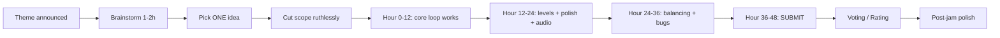

# Lab 28 — Forty-Eight Hours, One Game: Run Your Own Game Jam

> "A game jam is the fastest way to learn what 'finished' means."

**Time budget:** ~2 weeks total — but the jam itself is *48–72 hours of intense work*, with the surrounding time spent preparing, recovering, and polishing.
**Preferred engines:** Godot, Unity, Phaser, LÖVE — anything you can ship a game in. Use what you already learned in [Lab 25](lab-25-platformer-game.md) or 26.
**Working style:** solo, or in a team of up to 3 people.

---

## The hook

A **game jam** is a tradition older than indie game development as a profession. A theme is announced. A clock starts. You have **48 to 72 hours** to design, build, and submit a complete game. Everyone in the world working on the same constraint, at the same time, with the same brutally short deadline. **Ludum Dare**, **Global Game Jam**, **GMTK Jam**, **js13kGames** — these are some of the largest gatherings of indie creativity on Earth, and they have launched legendary games (Goat Simulator, Superhot, Baba Is You, Among Us — all started as jam games or were directly inspired by jams).

The jam teaches a lesson nothing else does: **scope is the enemy.** No professor will be more strict than the clock. No mentor will give better feedback than the *rating screen* the day after. Most importantly, you'll learn the most overlooked engineering skill: **shipping.** Knowing when something is "good enough" because it has to be.

In this lab, you're going to either **enter a real public game jam** (recommended) or **run your own** (with classmates as fellow participants). Either way: a theme, a deadline, a finished game on the other side. **Submit. Vote on each other's. Reflect.**

If you want a perfect appetizer, watch [**Mark Brown's *GMTK Game Jam* highlight videos**](https://www.youtube.com/c/MarkBrownGMT) — the best curator of jam games on YouTube, and a beautiful primer on what makes a small game *click*. Pair with [**The Witness's Jonathan Blow's *Designing Braid*** talks](https://www.youtube.com/watch?v=8rxdAKNTIww) — what one designer learned in years of small-game-making.

---

## Why this is worth your time

- **You will learn what "finished" feels like.** This is the rarest teachable skill in software.
- A submitted, played, *rated* jam game is a portfolio item that says **"I ship under pressure."** Recruiters notice.
- The jam community is one of the warmest in software. You'll get real feedback from real strangers who care.
- Constraint breeds creativity. *Some of your most original ideas come out under deadline.*
- This is the lab where students **most often discover that game-dev is the thing they actually love** (or that it isn't, in which case: also valuable).

---

## The target

> **Instructor TODO:** add reference screenshots of past student / public jam games to `docs/`.

**Basic — "I Submitted Something"**
You participated in either a real public jam (Ludum Dare, GMTK Jam, Global Game Jam, Brackeys Jam, js13kGames, your school's jam, or any jam listed on [itch.io](https://itch.io/jams)) **or** the in-class jam. **You submitted a complete, playable game by the deadline.** Game has a title, a goal, a working game loop. It's playable from beginning to end. It's hosted on **itch.io** with a public link. *No matter how rough.*

**Standard — "I Submitted Something Real"**
Everything from Basic, plus: theme is *meaningfully* incorporated (not slapped on as an afterthought). One distinct mechanic. Music + at least 5 sound effects. Polished title and end screens. A jam-style devlog (a blog post or in-README writeup of your 48 hours). Played and rated by at least 10 strangers (jams provide this naturally; in-class jam: classmates).

**Advanced — "I Made Something I'm Proud Of"**
You added **post-jam polish** in the second week (jams have a "rate" period and many devs polish during it): bug fixes, balance, additional levels, controller support, mobile support, accessibility (color-blind mode, key remapping, subtitles). Your post-jam version reaches a meaningfully higher quality bar than your jam submission.

---

## The big idea, in one diagram



The single biggest lesson of jamming: **finish > perfect.** A janky-but-finished game beats a beautiful-but-broken one *every single time.*

---

## Two-week plan with milestones

This lab's "plan" is unusual because the actual work is compressed into a weekend.

**Week 1 — Prepare**

- **Day 1 — Pick the jam.** *Strongly preferred: a real public jam.* See the list below. Match the dates to your calendar.
- **Day 2 — Pick your engine.** Use what you already know from [Lab 25](lab-25-platformer-game.md) or 26. *The jam is no time to learn a new engine.*
- **Day 3 — Make a "jam template."** Boilerplate for your engine: title screen, level transition, audio toggle, sane export setup. *This single hour will save you 5 during the jam.*
- **Day 4 — Practice.** Build a 1-day mini-game ("an enemy chases me, I dodge, I score") in your engine to make sure your toolchain works end-to-end.
- **Day 5 — Asset library.** Bookmark Kenney.nl, OpenGameArt, Freesound, Pixabay, Bensound, Incompetech. Save 10 favorite sprites and 5 pieces of music. *During the jam you don't have time to browse.*
- **Day 6 — Plan team logistics.** Who does what during the jam? Sleep schedule? When do you eat? Where do you work? *This sounds silly until 3am hits.*
- **Day 7 — Go light.** No new code. Sleep well. Read other people's jam post-mortems for inspiration.

**Day 8–10 — THE JAM (48–72 hours).**

The schedule:
- **Hour 0–4:** Theme is announced. Brainstorm 10 ideas. Pick ONE. **Cut scope.** What's the *minimum* possible game? Build that.
- **Hour 4–12:** Core loop working. Player can do the *one* thing the game is about.
- **Hour 12–24:** Add the second mechanic. Add audio. Add a title screen. Sleep!!! (At least 6 hours.)
- **Hour 24–36:** Levels / content. Balance. Bug fixes. Sleep again.
- **Hour 36–46:** Polish, polish, polish. Tutorial pop-ups. Win/lose screens. Credits.
- **Hour 46–48:** Export. Test on a fresh browser. Upload to itch.io. Write the listing. **SUBMIT.**

**Day 11–14 — Recover and polish**

- **Day 11 — Sleep.**
- **Day 12 — Read your ratings + comments.** Resist the urge to argue.
- **Day 13 — Patch the most-reported bugs.** Add accessibility.
- **Day 14 — Devlog + README.** Post-mortem: what worked, what didn't, what you'd do differently.

---

## Levels

### Basic — "I Submitted" (~30–40 hours)
- entered a real or in-class jam
- submitted by the deadline
- itch.io page with a play link, screenshots, controls
- complete game loop (start → play → end → restart)
- a devlog post-mortem section in the README

### Standard — "Submitted Something Real" (~40–55 hours)
- everything from Basic
- theme genuinely informs the game (not a sticker)
- music + SFX
- title + end screens
- played and rated by 10+ strangers (or 5+ classmates if in-class)
- a jam-style devlog post

### Advanced — "Side Quests" (each ~3–10h)

- **Post-Jam Polish.** Bug fixes, balance, more content. Your post-jam version is meaningfully better than the original submission.
- **Multiple Endings / Branching.** Storytelling depth.
- **Accessibility.** Color-blind mode, key remapping, on-screen text alternatives for audio cues.
- **Mobile / Touch.** Game playable on phones.
- **Speedrun Mode.** Built-in timer with leaderboard backed by [Lab 21](lab-21-rest-api-auth.md).
- **Streaming / Sharing.** A "share my best run" button that saves a GIF.
- **Original Art / Music.** You made the assets, or a friend did.
- **Localization.** At least one other language. Connects to [Lab 22](lab-22-spa-frontend.md)'s i18n.
- **Try Two Jams.** Submit to a second smaller jam in week 2 with a different game.

---

## Extension challenges (3–5 weeks)

- **Take Your Jam Game Commercial.** Take the most-rated mechanic, polish it for 2–3 more weeks, and put a paid version on itch.io. Even one paying user is a major portfolio + life moment.
- **Run A Jam.** Organize a 24-hour university jam. Set a theme, gather 10+ friends, judge. The organizer-facing skills are a different but valuable kind of growth.
- **Open-Source Your Jam Game.** Add docs, a contribute guide, GitHub Actions CI. Get one external pull request.

---

## Make it yours (required)

The jam *is* your "make it yours" — the theme is announced, and *you* decide what your game means. But pick your jam thoughtfully:

- **Public jams (recommended):**
  - **GMTK Jam** (annual, summer, ~50,000 entries) — themes are tight; community is huge.
  - **Ludum Dare** (3x per year) — the most legendary jam; LD48 (48 hours, solo) is extra hardcore.
  - **Brackeys Jam** (semi-annual) — beginner-friendly; large community.
  - **Global Game Jam** (annual, January) — in-person + online; most academic/student-focused.
  - **js13kGames** (annual, August) — make a JS game in 13 KB. Insane technical constraint.
  - **Ukrainian Devs Jam** — if available; community matters.
  - Or any jam from [itch.io/jams](https://itch.io/jams).

- **In-class jam:**
  - 24-hour or 48-hour jam, theme announced at the start.
  - Same submission requirements.
  - Played and rated by classmates.
  - Use this if your calendar doesn't align with a public jam.

You'll defend why you chose your jam and your interpretation of the theme.

---

## Working solo or in a team

Solo: an LD48-style solo jam is a rite of passage. Hard but legendary.

Team:
- *By role:* one person owns code; another owns art/audio; another owns level design + playtest. Smaller divisions equal less rework when sleep-deprived.
- *Pre-jam pact:* everyone agrees in writing what they're responsible for.
- *Communication discipline:* one shared Discord/Telegram channel; daily standups (yes, every 8 hours); no surprise refactors.

Two team rules: **git from day one** (every team should have a shared repo *before* the jam starts) and **list who did what.** Each team member must be able to play and explain the game alone.

---

## Tooling and engine tips

**Use what you already know.**
- If you did [Lab 25](lab-25-platformer-game.md), your Godot or Unity setup is your jam setup.
- If you did [Lab 26](lab-26-procedural-roguelike.md), your TypeScript + canvas setup is your jam setup.
- *The jam is a terrible time to learn a new engine.*

**Anyone**
- **Pre-make a template.** Title screen, end screen, audio toggle, mute, scene transitions, exporter — all done before hour 0.
- **Sleep at least 6 hours each night.** Sleep-deprived code is bad code. Most legendary jam games came from devs who slept.
- **Eat real food.** "Pizza for 48 hours" is a meme; it doesn't actually help.
- **Cut scope at hour 4 and again at hour 24.** The *single* most predictive sign of a finished game is "I removed something today."
- **Submit at hour 44, not 48.** Always leave a buffer for the upload-to-itch crisis.

---

## Suggested project structure

```txt
my-jam-game/
  README.md                    # devlog + submission writeup
  jam-info/
    theme.md                   # what the theme was, your interpretation
    timeline.md                # what you did each hour
  src/
    [engine-specific structure]
  assets/
    sprites/
    audio/
    fonts/
  exports/
    web/
  CREDITS.md                   # every asset, every license, every author
  docs/
    screenshots/
    demo.gif
```

---

## When you get stuck

- **"I don't have an idea."** Pick the *first* one that survives 5 minutes of "what would the player do moment-to-moment?" Don't wait for inspiration. Constraints make ideas; nothing makes ideas faster than a clock.
- **"My game's too big."** It is. *Every* jam game is too big. Cut a third now. Cut another third at hour 24.
- **"I'm behind."** Submit anyway. A submitted bad game beats an unsubmitted good one. Always.
- **"My export is broken."** This is *the* most-cited jam tragedy. Export every 6 hours, not just at the end.
- **"My game is too hard."** It is. Make level 1 trivially easy. Watch one non-game-developer play. They will not understand the things you take for granted.
- **"I want to add this huge cool feature."** It's hour 30. You don't. Polish what you have.

If stuck for 30+ minutes during a jam: **ship what you have, and keep going.** The only sin is silence.

---

## Submission checklist (the final-hours panic list)

- [ ] Game playable in a fresh browser session.
- [ ] No console errors.
- [ ] Title → game → end → restart loop unbroken.
- [ ] Mute / volume control works.
- [ ] Controls listed on the itch.io page.
- [ ] Screenshots: 3+ on the listing.
- [ ] GIF or video on the listing.
- [ ] Theme of the jam clearly mentioned.
- [ ] CREDITS.md (or in-game credits) for every asset.
- [ ] Submitted **before the deadline** (not at, *before*).

---

## What recruiters look at

- **They click play.** They can play in 30 seconds.
- **They look at your itch.io page** — title, screenshots, GIF, description.
- **They read your devlog.** A jam post-mortem is a *uniquely strong* signal — it shows reflection, scope discipline, self-criticism, and finishing instinct.
- **They look at your jam ranking.** Top half of a jam = excellent signal. Top quarter = exceptional.
- **They look at "what would you do differently."** This sentence in your devlog is what they're hiring for.

---

## What to put in your README (the devlog)

1. Game title + jam + theme + ranking (when announced).
2. **The play link.**
3. A 15-second GIF.
4. Controls.
5. **A devlog / post-mortem.** Three sections:
   - "What went well" (3–5 bullets)
   - "What went wrong" (3–5 bullets)
   - "What I'd do differently" (3–5 bullets)
6. Credits — every asset, every license.
7. Tech stack.
8. How to run locally.
9. Side quests + post-jam polish.
10. Known bugs (jam games always have some — list them honestly).
11. If team: who did what, hour-by-hour if you tracked it.

---

## Reflection

Be ready to:

1. **Live demo:** play through one full game loop on the projector.
2. **Walk through your timeline.** What were you doing at hour 6, 12, 24, 36, 46?
3. **Show the moment you cut scope.** What did you cut, and what survived?
4. **Show your worst hour.** What was breaking, and how did you recover?
5. **What would you do differently?** This is the most important question of the lab.
6. **What was the theme of your jam, and why did your game match it?**
7. **What was the hardest moment** — design, code, art, audio, time?

---

## Showcase

End-of-semester gallery — anonymous voting for **most fun jam game**, **most creative interpretation of theme**, **best post-jam polish**, and **most honest devlog**. Bring your laptop. The whole class plays each other's submissions.

---

## Going further

- *GMTK's *Boss Keys*, *The Art of the Jump*, *Why Hades Reigns* — game design's best video essay channel.
- *Ludum Dare* archives — explore 20 years of jam games, free.
- *Game Jam Survival Guide* by Christer Kaitila — the jam-prep canon.
- *Make Games* by Pixel Prophecy (YouTube) — solo-jam tutorials.
- *Indie Game: The Movie* — for inspiration on a sleep-deprived weekend.

---

## A final word

There's a strange feeling at hour 47 of a game jam — sleep-deprived, your code on fire, music drilling into your skull — when you click "submit." For a moment the world is silent. You shipped. *You*. In two days. From nothing. The next time you're afraid to start a project, that memory will be the thing that gets you to begin.
