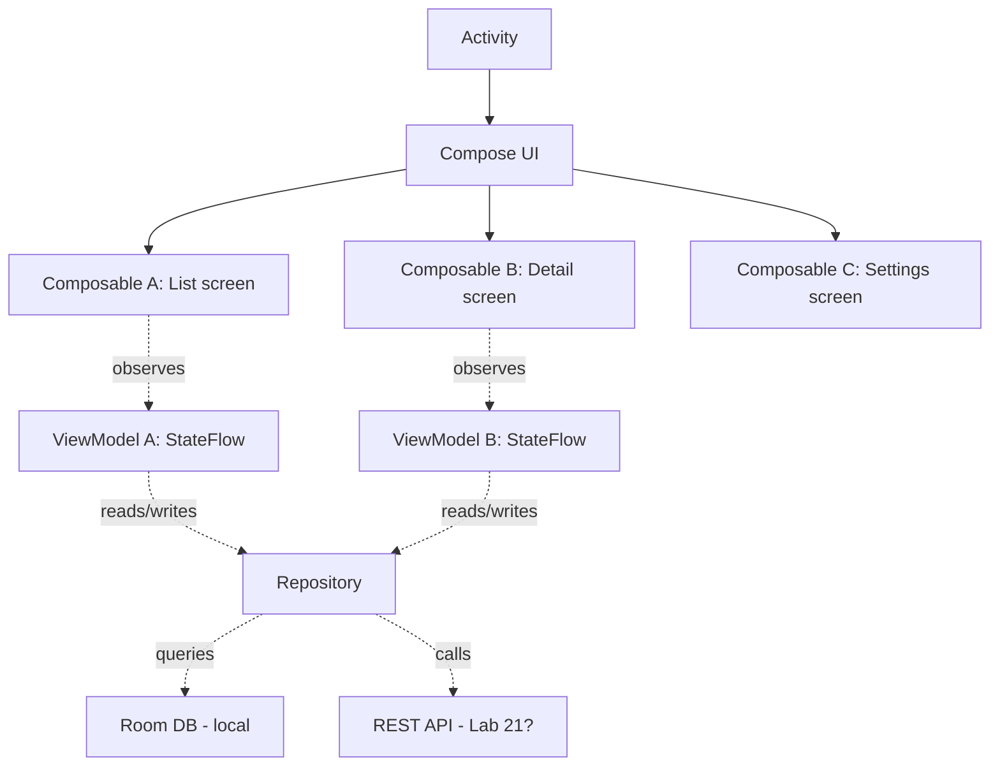

# Lab 29 — A Real Android App On A Real Phone: Build And Distribute Your First Mobile App

> "The phone in your pocket runs a Linux kernel and a JIT-compiled VM. You can put your code on it tonight."

**Time budget:** ~2 weeks for the core lab, with extension challenges that grow it to 3–5 weeks.
**Preferred language:** Kotlin (with Jetpack Compose for UI). Java is acceptable; Compose-first is much more relevant for 2026.
**Working style:** solo, or in a team of up to 3 people.

---

## The hook

Most software students go four years without ever putting their own code on a real phone. They graduate with a portfolio of web apps and CLI tools. Meanwhile, **3.5 billion humans use Android every day**, and the industry is desperate for engineers who actually understand the platform — *its lifecycle, its UI system, its quirks, its constraints, its battery model.*

In this lab, you're going to build **a real native Android app**, install it on **a real phone** (yours, a friend's, an emulator), and use it. Not a web wrapper. Not a hybrid. **A genuine, native Android app written in Kotlin with Jetpack Compose.** When you're done, you'll send a friend an APK link, they'll install it, and within minutes a piece of software you wrote will be running on hardware in their pocket. That's a different kind of "shipped" than any web app.

You'll touch **the modern Android stack**: Kotlin, **Jetpack Compose** (the new declarative UI framework — the same paradigm as React, SwiftUI, and Flutter), Room database, ViewModel + StateFlow, Navigation, Material 3 design, dark mode, and APK signing.

If you want a perfect appetizer, watch [**Philipp Lackner's *Compose in 30 minutes***](https://www.youtube.com/watch?v=cDabx3SjuOY) — the most efficient Compose tour on YouTube. Pair with [**Google's *Now in Android* repo**](https://github.com/android/nowinandroid) — Google's own reference architecture, an open-source app of stunning quality, free to read and steal from.

---

## Why this is worth your time

- **Native mobile is rare in junior portfolios.** Most students skip it because "iOS needs a Mac, Android is hard." Both excuses are smaller than they sound.
- An installable APK on your README is a *visceral* demo: a recruiter can install your software on their actual phone in 30 seconds.
- The **declarative UI** model (Compose, SwiftUI, React, Flutter) is the future of UI work. Once you understand it on Android, you understand it everywhere.
- The skills (**Kotlin coroutines, lifecycle awareness, offline-first storage, dependency injection**) are some of the most transferable in software.
- Connects directly to **[Lab 30](lab-30-cross-platform-app.md) (Cross-Platform App)** — building an Android-native version first sharpens your sense of *what's lost* when you choose React Native or Flutter.

---

## The target

> **Reference build:** [The Jetpack Compose Beginner Crash Course — Philipp Lackner](https://www.youtube.com/watch?v=6_wK_Ud8--0) — the canonical 2026 Android-native starting point. Pair with [Material 3 Apps with Jetpack Compose](https://www.youtube.com/watch?v=h7K4n9C2jkI) once your app needs polish.

**Basic — "It Runs"**
A real Android app that runs on **either an emulator OR a real device**. At least 3 distinct screens. Navigation between screens. A real feature (a list, a form, a counter, a timer — *any* genuine interaction). Built and signed into a **sideloadable APK** that you can send a friend.

**Standard — "It's a Real Tiny App"**
Everything from Basic, plus: **persistent local storage** (Room or DataStore — your data survives app close and phone restart), proper **state management** (ViewModel + StateFlow), **dark mode + light mode** that follow the system theme, **Material 3** components, smooth animations between screens, real error handling (offline state, empty states, loading states), **accessible** (TalkBack reads your screens), installed and used by at least 3 humans (friends, classmates).

**Advanced — "It's Production-Looking"**
You've added: **a real backend** (talks to [Lab 21](lab-21-rest-api-auth.md)'s API), **authentication** (login/signup), **push notifications** (Firebase Cloud Messaging), **camera or photo picker** integration, **location services**, **a Wear OS / tablet variant**, **CI** (GitHub Actions builds APKs), or *publishing to the Play Store* (optional — see softening note).

---

## The big idea, in one diagram



The mantra: **declarative UI, unidirectional data flow, single source of truth.** Same paradigm as React, SwiftUI, Flutter — once you have it once, you have it for life.

---

## Two-week plan with milestones

**Week 1 — Make it run**

- **Day 1 — Pick the app + tooling.** *One concrete app idea.* Install **Android Studio** (Hedgehog or newer). Create a new project with **Empty Compose Activity** template, Kotlin, **min SDK 26+**.
- **Day 2 — Hello world.** Run the app on an emulator. Run it on a real phone (USB debugging). *Milestone: your code is on a real device.*
- **Day 3 — UI scaffold.** A real first screen. List of items (placeholder data). Material 3 styling. Dark/light theme.
- **Day 4 — State + interaction.** A ViewModel that holds state. A button or input that updates state.
- **Day 5 — Navigation.** Add navigation between screens with **Navigation-Compose**.
- **Day 6 — Persistence.** Add Room (or DataStore for simple cases). State survives app restart.
- **Day 7 — APK + first share.** Build a release APK (signed with a debug keystore for now is fine). Send to a friend. *Milestone: someone else has installed your app.* Take screenshots.

**At this point you've completed the Basic level.**

**Week 2 — Make it real**

- **Day 8 — Real feature pass.** Whatever your app's *one* main feature is, polish it end-to-end.
- **Day 9 — Empty / loading / error states.** What does the screen look like with no data? Slow data? Failed data? Compose handles each gracefully.
- **Day 10 — Animations.** Smooth screen transitions. List item animations. Material motion.
- **Day 11 — Accessibility + dark mode.** Test with TalkBack. Test in both themes. Test with a 200% font size.
- **Day 12 — Pick a side quest.**
- **Day 13 — Polish, README, screenshots, demo video.**
- **Day 14 — Buffer / sign + distribute APK.**

---

## Levels

### Basic — "It Runs" (~14–18 hours)
- Kotlin + Compose project running on emulator and real device
- 3+ screens with navigation
- a real interactive feature
- signed APK that installs on any Android phone

### Standard — "It's a Real Tiny App" (~18–28 hours)
- everything from Basic
- persistent local storage (Room or DataStore)
- ViewModel + StateFlow architecture
- Material 3 with dark and light modes
- smooth animations
- empty / loading / error states
- accessible (TalkBack works)
- installed by at least 3 humans

### Advanced — "Side Quests" (each ~3–10h)

- **Backend Integration.** Connect to [Lab 21](lab-21-rest-api-auth.md)'s API. Authentication, sync.
- **Camera / Photo Picker.** Pick or capture an image, display it, save it.
- **Location.** Permission flow, current location, map (Google Maps / OSM).
- **Push Notifications.** Firebase Cloud Messaging. Server triggers a notification.
- **Charts.** Use **Vico** or **MPAndroidChart** to graph data. Especially good for fitness/finance/aviation apps.
- **Widgets.** A home-screen widget for your app (Glance API).
- **Wear OS.** A simple companion watchface or app.
- **Tablet Layout.** Responsive layouts for big screens (Material 3 has built-in support).
- **Localization.** At least one other language.
- **CI/CD.** GitHub Actions builds and publishes APKs on tag.
- **Play Store Publishing.** *Optional* — see note below.

---

## Extension challenges (3–5 weeks)

- **A Polished, Daily-Driver App.** Take it to the level where you actually use it daily for a month, iterate based on real friction. Distribute to 10+ users.
- **Combine With [Lab 21](lab-21-rest-api-auth.md) + [Lab 22](lab-22-spa-frontend.md).** A web admin panel + REST API + native Android client, all yours. Massive portfolio leverage.
- **Combine With [Lab 16](lab-16-smart-telemetry-beacon.md) / 18 (Embedded).** A companion app for your IoT device — view data, control the hardware. Embedded + mobile is a *rare* and powerful combo.

---

## Make it yours (required)

The architecture is universal; the *idea* makes the app. A few directions:

- **Habit Tracker.** Daily check-ins, streaks, charts. Used daily = real testing.
- **Aviation Logbook.** A pilot logs flights — date, aircraft, hours, notes. Strong portfolio fit for aviation institute students.
- **Tip Calculator++ — but Beautiful.** Tip calculators are a meme; *beautifully designed* tip calculators are not. Polish hard.
- **Pomodoro Timer.** With statistics, dark mode, persistent history.
- **Personal Recipe Book.** Add a recipe, add ingredients, mark favorites, search.
- **Workout Tracker.** Sets, reps, weights, history, charts.
- **Companion App For Your IoT ([Lab 16](lab-16-smart-telemetry-beacon.md)/18) Project.**
- **Daily Journal.** Markdown editor, daily entries, search, mood tags.
- **Public Transit Schedule.** Local schedules, your favorite stops.
- **Plant Watering Schedule.** Add plant, set frequency, get a notification.

You'll defend why you chose it.

---

## Working solo or in a team

Solo: viable, ambitious. Compose's declarative model dramatically lowers the barrier compared to old XML Android.

Team:
- *By layer:* one person owns UI + Compose; the other owns data (Room, network, ViewModels).
- *By feature:* one person owns 2 of your 3 screens; the other owns the third + settings + theming.
- *By tier:* one person hits Standard; the other targets Advanced side quests like push or CI.

Two team rules: **git from day one** (use Android Studio's `.gitignore` template) and **list who did what.** Each team member must be able to demo on a real phone.

---

## Tooling and language tips

**Kotlin + Jetpack Compose (recommended)**
- The current Android development standard.
- Use **Material 3** for components.
- Use **Navigation-Compose** for screen navigation.
- Use **Room** for persistence.
- Use **DataStore** for simple key-value preferences.
- Use **Hilt** for dependency injection (optional but professional).
- Use **Coil** for image loading.
- Use **Retrofit + Kotlinx Serialization** for networking.

**Java + XML (avoid for this lab)**
- The old way. Still works. Don't pick this in 2026; recruiters will notice.

**Anyone**
- **Test on a real device.** Emulators lie about performance, animations, and gestures.
- **Coroutines, not callbacks.** Async work in Kotlin uses suspending functions + coroutines. Read [**Kotlin Coroutines Guide**](https://kotlinlang.org/docs/coroutines-overview.html).
- **Lifecycle awareness.** UI state lives in ViewModels (which survive screen rotations); transient state lives in `remember`/`rememberSaveable`.
- **Compose previews.** `@Preview` lets you iterate on UI without running the app. Use them constantly.
- **Don't fight the platform.** Read Material 3 guidelines; design for Android, not iOS.

---

## Suggested project structure

```txt
my-android-app/
  README.md
  app/
    src/
      main/
        kotlin/com/yourname/myapp/
          MainActivity.kt
          ui/
            screens/
              ListScreen.kt
              DetailScreen.kt
              SettingsScreen.kt
            components/
            theme/
              Theme.kt
              Color.kt
              Type.kt
          data/
            local/
              MyDatabase.kt
              MyDao.kt
              MyEntity.kt
            remote/                  # if Advanced
              ApiService.kt
            repository/
              MyRepository.kt
          domain/
            model/
            usecase/
          presentation/
            list/
              ListViewModel.kt
              ListScreenState.kt
            detail/
              DetailViewModel.kt
        res/
          drawable/
          values/
            strings.xml
            themes.xml
        AndroidManifest.xml
  build.gradle.kts
  docs/
    screenshots/
    demo.gif
    apk/
      latest-release.apk          # signed APK for sideload
```

---

## When you get stuck

- **App crashes on rotation.** State is lost because it's in a Composable, not a ViewModel. Hoist it.
- **State doesn't update the UI.** You're using a regular variable, not `MutableStateFlow` or `mutableStateOf`. Compose only re-renders for observable state.
- **Recompositions everywhere.** Use the **Layout Inspector** + Compose's **recomposition counts** debug overlay. Most "wow it's slow" issues are unnecessary recompositions.
- **APK won't install on a friend's phone.** They need to enable **"Install unknown apps"** for their browser/file manager. Document this in your README.
- **Build fails on a clean machine.** You committed a local `local.properties` or you have absolute paths. Audit your `.gitignore`.
- **Network calls block the UI.** You're calling them on the main thread. Use `viewModelScope.launch { ... }` and a suspending Retrofit method.

If stuck for 30+ minutes: **read the logcat output from the device.** 90% of Android crashes are in there with the line number.

---

## Deployment checklist

- [ ] App runs on an emulator AND a real device (test both).
- [ ] No crashes in 5 minutes of normal use.
- [ ] Both dark and light themes work.
- [ ] Screen rotation doesn't lose state.
- [ ] App backgrounds and resumes cleanly.
- [ ] Tested on Android 8 (API 26) and Android 14 (API 34) at minimum.
- [ ] Sideloadable APK is signed and downloadable from your repo or a release page.
- [ ] APK install instructions in the README ("Settings → Install unknown apps → enable for your browser/file manager").
- [ ] No private API keys in source. Use BuildConfig + a `.env`-style local properties file.
- [ ] Version number set; named release on GitHub.

> **About publishing to the Play Store.** The Google Play Console has a one-time $25 developer fee. If that's a barrier, **a sideloadable APK is fully sufficient for this lab.** Many real apps (especially internal/B2B and indie ones) are distributed this way. If you want Play Store publishing as a side quest, do it; but don't let the fee block you.

---

## What recruiters look at

- **They install the APK.** First impression in 30 seconds: does the icon look right? Does the app open? Does it do *something*?
- **They look at architecture.** A clean separation of UI / ViewModel / Repository / Data is a major engineering signal.
- **They open in dark mode and light mode.** Both look intentional.
- **They rotate the phone** (or change to landscape on tablet). State survives.
- **They look at your README's architecture diagram.** Even a simple one signals you've thought about the structure.
- **They check accessibility.** TalkBack reads each screen sensibly.

---

## What to put in your README

1. App name + tagline.
2. **Screenshots** (light + dark, both screens).
3. A 15-second GIF of using the app.
4. **Sideloadable APK download link.**
5. Install instructions for friends ("how to install an APK").
6. Tech stack.
7. Architecture (a Compose + ViewModel + Repository diagram).
8. How to build locally.
9. Side quests + extensions.
10. Known limitations / TODOs.
11. If team: who did what.

---

## Reflection

Be ready to:

1. **Hand a tester your phone.** They use the app. You watch.
2. **Walk through one user action** end-to-end: tap → ViewModel → Repository → DB → UI re-render.
3. **Show what happens on rotation, on app close, on phone restart.**
4. **Why Compose, not XML?** What does declarative UI buy you?
5. **What's the difference** between `remember`, `rememberSaveable`, and a `ViewModel`'s `StateFlow`? When do you use which?
6. **Why is the ViewModel separate from the Composable?** What goes wrong if you put state inside the Composable directly?
7. **What was the hardest bug** — UI, state, lifecycle, or build configuration?

---

## Showcase

End-of-semester gallery — anonymous voting for **most polished UX**, **best accessibility**, and **most useful daily-driver**. Bring an Android phone (yours or shared) for sideloading.

---

## Going further

- *Now in Android* by Google — open-source reference Android app. Read it like a book.
- *Philipp Lackner* (YouTube) — best Compose tutorials on the platform.
- *Android Code Search* (cs.android.com) — read AOSP source. Fascinating.
- *Jetpack Compose: Internals* by Jorge Castillo — for when you go deep.
- *Material 3 Design Guidelines* — Google's UI bible.
- *Kotlin Koans* — hands-on Kotlin language exercises.

---

## A final word

The first time someone hands you their phone and your app is on it — open, working, doing what it should — there's a small, specific kind of pride. Phones are intimate; people don't install junk. They installed yours. Whether it ever ships further than that is up to you.
