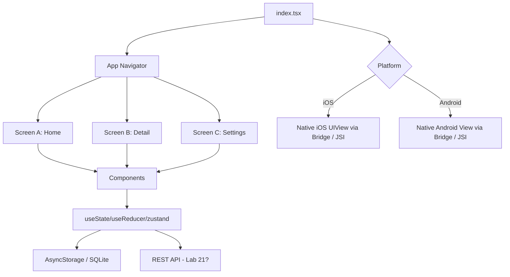

# Lab 30 — One Codebase, Two App Stores: Build a Cross-Platform Mobile App with React Native

> "The dream of 'write once, run everywhere' isn't a dream anymore. The compromise is just smaller than people think."

**Time budget:** ~2 weeks for the core lab, with extension challenges that grow it to 3–5 weeks.
**Preferred framework:** **React Native (with Expo)** — recommended primary path. **Flutter** acceptable as alternative.
**Working style:** solo, or in a team of up to 3 people.

---

## The hook

For two decades, mobile development meant *picking a side*. iOS engineers wrote Swift; Android engineers wrote Kotlin; the two armies barely spoke to each other. Then a small team at Facebook released **React Native** in 2015 — JavaScript that drives **real native UI** on both platforms. Today, **Instagram, Discord, Shopify, Coinbase, Tesla, Microsoft Teams, Walmart**, and large slices of **Facebook itself** ship React Native to billions of phones. **Google built Flutter** as their answer; **Meta** keeps doubling down on React Native; **the cross-platform war has been peaceful for a few years and the tools are unbelievably good.**

In this lab, you'll build **one codebase that ships a real app to both Android and iOS** — using **React Native** (specifically **Expo**, the friendliest, most-shipping-friendly toolchain in the ecosystem). You don't need a Mac to develop for iOS — Expo lets you preview on a real iPhone via the Expo Go app. **You don't need a Play Store account** — you build a sideloadable APK. **You don't need an App Store account** — you build for TestFlight or just test via Expo Go.

You'll touch the modern React stack: **TypeScript, hooks, navigation, AsyncStorage, gesture handling, animations (Reanimated 3), platform-aware code, native modules, EAS Build (Expo's cloud builder), OTA updates** — and you'll ship one codebase to two completely different operating systems.

If you want a perfect appetizer, watch [**William Candillon's *Can it be done in React Native?***](https://www.youtube.com/c/wcandillon) — beautiful examples of what's possible. Pair with [**Expo's *Building a Universal App* tutorial**](https://docs.expo.dev/tutorial/introduction/) — the gentlest, most-current intro to the ecosystem.

---

## Why this is worth your time

- **One codebase, two platforms.** A working app on both stores from one repo is a uniquely strong portfolio item.
- **React Native skills are some of the most asked-about** in the modern job market — most senior engineers can't comfortably do a mobile app, and recruiters know it.
- The skills (**TypeScript, React, hooks, async I/O, gesture/animation, native modules**) transfer directly to web (Lab 22), backend (Lab 21), and even desktop (Tauri/Electron).
- **Expo** is one of the best developer experiences in software. You'll be productive in hours, not weeks.
- **Connects to Lab 21 + Lab 22 + Lab 29.** Fullstack + mobile native + mobile cross-platform = a complete picture of a product engineer.

---

## The target

> **Instructor TODO:** add reference screenshots / GIF of a polished cross-platform build to `docs/`.

**Basic — "It Runs On Both"**
A React Native + Expo app that runs on **iOS via Expo Go** (your iPhone or a friend's) and **Android via Expo Go or sideloadable APK** (your Android phone). 3+ screens. Real interaction (form, list, counter, timer). Navigation. The same code path produces the same UI on both platforms.

**Standard — "It's a Real Tiny App"**
Everything from Basic, plus: **persistent storage** (AsyncStorage / MMKV / SQLite), **dark mode** following the system theme, **smooth animations** (Reanimated 3), responsive layouts (handling keyboards, notches, safe-area insets), real error handling (offline state, empty states, loading), **a sideloadable APK for Android**, *and* either a TestFlight build for iOS *or* Expo Go preview for iOS testing. Used by 3+ humans.

**Advanced — "It's Production-Looking"**
You've added: **a real backend** (Lab 21's API or your own), **authentication**, **push notifications** (Expo Notifications), **camera or photo picker**, **location**, **OTA updates** (Expo's killer feature — push JS-only updates without resubmitting), **CI/CD** with **EAS Build**, *or* publishing to one of the stores (Play Store $25 or App Store $99 — see softening note).

---

## The big idea, in one diagram



The mantra: **one JavaScript, two real native UI trees.** Same code, two operating systems, native components — not a webview.

---

## Two-week plan with milestones

**Week 1 — Make it run on both**

- **Day 1 — Pick the app + tooling.** *One concrete app idea.* Install **Node.js**, install **Expo CLI**: `npx create-expo-app@latest my-app -t expo-template-blank-typescript`. Install **Expo Go** on your phone.
- **Day 2 — Hello world.** Run on web (`npm run web`), run on Android (Expo Go scans QR), run on iOS (Expo Go scans QR). *Milestone: same code on both phones.*
- **Day 3 — Navigation.** Add **Expo Router** (file-based routing — like Next.js for mobile). Three screens.
- **Day 4 — UI.** Tab bar at bottom. Real components. Use **Tamagui** or **NativeWind** (Tailwind for React Native) for styling.
- **Day 5 — Real interactivity.** A form, a list, a button that does something interesting. State with React's `useState` or **Zustand**.
- **Day 6 — Persistence.** Add **AsyncStorage** (or **MMKV** for performance). State survives app close.
- **Day 7 — APK + TestFlight + first share.** Use **EAS Build** to make a development APK for Android (sideloadable). Use **Expo Go** for iOS share. *Milestone: a friend has used it.* Take screenshots.

**At this point you've completed the Basic level.**

**Week 2 — Make it real**

- **Day 8 — Real feature pass.** Polish the *one* main feature.
- **Day 9 — Dark mode + safe areas + keyboard.** Test on a phone with a notch and a phone without. Test the keyboard not covering inputs.
- **Day 10 — Animations.** Use **Reanimated 3** for at least one delightful animation (a swipe-to-delete, a hero transition, a pull-to-refresh).
- **Day 11 — Empty / loading / error states.** Critical polish.
- **Day 12 — Pick a side quest.**
- **Day 13 — Polish, README, screenshots, demo video.**
- **Day 14 — Buffer / final builds.**

---

## Levels

### Basic — "It Runs On Both" (~14–18 hours)
- Expo + React Native + TypeScript scaffold
- 3+ screens with navigation
- a real interactive feature
- runs on iOS (via Expo Go) and Android (via Expo Go or APK)

### Standard — "It's a Real Tiny App" (~18–28 hours)
- everything from Basic
- persistent storage
- dark mode + system theme
- smooth animations (Reanimated 3)
- responsive to safe areas, keyboard, notch
- empty / loading / error states
- sideloadable APK for Android, Expo Go preview for iOS
- 3+ humans have used it

### Advanced — "Side Quests" (each ~3–10h)

- **Backend Integration.** Connect to Lab 21's API.
- **Authentication.** Login + signup + logout, persistent session.
- **Push Notifications.** Expo Notifications. Server triggers a notification.
- **Camera / Photo Picker.** Capture or pick an image, display it.
- **Location.** Permission flow + map (react-native-maps).
- **OTA Updates.** Push a JS-only update over the air. (Expo's killer feature.)
- **CI/CD.** GitHub Actions + EAS Build → APK on every tag.
- **Tablet / iPad layouts.** Responsive at large sizes.
- **Localization.** At least one other language (i18next).
- **Native Module Integration.** Wrap a native iOS / Android API yourself. Hard but recruiter-impressive.
- **Play Store / App Store Publishing.** *Optional* — see softening note.

---

## Extension challenges (3–5 weeks)

- **A Polished, Daily-Driver App.** Use it daily for a month. Iterate on real friction. Distribute to 10+ users via TestFlight + APK.
- **Combine With Lab 21 + Lab 22.** Your own backend + web admin + cross-platform mobile client. The whole product, all yours.
- **Combine With Lab 29.** Build the same app twice — once native (Lab 29), once cross-platform (Lab 30). Then write a comparison: where Compose wins, where React Native wins, where they tie. *Massively* impressive technical writing.
- **Combine With Lab 16/18 (IoT).** Companion app for an embedded device — sensor data on your phone, control the hardware remotely.

---

## Make it yours (required)

The architecture is universal; the *idea* is the personality.

- **Aviation Logbook** (cross-platform, follows you on either phone).
- **Habit Tracker.**
- **Fitness Tracker** (steps, location-based runs).
- **Daily Journal.**
- **Recipe Book.**
- **Mood / Gratitude Log.**
- **Weather App** (with beautiful animations — a *good* weather app is a real signal).
- **Workout Tracker.**
- **Local Transit Schedule.**
- **Companion App For Your Lab 16/18 (IoT)** — sensor monitoring on your phone.
- **Companion App For Your Lab 21 Backend** — turn the API into something usable on a phone.

You'll defend why you chose it and why cross-platform was the right choice for this app (vs. native-only).

---

## Working solo or in a team

Solo: very feasible. Expo's DX makes this one of the most approachable mobile labs.

Team:
- *By layer:* one person owns UI + navigation + animations; the other owns data + state + storage + networking.
- *By feature:* split your screens 2 + 1.
- *Across labs:* if your team also does Lab 21, the API is shared between you. Real product engineering.
- *Across labs (ambitious):* Lab 29 + Lab 30 by the same team — two implementations of the same app, with a written comparison.

Two team rules: **git from day one** and **list who did what.** Each team member must demo on a real phone.

---

## Tooling and language tips

**React Native + Expo + TypeScript (recommended primary)**
- **Expo Router** for file-based navigation.
- **Tamagui** or **NativeWind** for styling.
- **Reanimated 3** for animations.
- **React Query / TanStack Query** for server state.
- **Zustand** for client state (or React's built-in `useReducer` for small apps).
- **AsyncStorage** (simple) or **MMKV** (fast, modern) for persistence.
- **EAS Build** for cloud-built APKs / IPAs (no Mac needed for Android; iOS native build needs a Mac, but Expo Go testing does not).

**Flutter (acceptable alternative)**
- Dart language. Beautiful, fast, great UI ecosystem.
- Slightly different paradigm (declarative widgets, but its own).
- Excellent if you've used it before; otherwise React Native is a lower-friction starting point.

**Anyone**
- **Expo Go for development.** It's the fastest dev loop on mobile.
- **EAS Build for distribution.** Free tier is generous; perfect for student projects.
- **No Mac required for Android.** A Mac (or a cloud Mac) is required to build iOS *.ipa* binaries; Expo Go works without one for development.
- **Use real devices, not just emulators.** Touch behavior, performance, and certain APIs only feel right on real hardware.
- **Watch the safe area** (notches, status bar). Use `react-native-safe-area-context` everywhere.
- **Don't fight the platform.** iOS users expect iOS conventions; Android users expect Android conventions. Use platform-aware components where needed.

---

## Suggested project structure

```txt
my-cross-app/
  README.md
  app.json
  package.json
  tsconfig.json
  app/                          # Expo Router file-based routes
    _layout.tsx
    index.tsx
    (tabs)/
      _layout.tsx
      home.tsx
      settings.tsx
    detail/[id].tsx
  components/
    ListItem.tsx
    EmptyState.tsx
    LoadingState.tsx
  hooks/
    useItems.ts
    useTheme.ts
  state/
    store.ts                    # Zustand
  services/
    storage.ts                  # AsyncStorage wrapper
    api.ts                      # if you have a backend
  theme/
    colors.ts
    spacing.ts
  assets/
    icons/
    images/
  docs/
    screenshots/
    demo.gif
    apk/
      latest.apk
```

---

## When you get stuck

- **App works in Expo Go but breaks in EAS Build.** A native module needs prebuild. Run `npx expo prebuild` and check the resulting `ios/` and `android/` folders.
- **iOS keyboard covers the input.** Wrap your screen in `KeyboardAvoidingView` with `behavior="padding"` (or `"height"` on Android).
- **Notches cut off content.** You're not respecting safe area insets. Use `useSafeAreaInsets()` from `react-native-safe-area-context`.
- **List performance is bad.** You're using `ScrollView` for a long list. Use `FlatList` (or **FlashList** from Shopify for serious performance).
- **State doesn't persist.** Forgot to wrap state setters in `AsyncStorage.setItem`. Use a library like **zustand-persist** or **redux-persist** to make persistence automatic.
- **App on iOS looks great, on Android terrible (or vice-versa).** You're hardcoding pixel values. Use `Dimensions` API + relative units.

If stuck for 30+ minutes: open the **React Native debugger** + **Flipper**. Log freely. Most state issues are visible in seconds.

---

## Deployment checklist

- [ ] Runs on a real iOS device via Expo Go.
- [ ] Runs on a real Android device via Expo Go or APK.
- [ ] No crashes in 5 minutes of normal use on either platform.
- [ ] Dark mode + light mode work.
- [ ] Safe areas + keyboard handled correctly.
- [ ] **Sideloadable APK** for Android, downloadable from the repo.
- [ ] Either **TestFlight invite link** for iOS *or* clear "scan this QR with Expo Go" instructions in the README.
- [ ] No private API keys in source.
- [ ] Tested on at least one Android phone *and* one iPhone (yours, a friend's, or the lab's).
- [ ] App icon, splash screen, name in `app.json` look intentional.

> **About publishing.** App Store ($99/year) and Play Store ($25 one-time) fees can be barriers. **A sideloadable APK plus iOS testing via Expo Go is fully sufficient for this lab.** Treat publishing as a future side quest, not a requirement.

---

## What recruiters look at

- **They scan the QR with Expo Go.** Or install the APK. First impressions form in 30 seconds.
- **They look at both platforms.** Does the iOS version feel like an iOS app? Does the Android version feel like an Android app? *Or do both feel uncanny?*
- **They look at architecture.** Components separated from screens, state separated from UI, services separated from components.
- **They check animations.** Smooth = polish; janky = inattention.
- **They look at your README's "platform tradeoffs" section.** What did you have to do *differently* on iOS vs. Android? *Recruiters love seeing this.*

---

## What to put in your README

1. App name + tagline.
2. **Screenshots** of both platforms side by side.
3. A 15-second GIF.
4. **Sideloadable APK link** + **Expo Go QR (or TestFlight link).**
5. Tech stack.
6. Architecture diagram.
7. **Platform tradeoffs section:** what you did differently on iOS vs. Android. (Even if "almost nothing" — *say so*.)
8. How to build locally.
9. Side quests + extensions.
10. Known limitations / TODOs.
11. If team: who did what.

---

## Reflection

Be ready to:

1. **Live demo on both phones** (yours + lab phone, or yours + a friend's).
2. **Walk through one user action** end-to-end on both platforms.
3. **Explain why React Native and not native.** What did you trade away?
4. **Show the platform-specific code** you wrote (if any). Why was it necessary?
5. **What's the difference** between Expo Go, EAS Build, and a bare React Native app?
6. **Why is `FlatList` better than `ScrollView`** for long lists?
7. **What was the hardest bug** — UI, navigation, native bridge, or build pipeline?

---

## Showcase

End-of-semester gallery — anonymous voting for **most polished cross-platform UX**, **smoothest animations**, and **best platform-specific touches**. Bring iPhone + Android phone for testers.

---

## Going further

- *William Candillon's *Can it be done in React Native?* (YouTube).
- *Expo Documentation* — the most-current source of truth for the ecosystem.
- *Reanimated 3 docs* — the best mobile animation library; learn it well.
- *Reading Discord's React Native architecture posts* — Discord ships RN to millions; their writeups are gold.
- *Flutter docs* — for when you want to compare paradigms.
- *Native Modules in React Native* — for when you go deep enough to write Swift / Kotlin glue.

---

## A final word

The first time you scan a QR code on your friend's iPhone and *your* app loads — same code that runs on your Android — you'll feel the meaning of "cross-platform" change. It's not a hack anymore. It's just how a lot of modern apps get built. By the end of this lab, you can be the person on the team who *can* ship to both stores. There aren't enough of those people. Be one.
