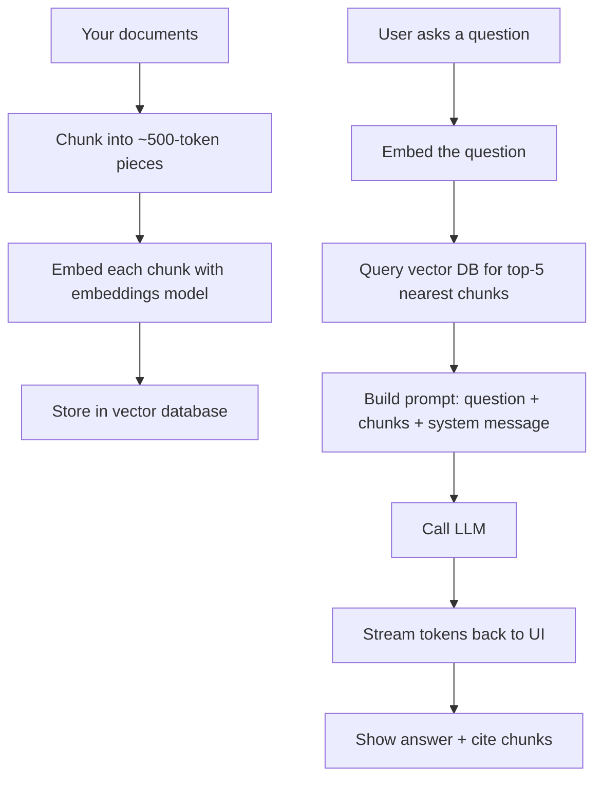

# Lab 31 — Build A Real LLM-Powered App: A Domain Chatbot With RAG

> "The interesting question isn't whether AI will replace developers. It's whether developers who can wire AI into real products will replace those who can't."

**Time budget:** ~2 weeks for the core lab, with extension challenges that grow it to 3–5 weeks.
**Preferred language:** TypeScript (Node.js + Vercel AI SDK or Next.js) — *or* Python (FastAPI + LangChain / LlamaIndex).
**Working style:** solo, or in a team of up to 3 people.

---

## The hook

In November 2022, **ChatGPT** went from a research preview to 100 million users in 60 days — the fastest-growing consumer product in history. By 2026, you can hardly find a SaaS product that doesn't have *"AI-powered"* on its landing page. Most are mediocre wrappers. *A few* are genuinely useful — and the difference between a magical AI product and a useless one almost always comes down to one technique: **Retrieval-Augmented Generation (RAG).**

A plain LLM (GPT-4, Claude, Gemini, Llama) only knows what's in its training data. It doesn't know your codebase, your professor's lecture notes, your aviation regulations, your team's Notion. **RAG fixes this:** when the user asks a question, you first *retrieve* the most relevant chunks from your own document collection, then *feed those chunks plus the question* to the LLM. Suddenly the model has perfect, current, domain-specific knowledge — without re-training.

In this lab, you'll build a real **AI-powered chatbot** that answers questions about a specific domain you choose: a textbook you love, a programming language's docs, your university's regulations, an aviation handbook (FAA Part 61, ICAO Annex 14), the works of a poet. **You'll learn the full RAG pipeline:** chunking documents, generating embeddings, storing them in a vector database, retrieving by semantic similarity, prompting the LLM with context, streaming responses, and shipping a polished web app a friend can actually use.

If you want a perfect appetizer, watch [**Andrej Karpathy's *State of GPT*** (Microsoft Build 2023, ~40 min)](https://www.youtube.com/watch?v=bZQun8Y4L2A) — the most influential AI talk of the LLM era, free. Pair with [**Jerry Liu's *Building Production-Grade RAG*** talks](https://www.llamaindex.ai/) — the founder of LlamaIndex on what real RAG systems look like.

---

## Why this is worth your time

- **Every product company is hiring engineers who can ship AI features.** A working RAG app proves you can do exactly that.
- The skills (**prompt engineering, embeddings, vector search, streaming responses, eval, cost-awareness**) are the *current* most-asked-about skills on the job market.
- Your project is **uniquely demonstrable.** Recruiters chat with it for 30 seconds and *immediately* understand what you built.
- AI is the rare technology where a thoughtful student project can be *better* than most paid SaaS products. Niche RAG apps are still wildly underserved.
- **Connects to Lab 21, 22, 24, 33, 34.** Real product engineering with AI inside.

---

## The target

> **Instructor TODO:** add reference screenshots of polished RAG apps (e.g., Perplexity, Notion AI, Cursor docs) to `docs/`.

**Basic — "It Talks to Your Docs"**
A web chat UI that takes a user message, calls an LLM, and returns a streamed answer. **The LLM has access to your domain documents** via RAG — relevant chunks retrieved, passed in the prompt. Five+ seed questions visibly produce useful, accurate answers. Source citations shown next to answers ("answered from page 12 of *X*"). Deployed.

**Standard — "It's a Real Mini-Product"**
Everything from Basic, plus: **session history** (chat persists across reloads), **streaming responses** (text appears word by word, like ChatGPT), **handling of "I don't know"** (model says so when retrieval fails — no hallucination), **a small eval set** (a JSON file of 10 question-answer pairs you ran the app against), **rate limiting**, **basic auth** (or at least an API key gate so you don't get a $300 OpenAI bill from a stranger), **a polished UI**. Used by 5+ humans.

**Advanced — "It's a Real Tool"**
You've added: **multi-document upload** (users add their own PDFs / Markdown), **conversation memory beyond retrieval** (model remembers earlier turns), **agentic loops** (the model can call tools — e.g., "search the web," "run a calculation"), **structured output** (model returns JSON the UI renders as a table or chart), **a benchmark vs. plain GPT** showing your RAG system measurably outperforms the plain model on your eval set, **a proper vector database** (Pinecone / Weaviate / pgvector), or **fine-tuning** a smaller open model on your domain.

---

## The big idea, in one diagram



The mantra of RAG: **retrieve first, generate second.** A plain LLM is a librarian without a library. A RAG system is a librarian *with* a library *and* a search engine.

---

## Two-week plan with milestones

**Week 1 — Make it work**

- **Day 1 — Pick the domain + tooling.** *One concrete domain.* (See ideas below.) Pick stack: Next.js + Vercel AI SDK + OpenAI (recommended) — or FastAPI + LangChain + OpenAI. Get an OpenAI API key (or an Anthropic/Google one). Set up a billing limit ($5–$10 plenty for this lab).
- **Day 2 — "Hello LLM."** A simple web page with a text input. User types a question; you call OpenAI's chat API; show the answer. *Milestone: your code is talking to GPT-4.*
- **Day 3 — Streaming.** Upgrade to streaming responses. Tokens appear as they're generated, not all at once. *Big UX upgrade for one day's work.*
- **Day 4 — Get your documents.** Pick 1 PDF or 5+ markdown documents (~10–100 pages total). Write a script to extract text. Chunk into ~500-token pieces with ~50-token overlap.
- **Day 5 — Embeddings + retrieval.** Embed each chunk with `text-embedding-3-small` (OpenAI) or a local model. Store in **a simple in-memory cosine-similarity store** for v1 (or **pgvector** if you're feeling brave). On a question, embed the question, find the top-5 nearest chunks.
- **Day 6 — RAG prompt.** Build the prompt: a system message ("You answer questions about *X* using only the provided context. If you don't know, say so."), the retrieved chunks, the user's question. Call the LLM. Show answer + which chunks were used. *Milestone: your app correctly answers a domain question.*
- **Day 7 — Polish + first deploy.** Clean UI (Tailwind, shadcn/ui). Deploy to Vercel. *Milestone: shareable URL.* Take a 30-second video.

**At this point you've completed the Basic level.**

**Week 2 — Make it real**

- **Day 8 — Session history.** Persist chat sessions. (LocalStorage is fine for now; PostgreSQL if you're combining with Lab 21.)
- **Day 9 — Hallucination guards.** Detect when retrieval failed (low similarity scores), force the model to say "I don't know" instead of inventing.
- **Day 10 — Eval set.** Create a `eval.json` with 10 question-expected-answer pairs. Write a small script that runs your RAG app over them and prints results. Score manually (or with another LLM).
- **Day 11 — Rate limit + cost guard.** Per-IP rate limit. API key auth (so it's not free for the world). Log every call to Postgres or a file.
- **Day 12 — Pick a side quest.**
- **Day 13 — Polish, README, screenshots, demo video.**
- **Day 14 — Buffer.**

---

## Levels

### Basic — "It Talks to Your Docs" (~14–18 hours)
- web chat UI
- streamed LLM responses
- RAG over your domain documents
- source citations
- deployed to a public URL

### Standard — "It's a Real Mini-Product" (~18–28 hours)
- everything from Basic
- session history persistence
- "I don't know" handling
- eval set (10+ Q&A) you've run
- rate limit + auth
- 5+ real users

### Advanced — "Side Quests" (each ~3–10h)

- **Multi-Document Upload.** Users upload their own PDFs / docs. Per-user vector spaces.
- **Conversational Memory.** Model uses earlier turns of the conversation, not just retrieval.
- **Tool Use / Agents.** The model can call tools — calculator, web search, code interpreter. (Use OpenAI's function calling.)
- **Structured Output.** Model returns JSON the UI renders as a table, chart, or card.
- **Benchmarking.** Run your RAG vs. plain GPT-4 on the eval set. Document the win.
- **Production Vector DB.** pgvector (free with Postgres), Pinecone, Weaviate, Chroma.
- **Fine-Tuning.** Fine-tune a smaller open model (Llama 3, Mistral) on your domain. Compare cost/latency/quality.
- **Local Model.** Run with Ollama instead of OpenAI. Document the tradeoffs.
- **Voice Interface.** Whisper for voice input, TTS for output. Eyes-free domain assistant.
- **Multi-Modal.** Accept images. (GPT-4o, Claude 3.5.)
- **Citation UI.** Click a citation in the answer; the source document scrolls to the cited paragraph.

---

## Extension challenges (3–5 weeks)

- **A Polished, Niche AI Product.** Take a domain underserved by existing AI tools (Ukrainian aviation regulations, your university's curriculum, a specific textbook) and build the AI product *you wish existed.* Distribute to 20+ real users.
- **Combine With Lab 24 (Browser Extension).** A right-click "Ask AI about this page" extension that uses your RAG backend.
- **Combine With Lab 32 (Build A Neural Net).** Use a *local model* you fine-tuned in Lab 32 instead of OpenAI. Total ownership of the AI stack.
- **Open-Source The Project.** Add docs, a contribute guide, GitHub Actions, MIT license. Get one external pull request.

---

## Make it yours (required)

The pipeline is universal; the *domain* is what makes it interesting.

- **Aviation Tutor.** RAG over FAR/AIM (FAA), ICAO Annex 14, or Ukrainian aviation regs. Answers ground-school-style questions. *Strong portfolio fit for an aviation institute.*
- **Course Tutor.** RAG over your university's actual textbooks (with your professor's permission). "Explain section 4.2 in simple terms."
- **Codebase Q&A.** RAG over a famous open-source codebase (Linux kernel, Postgres, React). "How does the React reconciler work?"
- **Lecture Buddy.** Upload your professor's slides; ask questions; get answers grounded in those slides.
- **Recipe Chatbot.** RAG over a beloved cookbook.
- **Medical First-Aid Helper** (with strong "this is not medical advice" disclaimers).
- **Ukrainian-Language AI Assistant for a domain.** Most LLM products are English-first; a thoughtful Ukrainian-language product is rare and valuable.
- **Customer Support For An Open-Source Project.** Pick a project with frustrating docs; build a "RAG support bot" for it; offer it to the maintainers.

You'll defend why you chose your domain.

---

## Working solo or in a team

Solo: feasible. The scope is contained.

Team:
- *By layer:* one person owns the data pipeline (chunking, embedding, vector DB); the other owns the app (UI, streaming, sessions).
- *By feature:* one person owns Basic + the eval set; the other owns Advanced (tool use, structured output, benchmarking).
- *Across labs:* if your team also does Lab 22, the chat UI + the auth come from there. Build the AI on top.

Two team rules: **git from day one** and **list who did what.** Each team member must explain the full pipeline end-to-end.

---

## Tooling and language tips

**TypeScript + Next.js + Vercel AI SDK + OpenAI (recommended primary)**
- **Vercel AI SDK** is the easiest way to add streaming AI to a Next.js app — purpose-built for it.
- Free Vercel deploy. Free GitHub. Cheap OpenAI API.
- Use **shadcn/ui** for a polished chat UI in 30 minutes.

**Python + FastAPI + LangChain or LlamaIndex (alternative)**
- **LlamaIndex** is the most feature-complete RAG framework; **LangChain** is more general.
- Python AI ecosystem is bigger; if you want to also fine-tune a model later, you'll be in Python anyway.
- Use **Streamlit** or **Gradio** for a quick UI; or pair with a TS/React frontend.

**Anyone**
- **Set a hard billing limit immediately.** OpenAI / Anthropic dashboards let you cap monthly spend. *Set a $10 cap before you write any code.* You will accidentally loop a request at 4am one night; you don't want to wake up to a $400 bill.
- **Log every API call.** Token counts, cost estimates. You'll want to know.
- **Don't put API keys in source.** `.env`, server-side only. Never expose to the browser.
- **Stream responses.** A chat UI without streaming feels broken in 2026.
- **Cache when possible.** Same question asked twice → cache the response. Embeddings are deterministic for the same text; cache them.

---

## Suggested project structure

```txt
my-rag-app/
  README.md
  app/                          # Next.js
    page.tsx
    api/
      chat/route.ts             # streams responses
      ingest/route.ts           # admin-only document ingestion
  lib/
    embed.ts                    # embeddings client
    vector.ts                   # vector DB client
    chunk.ts                    # text chunking
    rag.ts                      # the RAG pipeline
    prompts.ts                  # system prompts
  components/
    ChatUI.tsx
    Message.tsx
    Citation.tsx
  data/
    raw/                        # original PDFs / markdown
    chunks/                     # chunked text
    embeddings/                 # generated embeddings
  eval/
    questions.json              # eval Q&A pairs
    run-eval.ts                 # script to run eval
    results.json
  docs/
    architecture.png
    screenshots/
    demo.gif
```

---

## When you get stuck

- **Model says "I don't know" to questions in the docs.** Your retrieval is missing relevant chunks. Increase top-K (5 → 10), check chunk size (smaller chunks miss context; larger chunks miss specificity), inspect what's retrieved manually.
- **Model hallucinates answers not in the docs.** Strengthen the system prompt: "You may *only* answer using the provided context. If the context doesn't contain the answer, say 'I don't have that information.'"
- **Streaming doesn't work in production but works locally.** Vercel's edge runtime handles streaming differently than Node. Use the `runtime: 'edge'` directive or stick with Node serverless.
- **Embeddings are expensive.** Re-embed only when documents change. Cache embeddings on disk or in Postgres.
- **API rate-limit errors.** OpenAI rate-limits aggressively for new accounts. Implement exponential backoff with retries. Or use Anthropic — limits are usually friendlier.
- **Hallucinated citations.** Ask the model to cite chunks by ID, then validate that the cited chunk IDs are actually the retrieved ones. Discard hallucinated citations before showing.

If stuck for 30+ minutes: **print the exact prompt being sent to the LLM.** Most RAG bugs are in the prompt.

---

## Deployment checklist

- [ ] Live URL works.
- [ ] API key is **server-side only** — never in browser bundle.
- [ ] Hard billing limit set on the LLM provider.
- [ ] Rate limit + auth in place (no anonymous unlimited use).
- [ ] Streaming works in production.
- [ ] Mobile UI works.
- [ ] Citations point to real chunks.
- [ ] "I don't know" handling tested with off-domain questions.
- [ ] No secrets in source.
- [ ] README documents the eval methodology and results.

---

## What recruiters look at

- **They ask the chatbot 5 questions.** They will *intentionally* try off-domain questions, edge cases, and prompts designed to make it hallucinate. *Plan for this.*
- **They look at citations.** Are they real? Do they actually contain the answer?
- **They look at your eval set.** A `eval.json` with 10 thoughtful Q&A pairs is *huge* signal — it shows you've thought about correctness, not just demos.
- **They look at the code.** A clean separation between "pipeline" (chunking, embedding, retrieval) and "app" (UI, streaming, sessions) is engineering signal.
- **They look at your README's tradeoffs section.** What did you try that didn't work? Why?

---

## What to put in your README

1. App name + the domain it answers questions about.
2. **The live URL.**
3. A 30-second video of you asking it 3 questions.
4. Tech stack.
5. Architecture diagram (data → embeddings → retrieval → LLM → UI).
6. **Eval results.** "On 10 questions, my RAG was correct 9 times; plain GPT-4 was correct 5 times."
7. Cost: rough estimate of $/query.
8. Failure modes: where it gets confused, what it does wrong.
9. How to run locally (and how to ingest your own docs).
10. Side quests + extensions.
11. Limitations and ethical notes (e.g., "this is not legal/medical advice").
12. If team: who did what.

---

## Reflection

Be ready to:

1. **Live demo:** the panel asks 5 questions; you watch how the model handles each.
2. **Walk through the pipeline** for one question — input, embedding, retrieval, prompt, LLM call, streaming, render.
3. **Show your eval results.** What's the score? Why is RAG better than plain LLM?
4. **What happens when the user asks an off-domain question?**
5. **What does it cost** to answer one question? In tokens, and in dollars?
6. **What would you change** if you had to scale to 1000 users? 1 million?
7. **What's the difference** between embeddings, fine-tuning, and prompt engineering? When do you use which?
8. **What was the hardest part** — chunking, retrieval, hallucinations, UI streaming, or eval?

---

## Showcase

End-of-semester gallery — anonymous voting for **most useful AI app**, **best citation UX**, and **most honest about limitations**. Bring your laptop; classmates and recruiters will chat with it.

---

## Going further

- *State of GPT* — Andrej Karpathy, Microsoft Build 2023.
- *Building LLM Powered Applications* — DeepLearning.AI free course.
- *LlamaIndex documentation* — production-grade RAG patterns.
- *Anthropic's Prompt Engineering Guide* — the best official prompt guide.
- *OpenAI Cookbook* — copy-pasteable patterns for nearly everything.
- *Sebastian Raschka's *Building LLMs from Scratch*** book.
- *Lilian Weng's blog* — deep, accessible AI writeups.
- *Eugene Yan's blog* — production AI lessons.

---

## A final word

Most "AI products" right now are thin wrappers around an OpenAI API call. A few are genuinely useful — and the difference is almost always *how thoughtfully* the developer chose their domain, chunked their data, designed their prompts, and handled the model's failures. By the end of this lab, you can be the developer who makes the second kind. There aren't enough of those people. Be one.
