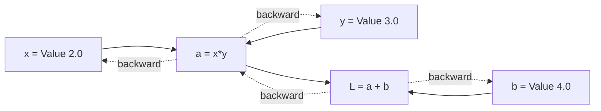
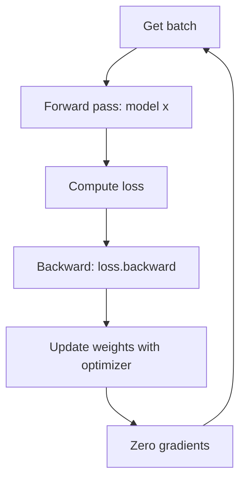

# Lab 32 — Build A Neural Network From Scratch (Yes, From Scratch)

> "I'd be a much worse machine learning engineer if I hadn't spent a long time understanding backpropagation by writing it in Python from scratch."
> — **Andrej Karpathy**, *Neural Networks: Zero to Hero*

**Time budget:** ~2 weeks for the core lab, with extension challenges that grow it to 3–5 weeks.
**Preferred language:** Python (NumPy + PyTorch). The mathematics translates to anything; the *ecosystem* is overwhelmingly Python.
**Working style:** solo, or in a team of up to 3 people.

---

## The hook

In 2022, **Andrej Karpathy** — co-founder of OpenAI, former director of AI at Tesla — released a free YouTube series called *Neural Networks: Zero to Hero.* He took the world's most complex modern technology (GPT, transformers, language models) and rebuilt it on a whiteboard in front of millions of viewers, **starting from a hand-coded scalar autograd engine.** The series is, by general agreement, the best introduction to deep learning that exists. It's free. It's about 15 hours total. It is *the* curriculum of the current AI generation.

In this lab, you'll do exactly what Karpathy did: **build a neural network from scratch, in Python, with NumPy** — *without* TensorFlow, *without* PyTorch's `autograd`, *without* shortcuts. You'll write your own automatic differentiation engine (the "magic" behind every modern AI library), train a tiny model on a real dataset, watch the loss curve go down for the first time, and feel the small click of *"oh — I understand what's happening inside ChatGPT now."*

After the from-scratch part, you'll **rebuild the same model in PyTorch** (the industry standard) to feel the speed difference and learn the production tool. Then you'll train on a *real* dataset — handwritten digits (MNIST), or generate names character-by-character (Karpathy's *makemore*), or train a tiny GPT to imitate Shakespeare. You will not be using AI; *you will be making one.*

If you want a perfect appetizer, watch the **first 30 minutes** of [**Karpathy's *The spelled-out intro to neural networks and backpropagation: building micrograd***](https://www.youtube.com/watch?v=VMj-3S1tku0). That's where you'll start. The whole lab is, essentially, "complete the Karpathy curriculum and apply it to a small original project."

---

## Why this is worth your time

- **Most ML practitioners haven't done this.** They use PyTorch as a black box. Doing it from scratch is the cleanest possible understanding of *what's actually happening* when a model trains.
- The skills (**autograd, computation graphs, gradient descent, backpropagation, the math of cross-entropy loss**) are the *foundation* of every other modern AI skill — fine-tuning, prompt engineering, debugging weird model behavior — all flow from these.
- A repo named `from-scratch-neural-net` with **Karpathy-quality writeups** is one of the most distinctive ML portfolio items possible.
- Connects directly to **Lab 31 (RAG)**, **Lab 33 (Computer Vision)**, **Lab 34 (Capstone)**, and **Lab 16/18 (Embedded ML)**. This lab is the *base* of the AI track.

---

## The target

> **Instructor TODO:** add reference plots / sample outputs (loss curves, generated names, MNIST predictions) to `docs/`.

**Basic — "I Built An Autograd Engine"**
You've built a **scalar autograd engine** (Karpathy's *micrograd*) — Value class with `+`, `*`, `tanh`, `**`, with a `backward()` method that does reverse-mode automatic differentiation. You've used it to train a tiny multi-layer perceptron (MLP) on a small toy dataset (e.g., classifying points in 2D, or learning a simple function). **The training loss visibly goes down.** A loss curve plot is in your README.

**Standard — "I Trained a Real Model"**
Everything from Basic, plus you've **rewritten your model in PyTorch** *and* trained on a *real, non-toy dataset*. Pick one (or do both for extra credit):
- **Image classification** on **MNIST** (handwritten digits) — get >97% test accuracy.
- **Character-level language model** that generates plausible names (the Karpathy *makemore* path) — given training data of names, your model produces *new, made-up* names that sound real.
- **Tiny Shakespeare GPT** — a from-scratch transformer that completes Shakespeare-style text after training on a small corpus.
You wrote a real training loop with batching, validation, learning-rate scheduling, and saving model checkpoints. You evaluated on a held-out test set. You made the **standard plots** — loss curve, accuracy curve, sample predictions.

**Advanced — "I Have Real ML Intuition"**
You've added: **a tiny transformer** with attention (following Karpathy's *Let's build GPT*), **fine-tuning** on a domain you care about (your messages, a textbook, your own writing), **deployment** (a Gradio or Hugging Face Spaces demo where strangers can poke your model), **hyperparameter sweeps** (with Weights & Biases or even just a script), **a comparison** of your from-scratch implementation vs. PyTorch's (showing they produce identical gradients on the same input — the proof that your math is right), or **runs on GPU** with measurable speedup.

---

## The big idea, in two diagrams

### Forward and backward pass (autograd)



Each `Value` remembers what created it; `backward()` walks the graph in reverse, applying the chain rule. *That single idea* is the foundation of every modern deep learning library.

### Training loop



This four-line loop, repeated thousands of times, is *literally how every neural network on Earth gets trained.* Once you've coded it once, you understand all of them.

---

## Two-week plan with milestones

This lab follows Karpathy's curriculum closely. Watch as you go.

**Week 1 — Build the engine, train tiny things**

- **Day 1 — Set up the environment.** Python 3.11, NumPy, PyTorch, Jupyter / VS Code, matplotlib. Watch the first 30 min of *micrograd*.
- **Day 2 — Write the `Value` class.** Forward arithmetic, the chain rule, `backward()`. Test on a tiny expression: compute the gradient by hand, then by your engine; confirm they match.
- **Day 3 — Build a multi-layer perceptron.** `Neuron`, `Layer`, `MLP` classes built on top of `Value`. Initialize weights randomly.
- **Day 4 — Train the MLP** on a toy 2D classification dataset (e.g., concentric circles). Plot the loss curve. *Milestone: your hand-built engine learned a function.*
- **Day 5 — Watch *makemore* part 1.** Move to PyTorch. Recreate the same MLP in PyTorch and verify the same dataset trains identically.
- **Day 6 — Choose your real dataset:** MNIST, *makemore*, or tiny Shakespeare GPT. Get the dataset; understand its shape.
- **Day 7 — Build the v1 model in PyTorch and start training.** Loss should go down by end-of-day.

**At this point you've completed the Basic level.**

**Week 2 — Train a real model**

- **Day 8 — Proper training loop.** Batching, validation set, learning-rate schedule, model checkpointing. Train for real.
- **Day 9 — Evaluate.** Test set accuracy / generated samples. Plot loss + accuracy curves. Make sample-prediction visualizations.
- **Day 10 — Improve.** Hyperparameter tweaks: learning rate, batch size, model size, layer count. Plot the differences.
- **Day 11 — Pick a side quest.**
- **Day 12 — Write the README** with the *Karpathy-style step-by-step explanation* — this is the most-impactful single hour of the lab.
- **Day 13 — Demo prep.** Deploy a Gradio demo on Hugging Face Spaces (free).
- **Day 14 — Buffer.**

---

## Levels

### Basic — "I Built An Autograd Engine" (~14–18 hours)
- working `Value` class with `+`, `*`, `tanh`, `**`, `backward()`
- MLP built on top
- trained on a toy dataset, loss goes down
- loss curve plot in README

### Standard — "I Trained a Real Model" (~18–28 hours)
- everything from Basic
- model rewritten in PyTorch
- trained on a real dataset (MNIST, makemore, or tiny Shakespeare)
- training loop with batching, validation, checkpointing
- evaluation + plots + sample predictions
- Karpathy-style README writeup

### Advanced — "Side Quests" (each ~3–10h)

- **Tiny GPT.** Build a transformer from scratch following Karpathy's *Let's build GPT*. Train on a small corpus.
- **Fine-Tune.** Fine-tune a small open model (GPT-2-small, DistilBERT) on a domain you care about.
- **Hyperparameter Sweeps.** With **Weights & Biases**. Compare 10+ configs.
- **GPU.** Run training on a free Colab/Kaggle GPU. Document the speedup.
- **Quantization.** Take your trained model down to 8-bit or 4-bit precision. Document quality loss.
- **Deploy.** **Hugging Face Spaces** with a Gradio interface. Strangers can poke your model.
- **Compare to PyTorch.** Verify your from-scratch gradients match PyTorch's on the same inputs. *Proof of correctness.*
- **Visualize Internals.** Plot weights, activations, attention heads.
- **Embedded ML.** Run a tiny model on Lab 16/18's microcontroller (TensorFlow Lite Micro). Wildly impressive.
- **Connects to Lab 31.** Use *your* fine-tuned model in your RAG app instead of OpenAI.

---

## Extension challenges (3–5 weeks)

- **Train and Ship a "useful" Model.** Pick a real, narrow problem (classify Ukrainian street signs, generate aviation callsign suggestions, score how "anxious" a piece of text sounds) and train a model that solves it well enough to be used by 5 humans. Write up the *whole* process.
- **Karpathy-Tier Writeup.** A 30-minute video walkthrough of your code, posted to YouTube. Genuinely educational. *This is gold for both portfolio and channel building.*
- **Build a Tiny GPT That Plays a Tiny Game.** Karpathy's nanoGPT trained on game transcripts (chess, tic-tac-toe). Predict the next move. Beat baseline.

---

## Make it yours (required)

The autograd engine is universal. The *dataset* and the *model story* are yours.

- **Aviation NameMaker.** Train a character-level model on a list of aircraft names; generate plausible new aircraft names ("F-28 Falcon Skystrike"). Whimsical; on-brand.
- **Ukrainian Name Generator.** Train *makemore* on a dataset of Ukrainian first names. The model invents new ones. Surprisingly delightful.
- **Bird-Call Classifier** — if you can find a small audio dataset.
- **Fashion-MNIST instead of MNIST** — same code, different dataset, different talking point.
- **Sentiment Classifier** for movie reviews or tweets.
- **Tiny Spam Classifier** for SMS — a real-world classic.
- **Music Generator** — a character-level model on MIDI sequences.
- **Code Completer** — train a tiny model on a small Python codebase. Watch it predict tokens.

You'll defend why you chose it and what you learned about your data.

---

## Working solo or in a team

Solo: this is one of the labs that *most* benefits from solo work because the learning is in the typing.

Team:
- *By depth:* one person owns the from-scratch engine + writeup; the other owns the PyTorch implementation + training + deployment.
- *By dataset:* each person picks a different dataset and trains a different model. The repo has both. Write a comparison.
- *By tier:* one person hits Standard solid; the other hunts Advanced (GPT, deployment, etc.).

Two team rules: **git from day one** and **list who did what.** Each team member must explain backpropagation.

---

## Tooling and language tips

**Python + NumPy + PyTorch (recommended)**
- Python 3.11 or 3.12.
- **NumPy** for the from-scratch parts.
- **PyTorch 2** for the real-model parts.
- **Jupyter** notebooks for exploration; convert to `.py` files for the final repo.
- **matplotlib** for plots.

**Free GPU options**
- **Google Colab** — free T4 GPU, perfect for this lab.
- **Kaggle Notebooks** — free GPU + datasets.
- **Hugging Face Spaces** — free model deployment.

**Anyone**
- **Watch Karpathy's videos slowly.** Pause. Type along. *Don't watch passively.*
- **Type the code yourself.** Copy-pasting from his repo defeats the entire purpose. The point is the typing.
- **Print everything during training.** Loss every 100 steps. Sample outputs every epoch. You learn the model's behavior visually.
- **Save checkpoints early.** Models that took 2 hours to train and weren't saved are *the* most painful learning moment. Check pointing is free; do it.
- **Don't optimize early.** First make it work, then make it fast.
- **A small model trained well >> a large model trained badly.**

---

## Suggested project structure

```txt
neural-net-from-scratch/
  README.md                     # Karpathy-style writeup with plots
  micrograd/
    value.py                    # the Value class
    nn.py                       # MLP, Neuron, Layer
    test_grads.py               # verifies gradients match PyTorch
    examples/
      train_circles.ipynb       # toy dataset training
  pytorch_models/
    mnist/
      train.py
      eval.py
      model.py
    makemore/
      train.py
      sample.py
    gpt/                        # advanced
      train.py
      sample.py
      model.py
  data/
    raw/
    processed/
  checkpoints/
  plots/
    loss_curves.png
    sample_predictions.png
  notebooks/
    explorations.ipynb
  requirements.txt
  docs/
    karpathy-references.md
```

---

## When you get stuck

- **Loss doesn't go down.** Most common cause: learning rate is wrong. Try `1e-3` for MLPs. Try `lr` an order of magnitude larger and smaller and see which moves the loss.
- **Loss is `NaN`.** Exploding gradients. Lower the learning rate. Add gradient clipping. Inspect the largest activation; it's probably ridiculous.
- **Train loss good, test loss bad.** Overfitting. Add dropout. Reduce model capacity. Get more data. Use data augmentation.
- **Model overfits in 1 epoch.** Your dataset is too small or your model is too big.
- **My from-scratch gradients don't match PyTorch's.** You implemented the chain rule wrong somewhere. Test each operation in isolation: compute gradient by hand, by your engine, and by PyTorch; pinpoint where they diverge.
- **Training is too slow.** Move to GPU (Colab). Vectorize: replace Python `for` loops with NumPy/PyTorch tensor ops.

If stuck for 30+ minutes: **shrink to a tiny example.** Train on 10 samples for 100 epochs and overfit perfectly. If the model can't even overfit a tiny set, the problem is in the model, not the data.

---

## Deployment checklist

- [ ] Repo runs end-to-end on a clean machine: clone → `pip install -r requirements.txt` → `python train.py` → loss goes down.
- [ ] All notebooks have outputs cleared before commit (use `nbstripout`).
- [ ] Trained checkpoints are saved (smaller models can be in the repo; larger ones use Git LFS or a release).
- [ ] Loss / accuracy plots are in the README.
- [ ] Sample predictions are in the README.
- [ ] **A live Gradio demo on Hugging Face Spaces** for the trained model (free; takes 10 minutes to set up).
- [ ] No hardcoded paths.
- [ ] Reproducible: seed set, deterministic data loading, results documented.

---

## What recruiters look at

- **They look at your README.** This is the lab where the README *is* the project. A Karpathy-style "what I built and what I learned" writeup is *uniquely* impressive.
- **They look at your loss curves.** Smooth, monotonically decreasing curves with sensible learning-rate schedules = signal.
- **They open the autograd engine.** A clean, ~150-line `Value` class with proper graph-tracking and backward = strong signal.
- **They poke the Hugging Face demo.** *They will ask it weird inputs.* Plan for failure modes.
- **They look at the Karpathy references.** "Have they done all the parts of the curriculum?" is a common evaluation.

---

## What to put in your README

1. Project name + tagline ("a small neural network, built two ways").
2. **Loss-curve plot** at the very top (the visual signal that learning happened).
3. The story: "I started with this toy dataset; I built `micrograd`; here's the gradient match with PyTorch; then I rewrote it in PyTorch; trained on MNIST; here's the test accuracy."
4. Sample predictions with images / generated text.
5. Hyperparameters used.
6. Tech stack.
7. Reproducibility: how to run from scratch (clone + train).
8. **Karpathy references:** which videos in *Zero to Hero* you watched.
9. **Live Gradio demo link** (Hugging Face Spaces).
10. Side quests + extensions.
11. Honest limitations: what's broken, what's mediocre, what surprised you.
12. If team: who did what.

---

## Reflection

Be ready to:

1. **Live demo:** load a checkpoint and run a forward pass on a sample input.
2. **Walk through your `Value.backward()`** — explain reverse-mode autodiff in plain words.
3. **Show your loss curve.** Why does it have that shape? What was the learning rate? What's the validation curve?
4. **Train one more step in front of the panel.** Show that the model learns.
5. **What's the bias-variance tradeoff?** Where does your model sit on it?
6. **Why is the chain rule the foundation of everything?**
7. **What's the difference** between gradient descent and stochastic gradient descent? Adam? RMSprop?
8. **What was the hardest part** — the math, the engine, the data, or the training loop?

---

## Showcase

End-of-semester gallery — anonymous voting for **best Karpathy-style writeup**, **most beautiful loss curves**, **most surprising model output**. Bring a laptop with the trained model loaded; classmates and recruiters will run inferences live.

---

## Going further

- **Andrej Karpathy — Neural Networks: Zero to Hero** (YouTube). The *only* required recommendation. The whole lab is built on this.
- *3Blue1Brown's *Neural Networks*** YouTube series — beautiful visual intuition.
- *Deep Learning Book* by Goodfellow, Bengio, Courville — free online.
- *Sebastian Raschka's *Build a Large Language Model From Scratch*** — book.
- *fast.ai's *Practical Deep Learning for Coders*** — Jeremy Howard's free course.
- *MIT OCW: 6.S191 (Intro to Deep Learning)* — free course with strong lectures.
- *Distill.pub* — gone but archived; the most beautiful ML explainers ever made.
- *Lilian Weng's blog* — modern, accessible, deep AI writeups.
- *The original GPT-2 paper* — once you've trained your own tiny GPT, this becomes readable.

---

## A final word

Most engineers who use AI never see the inside of an AI. They use PyTorch the way everyone uses sqrt — call it, get a number. That's fine. *But* — there's a different feeling that comes from having written your own gradient through a `tanh`, your own backward pass through a multiplication, your own loop that taught a tiny network something true. After that, every paper, every model, every news story about AI — you'll be able to read with a small smile, because you'll know what's happening behind the words.
