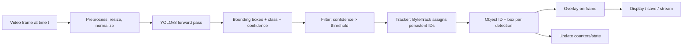

# Lab 33 — Make A Computer That Sees: Real-Time Object Detection And Tracking On Video

> "Once your computer can find objects in a video, the world starts looking different. Cars, hands, faces, drones, ships — the camera becomes a sensor."

**Time budget:** ~2 weeks for the core lab, with extension challenges that grow it to 3–5 weeks.
**Preferred language:** Python (OpenCV + PyTorch + Ultralytics YOLO).
**Working style:** solo, or in a team of up to 3 people.

---

## The hook

A camera is a strange thing. It takes 30 photographs per second of whatever you point it at — millions of pixels of pure data. For most of the history of computing, that data was *opaque*: a blob your computer couldn't read. Then in 2012, a model called **AlexNet** crushed the ImageNet competition; in 2015, **YOLO** ("You Only Look Once") made object detection real-time on a laptop; by 2024, **YOLOv8** can find people, cars, drones, dogs, planes — *all of them, in 60 frames per second*, on a $200 GPU. Suddenly, **the camera became a sensor.**

That single shift is the engine behind a startling fraction of modern technology: **Tesla's Autopilot, every drone with obstacle avoidance, the Boeing 787's cockpit traffic display, every sports broadcast with player tracking, every store with anti-theft cameras, every Ukrainian reconnaissance drone, every "is there a person at the front door?" smart camera.** Computer vision is the AI domain you can actually *see working* — and the demos are *impossibly* compelling.

In this lab, you'll build a **real-time object detection and tracking system** on a video. **You'll point your laptop's webcam at the world and it will see things in real time.** You'll detect objects (cars, people, planes, whatever you choose), assign each one a persistent ID across frames (so "car #4 entered at the bottom and exited at the top"), and visualize it. You'll deploy the result. *Your computer will see — and you'll have built it.*

If you want a perfect appetizer, watch [**Joseph Redmon's *YOLO: You Only Look Once* TED Talk**](https://www.ted.com/talks/joseph_redmon_how_a_computer_learns_to_recognize_objects_instantly) — the creator of YOLO explaining the idea in 7 minutes. Pair with [**The Coding Train's *Object Detection with ml5.js* series**](https://www.youtube.com/c/TheCodingTrain) for the gentlest possible intro, and [**Ultralytics' YOLOv8 documentation**](https://docs.ultralytics.com/) — the canonical reference for the modern YOLO ecosystem.

---

## Why this is worth your time

- **CV demos are the most magical AI demos.** A recruiter sees 30 seconds of *your laptop seeing* and forms an immediate impression: "this person works on real systems."
- The skills (**OpenCV, PyTorch, YOLO/RT-DETR, image preprocessing, tracking algorithms (SORT/DeepSORT/ByteTrack)**) are some of the most asked-about in AI hiring — especially in industries that hire heavily from your part of the world (drones, defense, autonomous systems, robotics).
- **Connects directly to Ukrainian aviation industry.** Drone CV, ship/vehicle classification, ISR — these are the technologies your country leads in.
- **Combines beautifully with embedded labs (16, 17, 18, 19).** Run YOLO on a Raspberry Pi or NVIDIA Jetson; you've made a real autonomous sensor.
- A working live-camera demo is **viscerally impressive** in interviews — far more so than a chatbot.

---

## The target

> **Instructor TODO:** add reference videos (e.g., a YOLO traffic-counting demo) to `docs/`.

**Basic — "It Detects"**
A Python program that **reads a video** (a file or a live webcam feed), **runs YOLOv8** on each frame, and **draws bounding boxes** with class labels around detected objects. At least 60% of the source frames have correct detections (subjective; visible). At least 5 distinct object classes detected over the run. Saved output video.

**Standard — "It Tracks"**
Everything from Basic, plus **persistent object IDs across frames** — using a tracker (BYTETrack, DeepSORT, or YOLOv8's built-in tracker). "Car #4" stays "Car #4" while it's visible; if it leaves frame and returns, it gets a new ID. **A counter** — "12 people walked through this door this hour." A simple **dashboard or overlay UI** that shows live counts. Run on at least one **real-world video you collected yourself** (street footage, a sports clip, your own webcam, a YouTube video downloaded with permission). **A web demo** (Gradio / Streamlit) where someone can upload a video and see the result.

**Advanced — "It's a Real System"**
You've added: **fine-tuned YOLO** on a custom dataset (planes, ships, faces, your friends, traffic signs, *something specific to you*), **a real-time live demo on the web** (browser webcam + WebSocket → server inference), **deployment to an edge device** (Raspberry Pi 5, NVIDIA Jetson Nano, or even an ESP32-CAM with a smaller model), **MOT16/17 evaluation** (proper Multi-Object Tracking metrics — MOTA, IDF1), **integration with another lab** (the embedded labs, especially 17 — visual servoing).

---

## The big idea, in one diagram



The mantra: **detection per frame, association across frames.** Detection is "what's in this image"; tracking is "is this the same object I saw last frame?"

---

## Two-week plan with milestones

**Week 1 — Make it see**

- **Day 1 — Set up the environment.** Python 3.11, PyTorch, OpenCV, Ultralytics YOLO. Optionally a webcam. *Working environment* before any model.
- **Day 2 — Hello YOLO.** Run YOLOv8 (`yolov8n.pt` — the nano model) on a single image. Print the detections. *Milestone: your computer named what's in an image.*
- **Day 3 — Run on a video.** Open a video file with OpenCV. Run YOLO on every frame. Draw bounding boxes. Save the output video. *Milestone: 30 seconds of your computer seeing.* Take a clip for the README.
- **Day 4 — Run on the webcam.** Same code, but the source is `cv2.VideoCapture(0)`. Live detection in real time. Watch your face become a `person` bounding box.
- **Day 5 — Performance.** How many FPS are you running at? Profile. Try a larger model (`yolov8s.pt`, `yolov8m.pt`) and feel the speed/accuracy tradeoff. Plot FPS vs. model size.
- **Day 6 — Add tracking.** Use Ultralytics' built-in tracker (`model.track(...)`) or BYTETrack. Now objects have persistent IDs. *Milestone: tracking works.*
- **Day 7 — Polish + first demo.** Pick a real-world video (street corner, sports clip, your own walk through campus). Process it. Save a 30-second highlight clip. Take screenshots.

**At this point you've completed the Basic level.**

**Week 2 — Make it useful**

- **Day 8 — Counter / line crossing.** Define a horizontal or vertical line on the frame. When an object's center crosses it, increment a counter. ("12 cars crossed this line.")
- **Day 9 — Web UI.** **Gradio or Streamlit:** upload a video, get the processed video back, see counts.
- **Day 10 — Real video.** Apply your system to a substantial, *real* video — a 5–10 minute clip you legally collected. Document the results. *Milestone: a real-world result.*
- **Day 11 — Pick a side quest.**
- **Day 12 — Polish, README, demo video.**
- **Day 13 — Deploy.** Hugging Face Spaces (free) hosts the Gradio demo.
- **Day 14 — Buffer.**

---

## Levels

### Basic — "It Detects" (~14–18 hours)
- runs YOLO on a video file or webcam feed
- draws bounding boxes with class labels
- saves output video
- detects 5+ classes correctly
- a live demo gif/video in the README

### Standard — "It Tracks" (~18–28 hours)
- everything from Basic
- persistent object IDs (tracking)
- a counter (line-crossing or zone-based)
- web demo (Gradio / Streamlit)
- ran on a real video collected by you
- deployed to Hugging Face Spaces

### Advanced — "Side Quests" (each ~3–10h)

- **Custom Fine-Tuning.** Collect 50–500 images of *your* class of interest (planes, ships, friend faces, traffic signs, your dog), label them with **Roboflow** or **Label Studio**, fine-tune YOLOv8. Document the process and results.
- **Real-Time Browser Demo.** Webcam in browser → WebSocket to server running YOLO → boxes back to browser. Massive demo impact.
- **Edge Deployment.** Run on a Raspberry Pi 5 or NVIDIA Jetson Nano. Document FPS / latency.
- **Even Smaller Edge.** Run YOLOv8 nano on **ESP32-CAM** with TensorFlow Lite Micro. Wildly impressive.
- **Multi-Camera.** Run on two cameras simultaneously; merge tracking across views.
- **Pose Estimation.** Use YOLOv8-pose to detect keypoints (joints, limbs).
- **Aviation flavor.** Train on aircraft (silhouettes from above), or on drone-camera vehicle types.
- **Sports Analytics.** Track players in a soccer/basketball clip; compute heat maps.
- **Audio + Video.** Combine with audio classification (e.g., bird call + bird sighting).
- **Privacy-First.** Blur faces / license plates automatically. Surprisingly useful and ethically interesting.
- **Connects to Lab 31.** Pipe the detected objects' bounding boxes into an LLM that *describes the scene in natural language* in real time. "There are 3 cars and 2 pedestrians; one car is approaching."

---

## Extension challenges (3–5 weeks)

- **A Real Tool.** Take one specific real-world problem (counting wildlife in a forest video, scoring tennis matches, detecting drones over a fence, classifying cars at a parking lot) and ship a polished tool. Distribute it. Document a real user.
- **Combine With Lab 17 (Self-Balancing Robot).** A robot with a webcam that tracks and follows a colored ball — visual servoing in miniature. *World-class demo*.
- **Combine With Lab 32 (From-Scratch).** Train your own *tiny* detector from scratch in PyTorch (don't use a pretrained YOLO). Document the painful gap between hand-trained and pre-trained models. *Massive* learning value.

---

## Make it yours (required)

The pipeline is universal; the *application* is everything.

- **Vehicle Counter For A Specific Street.** Walk to a corner with your phone, record 10 minutes of traffic, count vehicle types over the day.
- **Aviation Spotter.** Train YOLO on aircraft silhouettes; classify planes by type from rooftop video.
- **Drone Detector.** A small camera that detects flying objects in the sky. *Especially relevant for Ukrainian context.*
- **Wildlife Counter.** Backyard / park camera; counts birds, squirrels, neighborhood cats by species.
- **Sports Tracker.** Track players in a football clip; compute possession time per side.
- **Parking-Lot Occupancy.** Classify each parking space as full or empty.
- **Mask Detector** (post-pandemic but still demo-friendly).
- **Privacy Anonymizer.** Auto-blur faces and license plates in any uploaded video. Real, practical, useful.
- **Hand-Gesture Controller.** Webcam + hand keypoints → control a slideshow / a game.
- **Plant Disease Detector** (with a separate fine-tuned classifier).

You'll defend why you chose it.

---

## Working solo or in a team

Solo: feasible. The Ultralytics ecosystem makes the basic pipeline almost embarrassingly fast.

Team:
- *By layer:* one person owns the model + inference loop; the other owns the application (counting, UI, deployment).
- *By feature:* one person hits Basic + tracking; the other tackles fine-tuning or edge deployment.
- *Across labs:* if the team is also doing Lab 17 (robot) or Lab 18 (sensor monitor), one person can own the vision, the other the embedded side.

Two team rules: **git from day one** and **list who did what.** Each team member must explain at least the detection + tracking pipeline.

---

## Tooling and language tips

**Python + Ultralytics YOLO + OpenCV + Gradio (recommended)**
- **Ultralytics YOLO** — the easiest entry into modern detection. `model = YOLO('yolov8n.pt')` and you're 30 seconds from a live demo.
- **OpenCV** — for video I/O, drawing, and preprocessing.
- **Roboflow** or **Label Studio** — for labeling custom datasets.
- **Gradio** — fastest possible web UI for ML demos.
- **Hugging Face Spaces** — free deployment.

**GPU options**
- **Local NVIDIA GPU** if you have one.
- **Google Colab** — free T4 GPU; perfect for fine-tuning.
- **Lambda Labs / RunPod** — cheap A100s if you go deep.

**Anyone**
- **Start with `yolov8n.pt`** (the nano model). Fastest. Move up only if you have GPU + time.
- **Don't fine-tune in week 1.** Pretrained YOLO already detects 80 common COCO classes. Use them. Fine-tune only if your target class is *not* in COCO.
- **Webcams have weird color profiles.** Test on multiple sources.
- **Frame rate matters.** A 5-FPS detection feels broken. Aim for 15+ FPS minimum on whatever device you're using.
- **Tracking is more brittle than detection.** Test in scenes with occlusions (objects passing behind other objects).
- **Privacy.** If you record people on the street, *blur faces* in your demo videos. Even better, use synthetic or stock footage for sharing.

---

## Suggested project structure

```txt
object-detection/
  README.md
  requirements.txt
  src/
    detect.py                   # single-image
    detect_video.py             # video file
    detect_webcam.py            # live
    track.py                    # detection + tracking
    counter.py                  # line crossing / zones
    web_demo.py                 # Gradio app
  models/
    yolov8n.pt                  # downloaded
    custom_finetuned.pt         # if you fine-tune
  data/
    sample_videos/
    custom_dataset/             # if fine-tuning
      images/
      labels/
  outputs/
    processed_videos/
    screenshots/
  notebooks/
    fine_tuning.ipynb           # if applicable
    eval.ipynb
  docs/
    demo.gif
    architecture.png
```

---

## When you get stuck

- **Webcam not detected.** Try `cv2.VideoCapture(0)`, then `1`, then `2`. On Windows, sometimes you need `cv2.CAP_DSHOW` flag.
- **FPS is terrible (<5).** You're on CPU. Switch to a smaller model (`yolov8n.pt`), or run on Colab with GPU.
- **Tracking IDs flicker.** Tune the tracker's parameters: lower the matching threshold, increase the buffer for re-identification.
- **Detections are wrong on your video.** YOLO was trained on COCO; if your domain (e.g., medical, aerial, infrared) is far from COCO, you *need* fine-tuning.
- **Fine-tuning seems to make it worse.** Your dataset is too small, mislabeled, or imbalanced. Start with at least 50 images per class. Use Roboflow's augmentation features.
- **My demo is too slow on Hugging Face Spaces.** Free Spaces are CPU-only. Use a small model + downscaled input video.

If stuck for 30+ minutes: **save out 10 frames from your video and run detection on them as still images.** Most "tracking" bugs are actually "detection" bugs.

---

## Deployment checklist

- [ ] Repo runs end-to-end on a clean machine.
- [ ] Sample video in the repo (~10 seconds, MIT-licensed or your own).
- [ ] **Live Gradio demo on Hugging Face Spaces** — drag-and-drop a video; see results.
- [ ] README has a 15-second GIF of the system working.
- [ ] FPS metrics documented.
- [ ] If you fine-tuned: dataset description + class distribution.
- [ ] **Privacy:** any video with people's faces is either blurred, your own, or used with permission.
- [ ] No private API keys.
- [ ] Reproducibility: requirements.txt pinned, model checkpoint URL documented.

---

## What recruiters look at

- **They watch the GIF.** First 5 seconds; if the bounding boxes are wobbling and accurate, they're hooked.
- **They open the Hugging Face demo.** They'll upload a weird video. *Plan for failure modes.*
- **They check tracking.** Do IDs persist? Do they swap when objects cross? Do they recover after occlusion?
- **They look at fine-tuning.** A custom dataset + fine-tuned model is a *much* stronger signal than "I ran pretrained YOLO."
- **They look at deployment.** Is it on the web? On the edge? Documented?
- **They look at honest limitations.** "Here's where my system fails: night scenes, fast camera motion, very small objects." This earns trust.

---

## What to put in your README

1. Project name + tagline.
2. **A 15-second GIF** of the system working (with bounding boxes flying).
3. **Live demo link** (Hugging Face Spaces).
4. Tech stack.
5. Architecture diagram.
6. **Model + dataset details:** which YOLO, which dataset, fine-tuning info.
7. Performance: FPS, latency, model size.
8. Honest limitations: where it fails. *Recruiters love this section.*
9. **Privacy + ethics statement.** What footage was used, how was it sourced, how is privacy preserved?
10. How to run locally.
11. Side quests + extensions.
12. If team: who did what.

---

## Reflection

Be ready to:

1. **Live demo:** point a webcam at the room. Show detections.
2. **Show a tracking case** (an object leaves and re-enters frame). What happens?
3. **Walk through one frame's pipeline** — image in, boxes out.
4. **What does the YOLO architecture look like** at a high level?
5. **Why is YOLO "one shot" and other detectors "two stage"?**
6. **What's the difference** between detection and tracking? Between SORT, DeepSORT, and ByteTrack?
7. **What are the failure modes** of your system? Which would matter most in production?
8. **What ethical considerations** apply when deploying CV systems in public space?

---

## Showcase

End-of-semester gallery — anonymous voting for **most accurate detector**, **best tracking**, **most interesting domain**, and **most thoughtful privacy/ethics writeup**. Bring laptops with webcams; classmates will demo live.

---

## Going further

- *Joseph Redmon — YOLO TED Talk.*
- *Ultralytics YOLOv8 docs.*
- *PyImageSearch* — Adrian Rosebrock's tutorials. The most-referenced CV tutorial site on the web.
- *fast.ai's *Practical Deep Learning for Coders, Part 2*** — vision-heavy, modern.
- *Andrej Karpathy's CS231n* (Stanford CS231n: CNNs for Visual Recognition) — the *canonical* deep-learning vision course; lectures on YouTube.
- *MOT Challenge* — the standard tracking benchmark.
- *Roboflow Universe* — free vision datasets and pretrained models.
- *Two Minute Papers* (YouTube) — short, joyful summaries of the latest CV research.

---

## A final word

The first time your laptop puts a green box around a friend walking down the street and labels them `person 0.92` — and then a red box around the car parked behind them — there's a small reorientation. The camera stops being a mute thing. It becomes a sensor. From that moment on, every camera you see — phones, cars, drones, doorbells — looks a little different. And you'll know that on the other side of every one of those cameras is some version of the code you just wrote.
