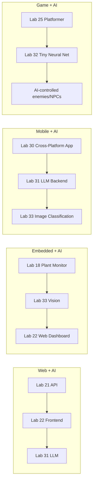
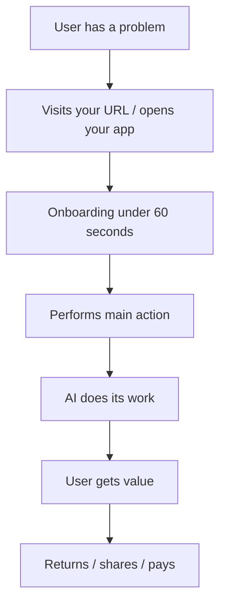

# Lab 34 — Capstone: Build And Ship Your Own AI-Powered Product

> "The most valuable thing you can build right now is an AI product that does *one thing* well for *one specific group of people.*"

**Time budget:** ~2 weeks for the core lab, with extension challenges that grow it to 3–5 weeks (or longer — this can become your real first product).
**Preferred languages:** Whatever fits the product — usually TypeScript + Python, often with one or two of the labs from the AI/web/mobile/embedded tracks combined.
**Working style:** solo, or in a team of up to 3 people.

---

## The hook

There's a curious gap right now in the world of software: **the giants ship general-purpose AI products** (ChatGPT, Claude, Gemini), and **a million tiny niches are still completely underserved.** A polished AI product for **Ukrainian aviation regulations** doesn't exist. An AI tutor that knows *only* your professor's lecture notes doesn't exist. A flight-instructor companion that watches a student-pilot's actions in a simulator and grades them in real time doesn't exist. A model that turns a hand-drawn aircraft sketch into a 3D printable file doesn't exist. A garden-watering robot that uses a camera to detect when a plant is wilting doesn't exist (well — *yet*).

For the last three labs, you've learned **to talk to LLMs (Lab 31), to build neural networks (Lab 32), and to make computers see (Lab 33).** This capstone is the lab where you take **at least two of those AI skills**, combine them with **at least one skill from the rest of the course** (web, mobile, embedded, game), and ship **a single coherent product** to real humans.

This is the lab where your portfolio stops looking like a list of academic exercises and starts looking like a *founder*'s. *That* is the lab a recruiter remembers.

If you want a perfect appetizer, watch [**Andrej Karpathy's *Software 3.0*** (Sequoia AI Ascent 2024)](https://www.youtube.com/watch?v=LCEmiRjPEtQ) — Karpathy on what programming looks like when LLMs are part of the stack. Pair with [**Indie Hackers podcasts**](https://www.indiehackers.com/podcast) about people shipping small AI products solo, and [**Pieter Levels**](https://levels.io/) — a famous solo developer who has shipped 30+ small products on top of AI APIs.

---

## Why this is worth your time

- **A capstone product is the single most-valuable item in a junior portfolio.** It says "this person can scope, design, build, ship, and iterate on something complete."
- **AI products are uniquely underserved at the niche level.** Big-tech can't build a beautiful AI tutor for *Ukrainian aviation cadets*; you can.
- The skills (**system design, scoping, AI cost-awareness, deployment, real-user feedback, monetization-readiness**) are the *real* skills of a working software engineer — and almost no one teaches them in a structured way.
- This lab is **the most likely to become your real first product or the inspiration for your first job.** Multiple students from courses like this have launched products from a final capstone.
- **It is also the lab that proves you can finish.** "Capstone" beats "prototype" *every single time* on a resume.

---

## The target

> **Instructor TODO:** add reference examples of polished, narrow AI products (Cursor, Tldraw, Suno, Krea, Granola) to `docs/`.

**Basic — "It's a Product, Not a Demo"**
You've built **one cohesive product** that combines:
- **at least one AI capability** (LLM call, fine-tuned model, vision pipeline — see "What counts as AI" below), AND
- **at least one shipping skill** from another lab (a web frontend, a mobile app, an embedded device, a game),
- **deployed publicly** (URL, app store listing, sideloadable APK, working hardware).
- **Used by at least 5 humans you don't live with.**

The product solves *one specific problem* for *one specific kind of person*.

**Standard — "It's Polished and Loved"**
Everything from Basic, plus:
- a **landing page** that explains what it is in 10 seconds (one screenshot/GIF, one sentence, one "try it" button),
- **real onboarding** (a first-time user can do the main thing in <60 seconds, no instructions),
- handles **failure modes gracefully** (offline, model errors, rate limits, weird inputs),
- **tracks at least one metric** (visits, sessions, "main action" completed),
- a written **post-mortem of what users did and how you iterated** — *real* feedback from at least 3 users, *real* changes you made because of it,
- 10+ humans have used it.

**Advanced — "It's Real"**
You've added something serious: **monetization-ready** (a polished payments-ready setup, even if free for now), **a real userbase** (50+ users), **a benchmark or eval system** (measurable correctness), **integration across 3+ labs** (e.g., AI + fullstack + mobile + embedded), **open source with a community** (one external pull request, a Discord/Telegram channel), or **a small revenue moment** (one paid user, one Patreon, one $5 sale on Gumroad).

---

## The big idea, in two diagrams

### What "AI capstone" can look like — choose one shape



### Product flow (universal)



The mantra: **one user, one problem, one path through the product.** Capstone projects fail when they try to be *everything* for *everyone*.

---

## Two-week plan with milestones

This lab works only if you're **brutally disciplined about scope.** Plan accordingly.

**Week 1 — Make the smallest possible version**

- **Day 1 — Pick the ONE problem.** Write it on a sticky note. *"AI tutor for FAA Part 61 ground-school questions, for student pilots in Ukraine."* That's a real problem statement; "AI productivity tool" is not. **Pick at least one AI capability + one shipping skill.** Get user-zero (you, a friend) to confirm "yes, I would use this."
- **Day 2 — Validate before building.** Talk to 3 potential users (real humans, not GPT). What do they currently do? What are their frustrations? What would they pay for? *15 minutes each.* Take notes.
- **Day 3 — Sketch the smallest possible version.** What's the minimum product that would solve the problem for one person? Whiteboard it. Cut it in half.
- **Day 4 — Build the AI core.** The model call, the prompt, the inference, the data pipeline — whatever the AI part is.
- **Day 5 — Build the shell.** The web page, the mobile app, the hardware enclosure — whatever the user touches.
- **Day 6 — Wire them.** End-to-end works. *Milestone: a single user can do the main thing.*
- **Day 7 — Deploy + show user-zero.** Get real human feedback by Day 7.

**At this point you've completed the Basic level.**

**Week 2 — Make it usable**

- **Day 8 — Onboarding.** A new user can do the main thing in <60 seconds without help. *Watch a stranger try it.*
- **Day 9 — Failure modes.** What happens when the model fails? When the user uploads garbage? When the network is slow? Each handled gracefully.
- **Day 10 — Get to 5+ users.** Post on a relevant subreddit / Telegram channel / Discord. Share with friends. Cold-DM 5 strangers. *Real usage > local testing.*
- **Day 11 — Iterate based on feedback.** Watch what users do; fix the friction.
- **Day 12 — Pick a side quest.**
- **Day 13 — Landing page, README, demo video.**
- **Day 14 — Buffer + final user push.**

---

## Levels

### Basic — "It's a Product" (~16–22 hours)
- one cohesive product
- AI capability + shipping skill, both real
- deployed publicly
- 5+ real users

### Standard — "Polished and Loved" (~22–32 hours)
- everything from Basic
- landing page
- onboarding works without instructions
- graceful failure modes
- one tracked metric
- a real user-feedback writeup (3+ users, written iterations)
- 10+ users

### Advanced — "Side Quests" (each ~3–10h)

- **Monetization Setup.** Stripe / Lemon Squeezy / Gumroad ready. Free tier + a paid tier defined. (Even if free for now.)
- **A Real Userbase.** 50+ users. Document how they found you.
- **Eval / Benchmark.** Measurable correctness against a held-out test set. Plot quality over iterations.
- **Multi-Lab Integration.** AI + fullstack + mobile, or AI + embedded + web — three+ labs in one product.
- **Open Source + Community.** Public repo, contribute guide, CI, one external PR.
- **Real Revenue.** One paid user. One $5 Gumroad sale. One Patreon supporter. *This is profoundly valuable for a portfolio.*
- **Production AI Cost Awareness.** Per-user cost tracked, optimized, documented.
- **Privacy / Ethics.** Especially if your product handles personal data, AI generations, or ML predictions about humans.
- **Accessibility.** WCAG-AA compliant; works with screen readers; supports low-bandwidth.
- **Localization.** Ukrainian + English (or another second language).

---

## Extension challenges (3–5 weeks → forever)

- **Take It To Real Users.** Don't stop at 10. Get to 100. Get to 1000.
- **Make It A Real Side Hustle.** A real product on Gumroad / Stripe with real revenue, however small.
- **Open Source It.** Publish, document, attract contributors, become known for it.
- **Apply To A YC / Antler / Local Startup Accelerator.** Capstone projects are *exactly* the size of pre-seed pitches. Multiple successful startups began as capstones.

---

## What counts as "AI"?

A capstone is "AI-powered" if it includes at least one of:
- An LLM call (your own RAG, plain GPT/Claude/Gemini, or fine-tuned).
- A trained or pretrained ML model (vision, audio, embeddings, classification).
- A traditional algorithm with AI-style results (a search engine with semantic retrieval, an embedding-based recommender, etc.).

What does **not** count: "It uses an API that uses AI" (e.g., Google Maps). The AI must be a deliberate, technical part *you* designed.

---

## Make it yours (required)

Pick a real problem you care about. Some directions:

**Aviation / Defense flavor (Ukrainian context):**
- **Ground-School Tutor.** RAG over FAR/AIM, Ukraine's aviation regulations, or your professor's actual notes.
- **Aviation Phrase Trainer.** Generate ATC scenarios; the student's voice response is transcribed (Whisper) and graded by an LLM.
- **Drone-Footage Reviewer.** Upload a drone video; vision-detects targets; LLM writes a structured report.
- **Mission Planner.** A small app that takes a mission description and generates structured waypoints + risk analysis.
- **Combat-Casualty First-Aid Trainer.** A flashcard app where the LLM generates new variants of TCCC scenarios.

**Education flavor:**
- **Student Tutor.** RAG over your university's actual textbooks (with permission). Free to your classmates.
- **Code Review Bot.** GitHub bot that uses an LLM to comment on PRs in a specific style.
- **Lecture Transcriber + Summarizer.** Whisper on lecture audio, LLM summary, searchable archive.

**Daily-life flavor:**
- **Recipe Helper.** "Here's what's in my fridge"; LLM suggests recipes; image classifier verifies what's there.
- **AI Personal Trainer.** Webcam-based form check on push-ups (vision) + LLM-generated workout plans.
- **AI Therapist Journal** — *only with extreme care, strong disclaimers, and no medical claims.*
- **Plant Doctor.** Photo of a plant + symptoms; AI diagnoses; recommends action. (Combines Lab 18 + Lab 33 + Lab 31.)

**Creative flavor:**
- **AI Music Tagger.** Upload a song; an LLM writes a description; an embedding classifier suggests "songs like this."
- **AI-Generated Game NPC.** A Lab 25/27 game where NPC dialogue is generated live.
- **AI Drawing Critic.** Upload a sketch; vision describes it; LLM gives encouraging feedback.

**Embedded flavor:**
- **Smart Plant Monitor with AI Diagnosis** — Lab 18's hardware + Lab 33's vision.
- **AI-Driven Self-Balancer** — Lab 17 + a vision input that follows a colored target.
- **Voice-Controlled IoT** — Lab 16's beacon + on-device wake-word detection.

You'll defend why you chose your problem and why you're well-positioned to solve it.

---

## Working solo or in a team

Solo: heroic but doable for a tightly scoped product.

Team:
- *By layer:* one person owns AI; one owns frontend; one owns backend / hardware. Specialization works extremely well at this scale.
- *By milestone:* one person owns Basic; another drives Standard; another hunts Advanced + user acquisition.
- *By skill:* if your team has someone who's strong at design, *let them lead the UX.* Capstones win or lose on UX.

Two team rules: **git from day one**, **list who did what**, and *one* thing extra: **write a clear product spec the team agrees on by day 2** — the team's biggest enemy is unspoken disagreement about scope.

---

## Tooling and language tips

**Whatever fits the product.** Some common stacks:
- **Web + AI:** Next.js + Vercel AI SDK + OpenAI/Claude + Postgres on Vercel.
- **Mobile + AI:** Expo + React Native + a backend that does the AI heavy lifting.
- **Embedded + AI:** Lab 16/17/18's hardware + a Raspberry Pi/Jetson running vision + a web dashboard.
- **Game + AI:** Godot/Unity + an LLM API for narrative or AI for procedural content.

**Anyone**
- **Pick the simplest stack you can ship.** A capstone failed by overengineering is not a capstone.
- **Always set a hard billing limit** on AI provider accounts.
- **Track usage from day one.** Even "console.log every API call" beats "no idea what's happening."
- **Watch a real user.** *In person, in silence.* The single most valuable thing you can do for any product.
- **Write a one-page README before any code.** What does it do? Who is it for? What's the main flow?
- **Cut scope twice.** Once on day 1, once on day 5.

---

## Suggested project structure

This depends entirely on the product, but most capstones look something like:

```txt
my-ai-product/
  README.md                     # the single most-important file
  PRODUCT.md                    # one-pager: what it is, who it's for, the user flow
  apps/                         # for monorepos
    web/                        # Lab 22-style frontend
    mobile/                     # if Lab 30
  services/
    api/                        # Lab 21-style backend
    ai/                         # the model calls, prompts, evals
  hardware/                     # if Lab 16/17/18 is involved
    firmware/
    enclosure/
  data/
    sample/
    eval/
  docs/
    landing/                    # the public landing page
    screenshots/
    demo.gif
    user-feedback/
      session1.md
      session2.md
      iterations.md
```

---

## When you get stuck

- **"I don't know what to build."** Pick a problem *you have personally.* The next-best is a problem your closest friend has. *Don't pick from market-research lists.*
- **"It's too big."** It is. Cut a third. Cut another third. Your week-1 version should embarrass you for being too small.
- **"No one is using it."** They won't, by accident. *Go to where your users are* (Telegram channel, subreddit, Discord, real-life class) and ask 5 strangers to try it.
- **"It's slow / expensive on AI."** Cache aggressively, downsize models, batch requests, fall back to cheaper models for non-critical paths.
- **"It works for me but not for users."** Watch a user use it. Quietly. The bug will reveal itself in 90 seconds.
- **"My team disagrees about scope."** Write the product spec down, sign it, stop arguing.

If stuck for 30+ minutes: **ship a worse version.** A finished, deployed, used product that does 30% of your dream is *infinitely* more valuable than a beautiful 80% prototype.

---

## Deployment checklist

- [ ] Live URL / app / device works for someone other than the team.
- [ ] Onboarding works in <60 seconds without instructions.
- [ ] Mobile-friendly (or "play on desktop" message if not).
- [ ] No private API keys exposed.
- [ ] Hard billing limits on all AI providers.
- [ ] Rate limiting + auth, *especially* if costs scale per user.
- [ ] Failure modes handled visibly.
- [ ] Privacy notice / disclaimer in the README.
- [ ] At least 5 humans (not your immediate team) have used it.
- [ ] Landing page or polished README that a stranger can understand in 10 seconds.

---

## What recruiters look at

- **They use it.** Without instructions. The first 60 seconds are the entire interview.
- **They look at the landing page.** Does it explain the product in 10 seconds? Is the screenshot/GIF good?
- **They read your user-feedback writeup.** *This is the single most-impressive section.* "I watched 5 users; here's what surprised me; here's what I changed."
- **They check the architecture.** Capstones with thoughtful architecture (clean separation, sensible deploy targets, real eval/metric loops) are *vastly* stronger.
- **They check the GitHub.** Multi-week activity, regular commits, real documentation = signal.
- **They open the live demo.** It must work. The first impression of a broken capstone is *very* hard to recover from.

---

## What to put in your README

1. Project name + tagline (in 10 words).
2. **Live link** (URL, app store, or sideload instructions).
3. A 30-second video.
4. Who it's for + the one problem it solves.
5. Tech stack.
6. **Architecture diagram.**
7. **What's "AI" about it** — exactly which models, which prompts, which datasets.
8. Eval / quality metrics (if applicable).
9. **User-feedback writeup:** "I watched 3 users use this. Here's what they did. Here's what surprised me. Here's what I changed."
10. Cost: rough $/user/month if AI-heavy.
11. Deployment & how to run locally.
12. Side quests + extensions completed.
13. Honest limitations and ethical notes.
14. If team: who did what.

---

## Reflection

Be ready to:

1. **Live demo, in front of the panel.** Short. Confident. The first 60 seconds matter most.
2. **Walk through the user's journey** — from "they hear about it" to "they're using it daily."
3. **Show real users using your product.** A 30-second clip, with their consent.
4. **What was your single biggest scope cut?** When did you cut it? What survived?
5. **What did you learn from real users that you couldn't have predicted?**
6. **What's the cost per user?** What does that mean for the business model?
7. **What's your fallback** when the LLM is down or the model gives a bad answer?
8. **Where does your product fail?** Be honest. Recruiters love this.
9. **What would you do with another 6 months?**

---

## Showcase

End-of-semester gallery — anonymous voting for **most useful capstone**, **best product/UX**, **most ambitious technical scope**, and **most surprising user-feedback writeup**. Bring laptops, phones, *or* hardware. Recruiters will *try* the products live; this is where they remember names.

---

## Going further

- *Software 3.0* — Andrej Karpathy at Sequoia AI Ascent 2024 (YouTube).
- *Indie Hackers* podcast.
- *The Mom Test* by Rob Fitzpatrick — a tiny book on talking to users.
- *Make Something People Want* — Paul Graham.
- *Pieter Levels' YouTube interviews* — solo developer who has shipped 30+ products.
- *Eugene Yan's blog* — production AI lessons from real systems.
- *Hugging Face's *Build Your First AI App*** course.
- *DeepLearning.AI's *Building Production-Grade LLM Apps***.

---

## A final word

Most software students leave university with a portfolio of academic exercises — a CRUD app for a fake bookstore, a sorting visualizer, a chess engine no one will use. *You* are leaving with a real product that real humans depend on. Even if the user count is 5 or 10 or 50, that small thing — the existence of a real artifact, used by real people, born from your hands — changes how you see the rest of your career. You stop being a student of programming and become a person who makes things.

Make this one count.

---

> *This is the final lab of the course. Look back at the previous 33. Pick the project that scared you most. The thing you wished you'd done. Build it now, with the AI tools at your disposal, and make it real.*
