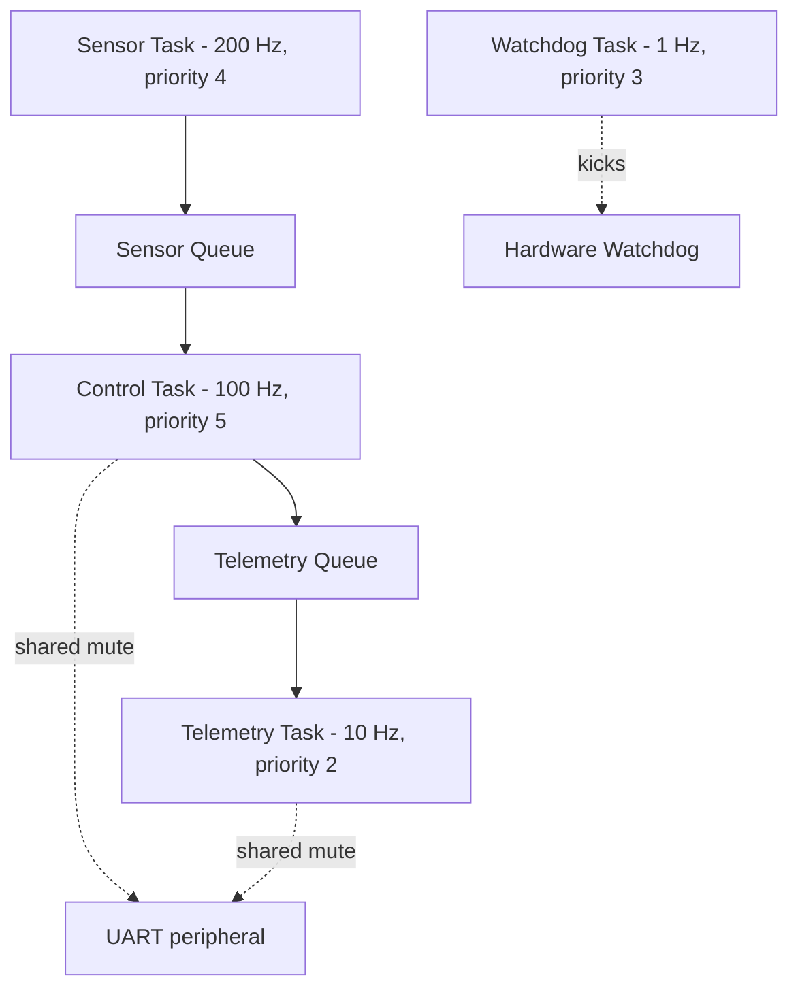
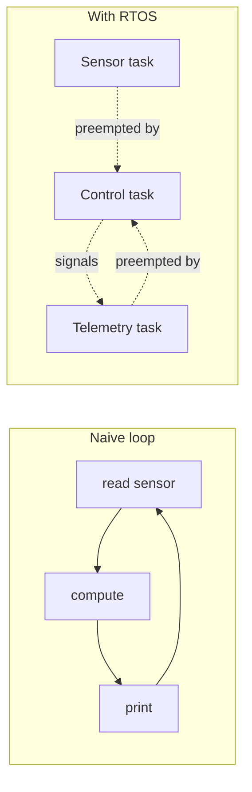

# Lab 35 — A Mini Autopilot On A Real RTOS: Multitasking The Way Drones Do It

> "If you don't have an RTOS, you don't have determinism. If you don't have determinism, you don't have an autopilot."
> — every flight-controller engineer, condensed

**Time budget:** ~2 weeks for the core lab, with extension challenges that grow it to 3–5 weeks.
**Preferred stack:** **FreeRTOS** (recommended primary — gentlest path, runs on Arduino-style boards) or **Zephyr** (modern, Linux-Foundation, used by Nordic / Intel) or **NuttX** (the RTOS that actually runs Pixhawk / PX4 — the steepest path but the most aviation-real).
**Working style:** solo, or in a team of up to 3 people.

---

## The hook

In 2009 a small group of researchers at ETH Zürich and a couple of open-source hackers started a project called **PX4** — an autopilot that would let anyone fly a drone autonomously with software they could read and modify. It needed to do many things at once: read an IMU at 1000 Hz, run a control loop at 250 Hz, talk to GPS at 10 Hz, send telemetry over radio at 50 Hz, and *never miss a single deadline.* On a $5 microcontroller. With no margin for error. Drop a single 4-millisecond control-loop tick at the wrong moment and the drone falls out of the sky.

The thing that makes that possible is a **Real-Time Operating System (RTOS)**. An RTOS is a tiny kernel — typically *under 10 KB* — that runs on a microcontroller and gives you something a normal `loop()` can't: **deterministic, prioritized, preemptive multitasking.** You write your code as separate **tasks**; the RTOS schedules them by priority and deadline; *fast tasks always win.* The result is software that does ten things at once and can prove, mathematically, that *nothing important got missed.*

Today you find RTOSes inside almost every safety-critical embedded system on Earth: **Pixhawk drones, the Boeing 787 and Airbus A350, anti-lock braking systems, pacemakers, missile guidance computers, Mars rovers, the Perseverance helicopter Ingenuity.** PX4's open-source autopilot runs on **NuttX** (a POSIX-style RTOS); ArduPilot runs on **ChibiOS**; consumer-grade IoT runs on **FreeRTOS** or **Zephyr**. They're all the same shape.

In this lab, you're going to build a **mini autopilot** — a real microcontroller running a real RTOS, with multiple cooperating tasks, priorities, queues, and *measurable timing guarantees*. By the end, you'll be able to point at a logic-analyzer trace and say "the control task always runs within 4 ms of its deadline, even when the telemetry task is busy" — and that sentence is the *whole game* of real-time systems.

If you want a perfect appetizer, watch [**Phil's Lab — *Real-Time Operating Systems Crash Course*** (YouTube, ~30 min)](https://www.youtube.com/c/PhilsLab) — Phil is an aerospace engineer; the explanation is uniquely aviation-flavored. Pair with [**Liam Bindle's *FreeRTOS in 100 Seconds***](https://www.youtube.com/) for a mental-model appetizer, and the **canonical** book: [*Mastering the FreeRTOS Real Time Kernel*](https://www.freertos.org/Documentation/RTOS_book.html) — *free PDF*, written by Richard Barry (FreeRTOS's creator).

---

## Why this is worth your time

- **RTOS skills are some of the rarest on a 1st-year embedded CV.** Aerospace, drone, automotive, medical-device, and industrial recruiters ask about them specifically. Almost no juniors have hands-on RTOS work.
- The skills (**preemptive scheduling, priority inversion, task communication, hardware timers, interrupt-safe coding**) are the *exact* skills that distinguish a "I made an Arduino blink" engineer from a "I write firmware for a real product" engineer.
- **Connects directly to Ukrainian aviation industry.** Drone autopilots, missile guidance, satellite avionics — every one of these needs RTOS thinking.
- A **traceable, measurable, deterministic** mini autopilot in your portfolio reads like a small piece of a real flight stack.

---

## The target

> **Instructor TODO:** add reference logic-analyzer screenshots and a video of a working mini-autopilot to `docs/`.

**Basic — "Multiple Tasks Cooperate"**
A microcontroller running a real RTOS with **at least 3 tasks**:
- a **sensor task** (reads a temperature / IMU / button at a fixed rate),
- a **control task** (consumes sensor data, makes a decision: e.g., turns an LED on if the temperature crosses a threshold),
- a **telemetry task** (prints structured output over UART at a slower rate).
Tasks communicate via **queues** (no shared globals). Each task has a deadline; you've measured the actual periods on a logic analyzer or via timestamps and shown they hold within ±1 ms.

**Standard — "It Looks Like A Real Autopilot"**
Everything from Basic, plus:
- a **mutex-protected shared resource** (e.g., the UART itself — one printer, multiple producers),
- a **priority hierarchy** that you've designed deliberately (high priority for control, lower for telemetry, lowest for housekeeping),
- a **watchdog task** that detects a stalled task and resets the system,
- **non-blocking everywhere** — no `delay()` longer than 1 ms in any task,
- **demonstrated determinism**: a worst-case latency report ("control loop wakes up within 200 µs of its deadline 99.9% of the time") backed by real measurements,
- a **clean state machine** for the autopilot's modes (`STANDBY → ARMED → ACTIVE → FAULT`).

**Advanced — "It's A Real Avionics Stack"**
You've added something serious: **NuttX** (the actual RTOS Pixhawk runs — much steeper learning curve, but you'll be reading the same kernel code that runs in real drones), **MAVLink-style structured telemetry** (CRC-protected binary messages — see Lab 37), **a real PID control loop** as a high-priority task (connect to Lab 17), **fault injection testing** (deliberately break tasks; verify the watchdog catches it), **dual-core scheduling** (ESP32 has two cores; assign tasks across them and document the tradeoffs), or **MISRA-C / strict static analysis** to catch the bugs that aerospace certification cares about.

---

## The big idea, in two diagrams

### Tasks, queues, and priorities



The **scheduler** runs every tick. The **highest-priority** ready task always wins. Tasks that aren't ready (waiting on a queue, a delay, a semaphore) sleep — they consume zero CPU.

### Why an RTOS isn't just "smart `loop()`"



In a `loop()`, a slow `printf` blocks everything for 80 ms. In an RTOS, a high-priority control task **preempts** the printer mid-print and runs *now*. That single difference is what lets a drone fly.

---

## Two-week plan with milestones

**Week 1 — Tasks come alive**

- **Day 1 — Pick the stack and get the toolchain.** **FreeRTOS on an ESP32 / STM32 / Arduino R4** is the recommended starting path (PlatformIO + Arduino-mode + FreeRTOS comes pre-bundled). Or **Zephyr** with its `west` toolchain. Or **NuttX** (advanced). Document your chosen platform.
- **Day 2 — "Hello, two tasks."** Two tasks blinking two LEDs at different rates (`vTaskDelay` for FreeRTOS, `k_msleep` for Zephyr). Confirm with your eyes that both blink independently. *Milestone: real concurrent execution on a $5 chip.*
- **Day 3 — Add the third task** (UART telemetry). Confirm all three run together without interfering.
- **Day 4 — Queues, not globals.** Replace any global variable with a `xQueueSendToBack` / `xQueueReceive` pair. Sensor task produces; control task consumes. *Milestone: zero shared mutable state.*
- **Day 5 — Mutex on UART.** Two tasks both want to print. Without a mutex, their messages interleave into garbage. Add an `xSemaphoreCreateMutex` and confirm clean output.
- **Day 6 — Measure timing.** Add a small "timestamp at task start" → print delta from expected. Run for 60 seconds. Plot or print the worst-case jitter. *Milestone: you have a real-time-systems plot.*
- **Day 7 — Polish + first demo.** Clean output, clean state. Take a video.

**At this point you've completed the Basic level.**

**Week 2 — Make it look like a flight controller**

- **Day 8 — Priority hierarchy.** Define priorities: `CONTROL > SENSOR > WATCHDOG > TELEMETRY > HOUSEKEEPING`. Document why.
- **Day 9 — State machine.** `STANDBY → ARMED → ACTIVE → FAULT`. UART commands move between states. Each task respects the current state.
- **Day 10 — Watchdog.** A separate task that "kicks" the hardware watchdog every 500 ms. If a higher-priority task stalls, the watchdog stops kicking, the chip resets, and a clean recovery happens. *Milestone: deliberate fault injection (a `while(1){}` in the control task) → reset → recovery.*
- **Day 11 — Worst-case latency report.** Instrument every task with timing. Run for 5 minutes. Print: "control task max jitter 187 µs, mean 23 µs, missed deadlines: 0."
- **Day 12 — Pick a side quest.**
- **Day 13 — Polish, README, screenshots, demo video.**
- **Day 14 — Buffer.**

---

## Levels

### Basic — "Multiple Tasks Cooperate" (~14–18 hours)
- ≥ 3 RTOS tasks running concurrently
- queues for inter-task communication (no shared globals)
- measured periods within ±1 ms of design
- structured UART output

### Standard — "Like A Real Autopilot" (~18–28 hours)
- everything from Basic
- mutex-protected shared resources
- explicit priority hierarchy with rationale
- watchdog task + recovery
- state machine
- worst-case latency report from real measurements

### Advanced — "Side Quests" (each ~3–10h)

- **Move to NuttX.** The RTOS that runs Pixhawk. Same lab, harder toolchain, *much* stronger aviation signal.
- **Real PID Control Loop.** Connect to Lab 17 — your control task becomes a real PID. Drives a motor or simulates a balancer.
- **Fault Injection.** Deliberate stalls, infinite loops, deadline overruns. Show your watchdog catches each.
- **Dual-Core (ESP32).** Use `xTaskCreatePinnedToCore` to split tasks across cores. Document the timing improvement.
- **Static Analysis.** Run `cppcheck`, `clang-tidy`, or a MISRA-C subset. Document and fix the warnings.
- **Trace Visualization.** Use **Tracealyzer** (free for students) or **SystemView** (Segger) to record a full trace. Beautiful, professional, recruiter-impressive.
- **Hard-real-time Linux comparison.** Run the same logic on a Raspberry Pi with **PREEMPT_RT** kernel. Compare jitter to your microcontroller. Connects to Lab 36.
- **CAN bus.** Implement a tiny CAN protocol between two microcontrollers. CAN is what cars and a lot of avionics talk on.
- **MAVLink Telemetry.** Send your telemetry as MAVLink messages over UART. Connects directly to Lab 37.
- **Power Profiling.** Measure current draw with each task active vs. idle. Critical for battery-powered drones.

---

## Extension challenges (3–5 weeks)

- **A Real Mini Autopilot.** Mount on a 2-DOF gimbal or a small wheeled robot. Run actual control loops at 250 Hz against an IMU. Demonstrate stability live.
- **Combine with Lab 17 + Lab 33.** PID balancer + a webcam + a vision pipeline (Lab 33's CV) → the robot keeps a colored ball balanced under camera observation. Three labs, one demo.
- **Combine with Lab 37.** Use your MAVLink-speaking microcontroller as a *companion sensor* to a PX4 SITL drone. The drone simulates flight; your microcontroller injects real telemetry from a real sensor (e.g., a pitot tube on a fan) into the simulation.
- **Open-source firmware.** Add a license, GitHub Actions building it from scratch in a Docker container, contributing guide. Get one external pull request.
- **Write a blog post or paper.** "What I learned re-implementing a Pixhawk-style scheduler on a $5 ESP32." Aerospace engineers will read it.

---

## Make it yours (required)

The mechanics (tasks, queues, priorities) are universal. The *system* is yours.

- **Mini Rocket Flight Computer.** Sensor = barometer + IMU. Control = "detect liftoff, log every 10 ms, deploy parachute at apogee." Telemetry = serial. Test by waving the board violently. Aviation flavor.
- **Drone Mini-Autopilot.** Sensor = IMU. Control = "compute desired motor outputs from a target attitude". Telemetry = MAVLink. Don't actually fly anything; the demo is the firmware.
- **Quadcopter Stabilizer.** PID + IMU + 4 motor PWM outputs. Don't fly it; benchtest only — but show the motors balance the rig live.
- **Cubesat Subsystem.** Sensor = sun-direction sensor (or simulated one). Control = "log attitude every second; downlink every minute." Telemetry = "slow radio link" simulated over UART.
- **Industrial Sensor Bus.** A network of microcontrollers over CAN, each running the same RTOS firmware, reporting to a master. Industrial-IoT flavor.
- **A "non-aviation" pure RTOS demo.** A traffic-light controller with priority preemption (emergency vehicle approaching → all lights stop → emergency lane clears). Cleaner concept demo without aviation stakes.

You'll defend why you chose your system.

---

## Working solo or in a team

Solo: very feasible. RTOS is a deeply *individual* mental shift; nothing replaces typing the queue calls yourself.

Team:
- *By task layer:* one person owns sensor + queue plumbing; the other owns control + telemetry + state machine; if 3 — third person owns watchdog + measurement + the timing report.
- *By tier:* one person hits Standard solid; the other hunts Advanced (NuttX port, dual-core, MAVLink).
- *Across labs:* one team member could pair this with Lab 17 (their PID becomes your control task) or Lab 37 (their MAVLink GCS talks to your firmware).

Two team rules: **git from day one** (with a clean `.gitignore` for your toolchain) and **list who did what.** Each member must explain *priority inversion* and the watchdog's role.

---

## Tooling and platform tips

**FreeRTOS on ESP32 (recommended primary)**
- ESP32 ($5–10) ships with FreeRTOS preinstalled. PlatformIO + Arduino-mode = 5-minute setup.
- Two cores; a great platform for "split tasks across cores" side quest.
- Wi-Fi onboard for telemetry side quests.

**FreeRTOS on STM32 (Nucleo F411 or F446)**
- More "real avionics" feel; harder toolchain.
- STM32CubeIDE + the FreeRTOS middleware = guided.

**Zephyr on Nordic nRF52840 / ESP32 / Linux native**
- The modern, Linux-Foundation-backed RTOS. Used by serious products.
- Cleaner threading API than FreeRTOS, but steeper learning curve.
- *Native simulator:* `west build -b native_posix` runs Zephyr *as a Linux process* — perfect for "no hardware" path.

**NuttX on Pixhawk / Cube / generic ARM (advanced)**
- The actual Pixhawk OS. Tools are real, gnarly, and aerospace-grade.
- POSIX-style API.
- Pick this if you want the strongest aviation signal; otherwise FreeRTOS first.

**Anyone**
- **Never use `delay()` from the bare framework.** Always use the RTOS sleep (`vTaskDelay`, `k_msleep`, `up_mdelay`).
- **Never share a variable between tasks without a queue or mutex.** Race conditions on bare memory are the #1 RTOS bug.
- **Don't call printf from an interrupt.** ISRs are short, fast, and only signal — they post to a queue, the task does the work.
- **Stack sizes matter.** Tasks have *individual* stacks. Too small = stack overflow + mysterious reboots. Start at 4 KB per task; reduce later.
- **Measure, don't assume.** Always validate timing with real measurements. Logic analyzers ($15 USB clones work fine) are the single best investment for this lab.

---

## Suggested project structure

```txt
rtos-mini-autopilot/
  README.md
  platformio.ini                 # or CMakeLists.txt for Zephyr
  src/
    main.c                       # task creation, scheduler start
    tasks/
      sensor_task.c
      control_task.c
      telemetry_task.c
      watchdog_task.c
    state/
      state_machine.c            # STANDBY/ARMED/ACTIVE/FAULT
    drivers/
      imu.c                      # platform-specific HAL
      uart.c
    util/
      queues.c                   # the shared queue handles
      timing.c                   # measurement helpers
  docs/
    architecture.png
    state-machine.png
    timing-report.md             # the worst-case latency writeup
    screenshots/
    logic-analyzer-trace.png
```

---

## When you get stuck

- **Tasks don't run / "scheduler started" but nothing happens.** Stack size too small. Bump task stacks to 4 KB.
- **Random crashes after minutes.** Stack overflow in one task. Enable `configCHECK_FOR_STACK_OVERFLOW` (FreeRTOS) and you'll get a hook telling you which task.
- **Queue receive blocks forever.** No producer is sending. Or the queue is too small and items get dropped silently. Use `xQueueSend` with a timeout, not `portMAX_DELAY`, during dev.
- **UART output is garbled.** Two tasks printing without a mutex. Add one.
- **Priority inversion.** A high-priority task waits on a mutex held by a low-priority task that's been preempted. Symptom: occasional missed deadlines on the high-priority task. Fix: enable **priority inheritance mutexes** (FreeRTOS does this with `xSemaphoreCreateMutex`, but read the docs).
- **Watchdog resets the chip even though everything seems fine.** Your watchdog kicker isn't being scheduled. Either it's lower priority than a busy task, or its delay is wrong.

If stuck for 30+ minutes: **plug in a logic analyzer**, scope every task's heartbeat GPIO toggle, and *see* where time is being spent. RTOS bugs are visible if you can see the schedule.

---

## Deployment checklist

- [ ] Firmware builds end-to-end on a clean machine (toolchain documented in README).
- [ ] All tasks start and run without stack overflows over 1 hour of operation.
- [ ] Measured worst-case jitter for each task in `docs/timing-report.md`.
- [ ] No use of bare-framework `delay()` over 1 ms; only RTOS sleeps.
- [ ] No shared globals between tasks; only queues + mutexes.
- [ ] State machine documented with a diagram.
- [ ] Fault injection demo recorded (deliberate stall → watchdog reset).
- [ ] Logic-analyzer screenshot or timing graph in the README.
- [ ] **A 30-second video** showing all three+ tasks running concurrently (LEDs blinking, UART streaming, control acting).
- [ ] No private API keys / Wi-Fi passwords in source.

---

## What recruiters look at

- **Aerospace / drone / automotive recruiters open this lab first.** RTOS work is *uniquely* signalable — almost no juniors have it.
- **They look at the timing report.** "Worst-case jitter 187 µs over 5 minutes, zero missed deadlines" is real-time-systems poetry. A vague "it works fast" is unsignalable.
- **They look at task communication.** Queues + mutexes = "this person knows concurrent systems." Shared globals = "still a beginner."
- **They look at the priority hierarchy.** A documented rationale ("control > sensor because dropping a sensor read is recoverable, dropping a control loop is a crash") reads as someone who's read real flight-controller code.
- **They look at the state machine.** Clean enums, deliberate transitions, error states = professional firmware shape.
- **They look at the watchdog demo.** Deliberate fault injection + recovery video = strong signal of someone who has worked with safety-critical systems.
- **They look for the personal twist.** A rocket flight computer, a quadcopter stabilizer, a cubesat subsystem reads as "I built something I cared about" rather than "I followed a tutorial."

---

## What to put in your README

1. Project name + tagline (the system you built).
2. **A 30-second video** of all tasks running.
3. **Architecture diagram** (tasks, queues, mutexes).
4. **State machine diagram.**
5. Tech stack: which RTOS, which board, which toolchain.
6. **Priority hierarchy with rationale** (one paragraph per task).
7. **Worst-case latency report** with real numbers.
8. **Fault-injection demo** — describe what you broke and how the system recovered.
9. How to build and flash.
10. Side quests + extensions completed.
11. Honest limitations: where it's brittle, what real avionics certification would still demand.
12. If team: who did what.

---

## Reflection

Be ready to:

1. **Live demo.** Power on. Show three tasks concurrently doing their thing.
2. **Inject a fault.** Stall the sensor task. Show the watchdog reset and recovery.
3. **Walk through one task switch.** What happens between the moment a high-priority task becomes ready and the moment it actually runs?
4. **What is priority inversion?** Why does it matter? How did you defend against it?
5. **Why queues and not shared globals?** What goes wrong without queues?
6. **What's the difference** between an interrupt and a task? When do you use which?
7. **What changes** if this were certified avionics code (DO-178C)? Why is RTOS choice so heavily regulated?
8. **What was the hardest bug** — toolchain, scheduling, or hardware?

---

## Showcase

End-of-semester gallery — anonymous voting for **most professional firmware**, **best timing report**, **most ambitious system**, and **best fault-injection demo**. Bring the device running; classmates will inject faults to try to break it.

---

## Going further

- *Mastering the FreeRTOS Real Time Kernel* by Richard Barry — free PDF, the canonical book.
- *Phil's Lab* on YouTube — RTOS, STM32, aerospace-flavored.
- *Andreas Spiess* on YouTube — IoT, ESP32, friendly.
- *NuttX documentation* — for when you go pro.
- *Zephyr documentation* — modern, Linux-Foundation backed.
- *PX4 source code* on GitHub — read how a real autopilot is structured.
- *ArduPilot source code* on GitHub — same, different flavor.
- *Patterns for Time-Triggered Embedded Systems* by Michael Pont — older but timeless.
- *Real-Time Systems Design and Analysis* by Phillip Laplante — the textbook.

---

## A final word

The first time you watch your firmware on a logic analyzer — three tasks blinking different GPIOs at exact, predictable, *deterministic* periods, with the high-priority one preempting the low-priority one mid-print — there's a small click in your head. You stop seeing software as "code that runs eventually" and start seeing it as "code that runs *at this exact moment, no later.*" After that, every embedded system you encounter looks different. And when someone tells you "we're hiring for flight-controller firmware," you'll know what they're actually asking for. There aren't enough engineers who do. Be one.
