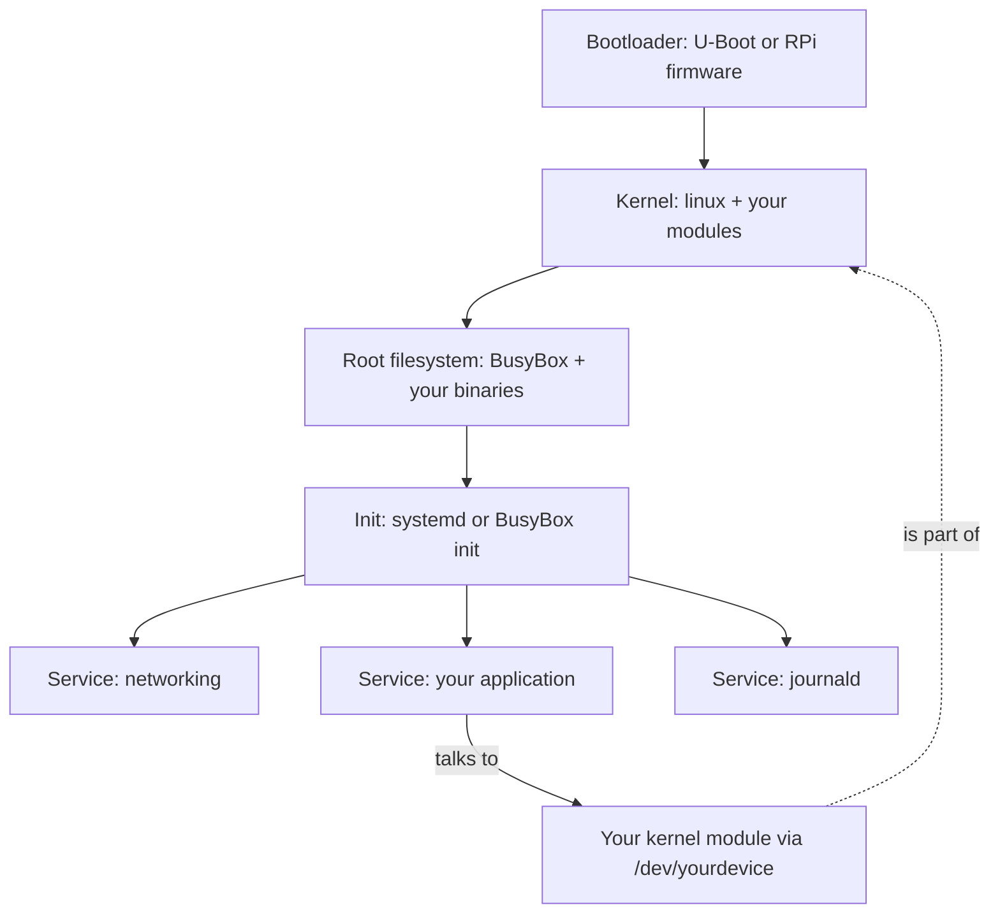

# Lab 36 — Below The Application: Build Your Own Embedded Linux From The Inside

> "Operating systems aren't magic. They're just code. Someone wrote it. You can read it. You can change it. You can build your own."
> — every kernel hacker's first realization

**Time budget:** ~2 weeks for the core lab, with extension challenges that grow it to 3–5 weeks.
**Preferred stack:** **Buildroot** on a **Raspberry Pi** (recommended — friendliest path) or **Yocto** (industrial path), plus a **Linux kernel module** written in C.
**Working style:** solo, or in a team of up to 3 people.

---

## The hook

The phone in your pocket runs Linux. The car you ride in runs Linux. **The Mars helicopter Ingenuity** ran Linux. **Almost every modern drone's "companion computer" — the smarter brain alongside the flight controller — is a small Linux board (Raspberry Pi, NVIDIA Jetson, BeagleBone) running a custom-tailored Linux distribution.** Linux is in your washing machine and on the International Space Station. It is the most-deployed operating system in human history, and almost every developer uses it without ever looking inside.

In this lab, you're going to *look inside.*

You'll build your own **custom Linux distribution** — a real bootable image, with your own kernel configuration, your own init system, your own application baked in. The Pi will boot in under 10 seconds, straight into your code, with nothing else running. You'll write a **Linux kernel module** — *your own piece of the kernel* — a tiny character device driver that other programs on the system can talk to. You'll learn what `init` actually is, what `systemd` *really* does, where logs go, and why your laptop takes 30 seconds to boot when it could take 3.

This is the lab where **the operating system stops being a black box.** After it, you'll read every Linux startup message, every `dmesg`, every `journalctl` entry differently — because you've sat where their authors sat. **It's also the most direct path into the highest-paying niche in software:** embedded Linux engineers in aerospace, automotive, telecom, and defense are paid like rockstars because almost no juniors learn this.

If you want a perfect appetizer, watch [**Bootlin's *Embedded Linux 101*** (free, world-class)](https://bootlin.com/training/) — Bootlin's training materials are the gold standard, all free, used by entire industries. Pair with [**Linus Torvalds' famous Aalto talk**](https://www.youtube.com/watch?v=oSSkDPK_PNg) (~1.5 hours, Linus on how Linux works), and [**Brendan Gregg's *Linux Performance Tools***](https://www.brendangregg.com/) for when you want to go deep.

---

## Why this is worth your time

- **Embedded Linux is one of the highest-leverage CS skills you can have at your stage.** Aerospace, automotive, satellite, drone, and robotics companies pay enormous premiums for engineers who can build and tune Linux for embedded targets.
- **Almost no 1st-year students touch this.** A working custom Buildroot image + a kernel module on a portfolio is a *career-defining* line item.
- The skills (**cross-compilation, kernel configuration, init systems, kernel modules, kbuild, sysfs, devtmpfs, journald**) are the *foundational* skills of operating systems work — once you have them, every Linux server, every IoT device, every drone companion computer suddenly makes sense.
- **Connects directly to drone software stacks.** Real drones use Linux companion computers (Raspberry Pi, Jetson) running [Lab 33](lab-33-object-detection-tracking.md)-style vision pipelines, [Lab 31](lab-31-llm-rag-app.md)-style LLM inference, MAVLink bridges, and mission planners. Building Linux for that target *is* this lab.

---

## The target

> **Instructor TODO:** add reference screenshots of a working custom Pi distro to `docs/`.

**Basic — "It Boots Into Your Code"**
A **custom Linux image** built with Buildroot for a Raspberry Pi (3, 4, or 5). The Pi boots from your image to a login prompt in under 30 seconds. Your application — written in C / C++ / Python / Rust — auto-starts at boot via an init service. The image is reproducible: anyone can `git clone` your repo and `make` to get the same SD-card image.

**Standard — "It Boots Fast And Has A Driver You Wrote"**
Everything from Basic, plus:
- **Boot time under 10 seconds** to your application (measured),
- a **Linux kernel module** you wrote (a "hello-world" character device or a simple GPIO driver) — loaded at boot, accessible via `/dev/yourdevice`,
- **journald + structured logs** from your application,
- a **read-only root filesystem** (so the Pi survives unsafe shutdowns — the way industrial Linux devices actually work),
- **systemd or BusyBox init** with proper service units,
- **networking** (Wi-Fi via wpa_supplicant or Ethernet via DHCP) configured at boot.

**Advanced — "It's A Real Embedded Linux Product"**
You've added: **Yocto-built image** (the industrial-grade alternative to Buildroot — what Mercedes-Benz, BMW, GE, every serious embedded company uses), **OTA update mechanism** (the Pi can update itself from a remote server), **PREEMPT_RT real-time kernel** (turn vanilla Linux into a hard-real-time system — connects to [Lab 35](lab-35-rtos-mini-autopilot.md)), **device tree modifications** (the *real* low-level configuration of how the kernel sees hardware), **a custom bootloader** (U-Boot configuration), or a **production observability stack** (Prometheus node exporter + a remote dashboard).

---

## The big idea, in two diagrams

### What "Linux" actually is



A "Linux distribution" is *just* these layers stacked. Ubuntu, Debian, Raspberry Pi OS — they're each a particular choice of bootloader + kernel config + root filesystem + init system + default services. **Buildroot lets you make your own.**

### What Buildroot does


You configure *what* you want; Buildroot fetches, compiles, and packages it. The result is a single SD-card image you can hand to anyone.

---

## Two-week plan with milestones

**Week 1 — Build a custom Linux from scratch**

- **Day 1 — Set up the host.** Linux build host (Ubuntu / Debian VM works perfectly on macOS / Windows). Install Buildroot dependencies. Get a Raspberry Pi (3, 4, or 5; Pi Zero 2 W also works). Get a USB-to-serial adapter (~$3) — *you will need a serial console for kernel debugging.*
- **Day 2 — First Buildroot build.** `make raspberrypi4_64_defconfig` (or your Pi's matching config). `make`. Wait ~45 minutes. Flash the resulting `sdcard.img` with `dd` or [Raspberry Pi Imager](https://www.raspberrypi.com/software/). Insert into Pi. Power on. *Milestone: a Pi booting your custom Linux.*
- **Day 3 — Add your application.** Write a tiny C/Python program. Add it to your Buildroot config as a custom package (Buildroot has clean `package/` conventions). Rebuild. Confirm it ships in the image.
- **Day 4 — Init script.** Add a BusyBox init script (or systemd unit) so your application starts on boot. Boot the Pi. *Milestone: Pi boots → your code runs.*
- **Day 5 — Networking.** Add Wi-Fi or Ethernet support to the build. Confirm the Pi can `ping` the internet at boot.
- **Day 6 — Boot-time analysis.** Measure where time goes during boot (`systemd-analyze` if systemd, or `bootchart` for BusyBox). Identify the slowest 3 services. Disable what you don't need.
- **Day 7 — Polish + reproducibility.** Document the build steps. Confirm a teammate / classmate can clone your repo and produce the same image.

**At this point you've completed the Basic level.**

**Week 2 — Look inside**

- **Day 8 — Hello kernel.** Write a tiny `hello.ko` — a kernel module with `module_init` that prints to `dmesg`. Cross-compile it against your Buildroot kernel. Load with `insmod`. *Milestone: your code runs **inside the kernel.***
- **Day 9 — Character device.** Upgrade `hello.ko` to register a character device (`/dev/myhello`). User-space programs can `cat /dev/myhello` and read a string from your kernel module. *Milestone: a real driver.*
- **Day 10 — Auto-load + integrate.** Configure your image to load the module at boot. Your application reads from `/dev/myhello` to demonstrate end-to-end.
- **Day 11 — Read-only root filesystem.** Reconfigure for read-only `/`, with a small writable `/var` overlay. Cut power mid-run; confirm the Pi boots cleanly. This is *exactly* how industrial / aviation / automotive Linux works.
- **Day 12 — Pick a side quest.**
- **Day 13 — Polish, README, screenshots, demo video.**
- **Day 14 — Buffer.**

---

## Levels

### Basic — "It Boots Into Your Code" (~16–22 hours)
- custom Buildroot image
- your application auto-starts at boot
- networking works
- boot to login under 30 seconds
- reproducible from a clean repo

### Standard — "Fast Boot + Your Driver" (~22–32 hours)
- everything from Basic
- boot under 10 seconds
- a working Linux kernel module you wrote
- journald or busybox-syslog logs from your application
- read-only root filesystem
- documented service units / init scripts

### Advanced — "Side Quests" (each ~3–10h)

- **Yocto Build.** Same image, but built with the Yocto Project. Industrial-grade. Recruiter-impressive.
- **OTA Updates.** Implement a Mender / RAUC / SWUpdate flow. Push a new image to the Pi from a server. Roll back on failure.
- **PREEMPT_RT Kernel.** Build a real-time-patched kernel. Measure latency. Connects to [Lab 35](lab-35-rtos-mini-autopilot.md).
- **Device Tree.** Customize the device tree to match a custom hardware configuration (e.g., add a fake sensor at I2C address 0x40).
- **U-Boot Configuration.** Replace the Pi's default firmware with a U-Boot configuration. Document the boot flow.
- **Secure Boot.** Sign your kernel + initramfs. Pi only boots images you signed.
- **Container on Linux.** Run your app inside a container (`runc`, `containerd`, or full Docker) on your custom image.
- **Telemetry.** Add a Prometheus node exporter; ship metrics to a remote Grafana.
- **Custom systemd target.** A boot mode that skips the network and starts only your app — for fastest possible boot.
- **Read /proc and /sys.** Write a small dashboard from your app that pulls live system stats from sysfs.

---

## Extension challenges (3–5 weeks)

- **Build the OS for a drone companion computer.** A real Pi running your custom Linux + a YOLOv8 object-detection pipeline ([Lab 33](lab-33-object-detection-tracking.md)) + a MAVLink bridge to a PX4 SITL drone ([Lab 37](lab-37-px4-mavlink-drone-stack.md)). Three labs, one stack.
- **Combine with [Lab 35](lab-35-rtos-mini-autopilot.md).** Write the same control logic twice — once on a microcontroller with FreeRTOS ([Lab 35](lab-35-rtos-mini-autopilot.md)), once on a Pi with PREEMPT_RT Linux (this lab). Compare jitter, power, complexity. *World-class* technical-writing piece.
- **Combine with [Lab 33](lab-33-object-detection-tracking.md) + [Lab 31](lab-31-llm-rag-app.md).** A Pi running your custom Linux that does on-device computer vision *and* a small local LLM. Edge AI in your custom OS.
- **Open source the build.** A clean repo, GitHub Actions building the image in a Docker container nightly, contributing guide. Get one external pull request.
- **Write a deep blog post.** "How I built a 6-second-boot Linux distro for a Raspberry Pi from scratch." This kind of writeup gets shared widely on Hacker News and Reddit.

---

## Make it yours (required)

The build pipeline is universal. The *device* is yours.

- **Drone Companion Computer.** A Pi that boots into a MAVLink bridge + an object-detection pipeline. Vision-based following, autonomous landing detection. Aviation-flavored. Connects to Labs 33 and 37.
- **Cubesat Onboard Computer.** Pi that runs a "mission scheduler" — log telemetry, take an image with the camera, downlink at simulated radio passes. Cubesat-flavored.
- **Industrial Sensor Gateway.** Pi that boots, reads sensors over I2C/SPI/CAN, and forwards data to a server. Industrial-IoT.
- **Aviation Logbook Server.** Pi that hosts a small web UI ([Lab 22](lab-22-spa-frontend.md)) for a pilot's flight logbook. Boots fast, runs forever, headless.
- **Smart Home Hub.** Pi that boots into Home Assistant or Tasmota equivalents. Practical.
- **Personal Cloud / NAS.** Pi that boots into Nextcloud / SFTP / Samba — your own personal cloud. Surprisingly relevant skills.
- **Retro Console.** Pi that boots straight into RetroPie / EmulationStation. Custom OS for one purpose.
- **Kiosk.** Pi that boots into a single fullscreen browser pointing at your URL. Used in airports, museums, conferences.

You'll defend why you chose your device.

---

## Working solo or in a team

Solo: this lab is famously hard solo. Pair-programming on the kernel-module day is strongly encouraged.

Team:
- *By layer:* one person owns the Buildroot/Yocto config + boot pipeline; the other owns the kernel module + driver work; if 3 — third person owns the application, networking, observability.
- *By feature:* one person hits Basic + Standard solid; the other targets Advanced (Yocto port, OTA, PREEMPT_RT).
- *Across labs:* one team member could pair this with [Lab 33](lab-33-object-detection-tracking.md) or 37 for a combined drone-companion-computer demo.

Two team rules: **git from day one** (with a *clean* `.gitignore` — Buildroot output is huge, don't commit it) and **list who did what.** Each member must explain the boot flow end-to-end.

---

## Tooling and platform tips

**Buildroot (recommended primary)**
- Friendlier than Yocto for a 2-week lab.
- Single `make menuconfig`; clean Kconfig conventions.
- `package/` directory for adding your own software.
- One-shot build: `make`. Output: `output/images/sdcard.img`.

**Yocto (industrial path)**
- More powerful, more complex, more *real* for industry.
- Layer-based architecture (`meta-raspberrypi`, `meta-virtualization`, etc.).
- Worth doing as a side quest after Buildroot succeeds.

**Hardware**
- **Raspberry Pi 4 (4GB)** is the recommended target — strong community support, fast enough, plenty of RAM.
- **Raspberry Pi 5** is faster but newer; some Buildroot configs may lag.
- **Raspberry Pi Zero 2 W** works but is slow; good for "minimal Linux" challenge.
- **NVIDIA Jetson Nano / Orin Nano** is the next step up — for ML workloads. Yocto Layer `meta-tegra`.
- **USB-to-serial adapter** ($3) — *not optional.* You will need it the first time the Pi fails to boot.
- **SD card reader** (your laptop's slot or USB).

**Anyone**
- **Build on a Linux host.** Cross-compilation from Linux is well-supported; from macOS / Windows is painful. Use a VM (UTM on Apple Silicon, VirtualBox, WSL2).
- **First build is slow** (~45 min). Subsequent rebuilds are fast (cache hits).
- **Don't commit the `output/` directory.** It's gigabytes.
- **Your serial console is your friend.** Connect a USB-to-serial adapter to the Pi's UART pins; you'll see kernel boot messages even when nothing else works.
- **Start from a working defconfig.** `raspberrypi4_64_defconfig` is your base. Modify; don't start from blank.

---

## Suggested project structure

```txt
embedded-linux-pi/
  README.md
  buildroot/                    # cloned as a submodule (or a pinned tarball ref)
  configs/
    myproject_defconfig         # your custom defconfig
    linux.config                # your kernel config
  packages/
    my-app/
      Config.in
      my-app.mk
      src/
        main.c
    kernel-module-myhello/
      Config.in
      kernel-module-myhello.mk
      src/
        myhello.c               # your kernel module
        Makefile
  overlays/
    rootfs/
      etc/
        init.d/
          S99-my-app
        systemd/system/
          my-app.service
        wpa_supplicant.conf
  scripts/
    build.sh                    # one-line wrapper
    flash.sh                    # dd-to-sdcard
  docs/
    boot-flow.png
    architecture.png
    boot-time-report.md
    screenshots/
```

---

## When you get stuck

- **`make` fails with "missing dependency."** Buildroot needs many host packages (build-essential, libncurses-dev, etc.). Run their official `Buildroot Manual` chapter 2 dep checklist.
- **Pi doesn't boot at all.** Connect serial console. Read the messages. 90% of "doesn't boot" is "missing kernel image" or "wrong device tree."
- **Pi boots but no network.** Verify your wpa_supplicant.conf or DHCP service. Add a `network-online.target` dependency to your service.
- **Kernel module won't load: "Invalid module format."** Compiled against the wrong kernel headers. Build it through Buildroot, not on your laptop's host kernel.
- **`/dev/myhello` doesn't appear.** Did you call `device_create()` from your module? Did you also register the class? See the LDD3 book chapter 3 example for a complete pattern.
- **Boot is still 30 seconds.** Disable services you don't need. Use `systemd-analyze critical-chain` to find the slowest. Or move to BusyBox init for raw speed.
- **Read-only filesystem breaks my application.** Identify what writes (often: log files, lock files, sqlite). Move those to `/var` (which is on a writable overlay).

If stuck for 30+ minutes: **plug in the serial console.** It is the embedded Linux equivalent of a print statement.

---

## Deployment checklist

- [ ] Build is reproducible: clean clone → `make` → identical image.
- [ ] Pi boots reliably from a freshly-flashed SD card.
- [ ] Boot time documented in `docs/boot-time-report.md`.
- [ ] Application auto-starts and stays running.
- [ ] Networking works at boot.
- [ ] Kernel module loads at boot; `/dev/yourdevice` accessible.
- [ ] Read-only root filesystem survives a hard power cycle.
- [ ] Logs persist (or are documented as "intentionally volatile").
- [ ] **A 30-second video** of the Pi booting and running your app.
- [ ] No private credentials in source (`secrets.h` excluded; Wi-Fi password documented as "set yours here").
- [ ] Readme explains how to flash the image on a fresh SD card.

---

## What recruiters look at

- **Embedded Linux is one of the *highest-ROI* lab types for a junior CV.** Recruiters in aerospace, automotive, and industrial IoT *immediately* recognize the work.
- **They check for Buildroot / Yocto experience.** Listing "I built a custom Linux image with Buildroot" on a resume is rare and instantly readable.
- **They look at the kernel module.** A working `.ko` you wrote — even a hello-world character device — proves you've crossed the kernel/userspace boundary. *Almost no juniors have.*
- **They look at boot time.** Sub-10-second boot reads as "this person tuned a real product." 60+ seconds reads as "ran defconfig once, called it done."
- **They look at the read-only rootfs.** This is the signature decision of an embedded-product engineer; understanding why and implementing it cleanly is gold.
- **They look at the personal twist.** "Drone companion computer running ML inference" is a vastly stronger signal than "generic Pi distro."
- **They look at reproducibility.** A repo someone else can build is *radically* stronger than a one-off SD-card image.

---

## What to put in your README

1. Project name + tagline (your device's purpose).
2. **A 30-second video** of boot → application running.
3. **Architecture diagram** (bootloader → kernel → init → services).
4. **Boot flow + boot-time report.**
5. Tech stack: Buildroot version, kernel version, libc, init system.
6. **The kernel module:** what it is, what it does, what `/dev/...` device it provides.
7. How to build the image from scratch (one paragraph).
8. How to flash the image to a fresh SD card.
9. Known limitations / TODOs.
10. Side quests + extensions.
11. **Honest "what real product engineers would still do":** signed images, OTA, watchdog, certified bootloader, etc.
12. If team: who did what.

---

## Reflection

Be ready to:

1. **Live demo.** Power on. Show fast boot. Show the app running. Show the kernel module loaded.
2. **Walk through the boot flow** — bootloader → kernel → init → service → app. What happens at each step?
3. **`dmesg` your kernel module.** Show your `pr_info` lines.
4. **Read from `/dev/yourdevice` live.** Walk through the kernel-module code that produces that data.
5. **What's the difference between user-space and kernel-space?** What's in each? What protects each?
6. **What's the difference** between Buildroot and Yocto? Why would you pick which?
7. **Why a read-only root filesystem?** What real-world failure does it prevent?
8. **What was the hardest debugging moment** — toolchain, kernel, or boot flow?

---

## Showcase

End-of-semester gallery — anonymous voting for **fastest boot time**, **most useful device**, **most complete kernel module**, and **best documentation/reproducibility**. Bring the Pi running.

---

## Going further

- *Bootlin Embedded Linux Training* (free, world-class).
- *Linux Device Drivers, 3rd Edition* (LDD3) — free online — the canonical kernel-module book.
- *Linux Kernel Development* by Robert Love — the gentlest deep introduction to the kernel itself.
- *The Linux Programming Interface* by Michael Kerrisk — the user-space-to-kernel-call bible.
- *Yocto Project Mega-Manual* — when you want industrial.
- *Brendan Gregg's blog and books* — Linux performance tooling.
- *kernelnewbies.org* — surprisingly friendly community for people writing their first kernel patches.
- *Linux Foundation YouTube channel* — talks from real practitioners (Ingenuity, BMW, SpaceX).

---

## A final word

There's a moment when your Pi boots from your image, runs your code, and you `dmesg | grep myhello` and see the message *your kernel module* printed *into the Linux kernel*. The Linux kernel — the same kernel running on Google's servers, on Tesla's cars, on the Mars helicopter, on the International Space Station — has *your* code in it. *That's the moment.* The OS stops being mystical and starts being something humans wrote. Including you.

Almost nobody who studies CS at your level ever has that moment. After this lab, you have. From there, every layer above and below feels reachable.
