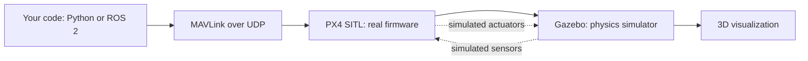
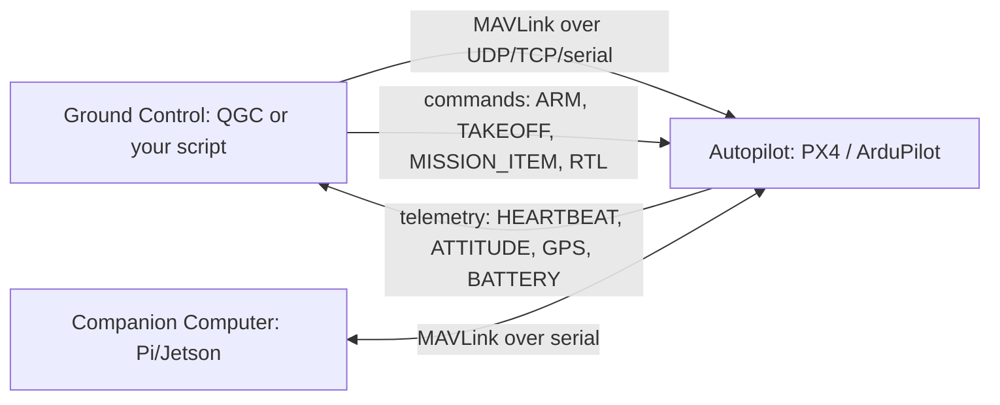
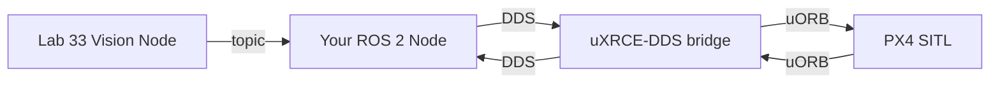

# Lab 37 — Fly A Drone With Your Code: PX4 SITL, MAVLink, And An Autonomous Mission

> "The first time your simulated drone takes off because *your* Python script told it to — that's the moment a closed industry opens."

**Time budget:** ~2 weeks for the core lab, with extension challenges that grow it to 3–5 weeks.
**Preferred stack:** **PX4 SITL** (software-in-the-loop simulation) + **QGroundControl** + **Python with `pymavlink` / MAVSDK-Python** *or* **ROS 2** (Humble or Jazzy).
**Working style:** solo, or in a team of up to 3 people.

---

## The hook

In 2009, ETH Zürich's Computer Vision and Geometry Lab needed an open-source autopilot to fly research drones. They wrote one. They called it **PX4**. Today, that codebase flies in **millions** of drones around the world — racing quads, mapping platforms, agricultural UAVs, defense ISR drones, the **Skydio** consumer drones in your local park, the **Saker Scout** and **Vector** drones in Ukraine's defense industry, parts of **NASA's Ingenuity helicopter on Mars**. PX4 talks the **MAVLink protocol** — the universal language of drones — to ground stations, companion computers, vehicle simulators, and other drones. **MAVLink is to drones what HTTP is to the web.** Every developer building drone software learns it.

In this lab, you're going to fly a real drone — in software. **PX4 SITL** runs the *exact same firmware* that ships on real Pixhawks, but in a simulator. You connect to it from your code over MAVLink, send commands ("arm," "takeoff," "fly to this waypoint," "land"), and watch a *physically-modeled drone* take off, fly your mission, and land — all driven by code you wrote. You can record the simulation as video. You can crash it without breaking $400 of hardware. And then, when you connect a real Pixhawk, **the same code works on the real drone.**

This is the lab where you stop watching drone videos on YouTube and start writing the software that controls them. **For Ukrainian students at an aviation institute, this lab might be the most career-relevant one in the entire course** — the country's drone industry is the largest source of new defense and dual-use technology engineering jobs in 2026, and *almost no one* coming out of university has hands-on PX4 / MAVLink / ROS 2 experience.

If you want a perfect appetizer, watch [**PX4's *PX4 in 5 minutes*** intro](https://docs.px4.io/main/en/) and the [**Open Drone Foundation YouTube channel**](https://www.youtube.com/@OpenDroneFoundation). Read [**MAVSDK-Python's getting-started guide**](https://mavsdk.mavlink.io/main/en/python/) — it's the gentlest possible MAVLink intro. For a deeper dive, [**Auterion's *Autopilot 101* talks**](https://auterion.com/) — the company that commercialized PX4 — give the cleanest industry view available.

---

## Why this is worth your time

- **Ukraine's drone industry is hiring.** Skills with PX4, MAVLink, and ROS 2 are *immediately* placeable in defense, dual-use, and consumer-drone companies in your country and abroad.
- **PX4 is one of the largest open-source aerospace projects in history.** Reading and writing code that flies real drones is genuinely rare for a 1st-year.
- The skills (**MAVLink protocol, SITL simulation, mission planning, ROS 2 nodes, computer-vision integration**) are the *exact* skills the autonomous-systems hiring market is asking for.
- **Combines beautifully with everything you've done.** [Lab 17](lab-17-pid-self-balancer.md)'s PID intuition makes attitude control click. [Lab 33](lab-33-object-detection-tracking.md)'s vision pipeline becomes a real "follow the target" system. [Lab 35](lab-35-rtos-mini-autopilot.md)'s RTOS knowledge becomes "I understand what's *inside* the autopilot." [Lab 36](lab-36-embedded-linux-from-inside.md)'s Linux distro becomes the companion computer. **This is the capstone of the embedded/aviation track.**

---

## The target

> **Reference videos:** [Ardupilot & PX4 SITL — From 0 to 100 in One Hour](https://www.youtube.com/watch?v=mKt4ZTaE2bk) for the toolchain-and-first-mission spine, and [Swarm of 16 PX4 Drones Creates 3D Heart Shape — MAVSDK Drone Show SITL Demo](https://www.youtube.com/watch?v=7j3QzX3dlfk) for the visual bar of what's possible at the Advanced level.

**Basic — "It Flies On Command"**
PX4 SITL runs on your machine (in Docker or natively). A 3D simulator (**Gazebo**, **jMAVSim**, or **Gazebo Garden**) shows the drone visually. You wrote a script (Python with `pymavlink` or MAVSDK) that **arms the drone, takes off to 5 m, hovers for 10 s, and lands** — autonomously, end-to-end. Recorded as a video.

**Standard — "It Flies A Real Mission"**
Everything from Basic, plus:
- a **multi-waypoint mission** (takeoff → 4+ waypoints in a pattern → land) flown autonomously,
- **telemetry logging** (your script logs altitude, GPS, battery, attitude every 100 ms to a CSV),
- a **mission visualizer** — your script (or a small web UI) shows the drone's planned path vs. its actual path,
- handles **failure modes**: GPS lost mid-mission, low battery, manual override → autonomous return-to-launch (RTL),
- a **MAVLink message inspector** in your README — show the actual binary messages going across the wire,
- works in **QGroundControl** too (you can fly the same mission from the GUI as a sanity check).

**Advanced — "It's An Autonomous System"**
You've added: **vision-based behaviors** ([Lab 33](lab-33-object-detection-tracking.md)'s object detection feeds into mission decisions — "follow the red ball," "land on the marker," "avoid the obstacle"), **a ROS 2 node** that publishes/subscribes to PX4 topics via the **uXRCE-DDS** bridge (the modern PX4 ↔ ROS 2 connection), **swarm coordination** (multiple SITL instances flying in formation), **a custom MAVLink dialect** for a special payload, **integration with a real Pixhawk** (over USB/serial — your code that flew SITL now flies real hardware), or **a tiny ML-driven decision** ([Lab 32](lab-32-neural-net-from-scratch.md)'s network picks a landing zone from camera input).

---

## The big idea, in three diagrams

### What SITL is



The same firmware that runs on a real Pixhawk runs in SITL — only the sensors and actuators are simulated. **Your code can't tell the difference.**

### MAVLink in one picture



**MAVLink is just a binary protocol.** A few hundred message types, all documented, all open source. If you know HTTP, you can learn MAVLink in an afternoon.

### ROS 2 + PX4 (advanced)



**ROS 2** is the framework every robotics and autonomous-systems company uses. PX4 talks ROS 2 natively via uXRCE-DDS. Once you have this bridge, you can plug in vision, ML, or any sensor as just another ROS 2 node.

---

## Two-week plan with milestones

**Week 1 — Make it fly**

- **Day 1 — Pick the stack and install.** Linux host (Ubuntu 22.04 / 24.04 in a VM works; Docker also works on macOS). Clone PX4-Autopilot. Run `make px4_sitl gz_x500` — wait while it builds. Open Gazebo. *Milestone: a simulated drone you can see.*
- **Day 2 — Install QGroundControl.** Free, cross-platform. Connect it to PX4 SITL. Manually arm and take off via the GUI. *Milestone: you've flown a drone.*
- **Day 3 — Hello pymavlink.** A 20-line Python script that connects to SITL via UDP, prints the heartbeat, and reads the live altitude. *Milestone: your code is talking to a drone.*
- **Day 4 — Arm, takeoff, land.** Same script, but now sends commands. The drone arms, takes off to 5 m, hovers, lands. *Milestone: end-to-end autonomous flight.* Take a video.
- **Day 5 — Multi-waypoint mission.** A list of 4+ waypoints in a square pattern. Upload via MAVLink. Set the drone to AUTO mode. Watch it fly the mission. *Milestone: a real autonomous mission.*
- **Day 6 — Telemetry logging.** Log altitude, GPS, attitude, battery to a CSV every 100 ms. Plot the path with matplotlib.
- **Day 7 — Polish + first demo.** Clean script, clean output, clean video.

**At this point you've completed the Basic level.**

**Week 2 — Make it look like an autonomous system**

- **Day 8 — Failure modes.** Inject failures: kill GPS mid-mission (PX4 has a fault-injection feature). Watch the drone go into RTL. Document.
- **Day 9 — Mission visualizer.** A small web page (or matplotlib animation) showing planned path vs. actual path side by side.
- **Day 10 — MAVLink message inspector.** Use [`mavlink-router`](https://github.com/mavlink-router/mavlink-router) or a custom Python script to log every message going across the wire. Pick 3 to explain in your README.
- **Day 11 — Pick a side quest.**
- **Day 12 — Polish, README, demo video, mission animation.**
- **Day 13 — Buffer.**
- **Day 14 — Buffer.**

---

## Levels

### Basic — "It Flies On Command" (~14–18 hours)
- PX4 SITL running with Gazebo
- QGroundControl connected
- Python script: arm → takeoff → hover → land
- video of the autonomous flight

### Standard — "It Flies A Real Mission" (~18–28 hours)
- everything from Basic
- multi-waypoint mission flown autonomously
- telemetry logged + mission visualized
- failure modes handled (RTL on GPS loss, etc.)
- MAVLink message inspector in the README
- works in both your script and QGroundControl

### Advanced — "Side Quests" (each ~3–10h)

- **Vision Following.** Connect [Lab 33](lab-33-object-detection-tracking.md)'s object detector. Drone follows a red ball / a person / a colored marker as it moves. *World-class portfolio piece.*
- **Precision Landing.** Detect an ArUco / AprilTag marker; land precisely on it.
- **ROS 2 Node.** Rewrite the mission script as a ROS 2 node using PX4-ROS 2 bridge. Use `rclpy` or `rclcpp`. Recruiter-impressive.
- **Swarm.** Two or three SITL instances on different ports, all running the same logic with different roles (leader/follower).
- **Real Pixhawk.** Get a Pixhawk dev board ($100–200, but lab-shareable). Run the same code over USB/serial. *Real flight.*
- **Custom MAVLink Dialect.** Define your own message type for a custom payload (e.g., "spray fertilizer," "release parachute"). Generate code with the official MAVLink generator.
- **Companion-Computer Stack.** Run ROS 2 + your mission code on the Pi from [Lab 36](lab-36-embedded-linux-from-inside.md). The Pi is the autonomy brain; PX4 SITL is the flight controller.
- **Mission Replay.** Save a `.tlog`; replay it later. Compare two missions side-by-side.
- **Geofencing.** Define a polygon; drone refuses to fly outside it. Real safety feature.
- **Wind / Failure Stress Test.** Crank up Gazebo's wind. Document how mission behavior degrades. Tune control gains.
- **MAVProxy.** Use MAVProxy as a routing hub between PX4, your script, and QGC simultaneously. Multi-client setup.

---

## Extension challenges (3–5 weeks)

- **A real autonomous demo on hardware.** Pair with a school's drone (or a small <250g toy quadcopter with PX4 firmware). Fly your mission outdoors. *Genuinely* career-defining.
- **Combine [Lab 33](lab-33-object-detection-tracking.md) + Lab 37.** Vision-based autonomous tracking — drone follows a moving target via a camera. Record video. Post to LinkedIn / GitHub.
- **Combine [Lab 35](lab-35-rtos-mini-autopilot.md) + Lab 37.** Your own RTOS code ([Lab 35](lab-35-rtos-mini-autopilot.md)) acts as a *sensor companion* speaking MAVLink to PX4 SITL. The kid version of running custom firmware alongside a real autopilot.
- **Combine [Lab 36](lab-36-embedded-linux-from-inside.md) + Lab 37.** Your custom Linux distro runs a ROS 2 node that commands PX4 SITL. Three labs in one stack — the *real* drone-companion-computer architecture.
- **Combine [Lab 32](lab-32-neural-net-from-scratch.md) + Lab 37.** Train a tiny model that picks safe landing spots from camera input. Drone autonomously selects and lands. Demo blockbuster.
- **Open source everything.** A clean repo with mission scripts, ROS 2 nodes, README, video demos. Get one external pull request.
- **Write a deep blog post.** "How I built an autonomous drone-following system using only free software." This kind of content gets shared in defense-tech and drone communities.

---

## Make it yours (required)

The pipeline is universal. The *mission* is yours.

- **Search-And-Rescue.** Drone autonomously searches a grid pattern over a simulated forest. When camera detects a "person" (use a synthetic image marker), reports position and orbits.
- **Mapping.** Drone flies a serpentine pattern; logs photos at each waypoint. Stitches into a panorama.
- **Reconnaissance Drone.** Drone follows a ground vehicle from above (vision tracking). Aviation/defense flavor.
- **Agricultural Drone.** "Fly over a 100×100 m field; log NDVI-equivalent (use the camera) at each waypoint."
- **Inspection Drone.** Fly around a simulated tower; capture photos of every face.
- **Delivery Drone.** Pickup at A, drop at B, return. Test with weight changes via Gazebo's payload model.
- **Geofenced Patrol.** A defined polygon; drone patrols autonomously; alerts on intruder (vision-detected).
- **Precision Landing.** Find an ArUco marker; land precisely on it. Used in real autonomous-recharging stations.
- **First-Person View Toy.** A simulated FPV racing drone flying through a course of gates (Gazebo has a racing environment).

You'll defend why you chose your mission.

---

## Working solo or in a team

Solo: feasible. The MAVLink ecosystem is well-documented; PX4 SITL is friendly.

Team:
- *By layer:* one person owns mission logic + script; the other owns telemetry + visualization; if 3 — third person owns ROS 2 + computer-vision integration.
- *By feature:* one person hits Basic + Standard solid; the other targets Advanced (ROS 2, vision, real hardware).
- *Across labs:* if [Lab 33](lab-33-object-detection-tracking.md) (vision) and Lab 37 are done by the same team, **you have the makings of a portfolio-defining demo** — autonomous vision-based drone behavior.

Two team rules: **git from day one** (this lab has many configs and scripts; keep them organized) and **list who did what.** Each member must explain MAVLink end-to-end (your script's intent → wire bytes → PX4 action).

---

## Tooling and platform tips

**Python + pymavlink + MAVSDK (recommended primary)**
- Friendliest entry. `pip install mavsdk` and you're flying in 10 lines.
- `pymavlink` for low-level message access (when you want to *see* the protocol).
- MAVSDK-Python for higher-level commands (cleaner code, less granular control).

**ROS 2 (Humble / Jazzy) (advanced path)**
- The framework every modern autonomous-systems job mentions.
- `rclpy` for Python; `rclcpp` for C++.
- PX4-ROS 2 bridge via uXRCE-DDS — well-documented.

**QGroundControl**
- Free, cross-platform GUI ground station.
- Always have it open as a sanity check next to your scripts.

**PX4 SITL + Gazebo**
- The standard simulation stack.
- `make px4_sitl gz_x500` builds and launches Gazebo with a quadcopter.
- jMAVSim is lighter (no 3D world); useful when Gazebo is too heavy for your laptop.

**Hardware (optional advanced)**
- **Pixhawk 6C / 6X dev kit** (~$200) — the lab can share one.
- **Holybro X500 V2 frame** if you want a flyable drone (bigger investment).
- **Tello Edu** ($150) — a small commercial drone with a Python SDK; not PX4 but a friendlier first hardware step.

**Anyone**
- **Read the PX4 docs.** They're excellent. Better than 90% of commercial product docs.
- **Always check arm-state before commanding.** PX4 will reject everything if pre-arm checks fail; your script needs to wait + report cleanly.
- **MAVLink is over UDP by default.** Your script connects to `udp://:14540` for SITL.
- **Don't fight QGC.** It's the reference implementation. If your script does something QGC doesn't, you're probably doing it wrong.
- **Coordinate frames are subtle.** PX4 uses NED (North-East-Down); ROS 2 uses ENU (East-North-Up). Half of all bugs are sign errors. Read the docs section on frames carefully.

---

## Suggested project structure

```txt
drone-stack/
  README.md
  scripts/
    mission_basic.py            # arm, takeoff, hover, land
    mission_waypoints.py        # multi-waypoint
    telemetry_logger.py
    mavlink_inspector.py
  ros2_ws/                      # if Advanced
    src/
      my_mission_node/
        my_mission_node/
          mission.py
        package.xml
        setup.py
  visualizer/
    plot_mission.py
    web/                        # if you build a web UI
  configs/
    sitl_config.yaml
    mission_squares.json
  videos/
    basic_flight.mp4
    waypoint_mission.mp4
    failure_recovery.mp4
  docs/
    mavlink-messages.md
    architecture.png
    coordinate-frames.md
    screenshots/
```

---

## When you get stuck

- **PX4 SITL won't build.** Almost always missing host dependencies. Use the Docker image (`px4io/px4-dev-simulation-jammy`) — it has everything pre-installed.
- **Gazebo is slow / unusable.** Use jMAVSim instead — much lighter. Or use a headless simulator config (no 3D rendering).
- **My script connects but the drone doesn't arm.** Pre-arm checks failing. Check QGroundControl: it shows you exactly what's wrong (GPS not locked, battery low — yes, even simulated batteries can be "low").
- **Drone arms but doesn't take off.** You're sending a takeoff command before the drone's ready, or you're in the wrong flight mode. Wait for `MAV_STATE_ACTIVE`. Switch to OFFBOARD or AUTO mode.
- **"Mission upload timeout."** Your script is sending mission items too fast (or too slow). MAVSDK handles this for you; pymavlink requires careful protocol-state machine handling.
- **Drone flies *up* when I send "go down 5 m."** NED frame: down is positive Z. Half the people who do this lab hit this once.
- **ROS 2 bridge connects but no messages arrive.** uXRCE-DDS daemon isn't running, or it's on the wrong port. Check `microxrcedds_agent` is up; check PX4 is configured for `dds_topics.yaml`.

If stuck for 30+ minutes: **open QGC, fly the mission manually first.** If QGC can do it and your script can't, your script is the bug. If QGC can't either, your *PX4 setup* is the bug.

---

## Deployment checklist

- [ ] PX4 SITL builds and runs end-to-end on a clean machine (Docker recipe documented).
- [ ] QGroundControl connects.
- [ ] Mission script flies the mission without crashes.
- [ ] **30-second video of the autonomous mission** in the README.
- [ ] **Mission visualization** (planned vs. actual path) in the README.
- [ ] Failure-mode demo recorded (e.g., GPS loss → RTL).
- [ ] MAVLink message inspector output in the README.
- [ ] Telemetry CSV from a real run in `data/` (or in a release artifact).
- [ ] If ROS 2: workspace builds end-to-end with `colcon build`.
- [ ] If real hardware: a *separate* pre-flight checklist documented (much more strict than SITL).
- [ ] No private credentials in source.
- [ ] Coordinate-frame conventions (NED vs ENU) clearly documented.

---

## What recruiters look at

- **Defense / drone / autonomous-systems recruiters watch the video first.** A 30-second clip of a drone autonomously flying a mission *your code* commanded is one of the most compelling junior-CV demos possible.
- **They look for "PX4," "MAVLink," and "ROS 2"** specifically. These keywords are *exactly* what they're hiring for.
- **They look at the mission visualizer.** Planned-vs-actual paths, telemetry plots, failure-mode handling = "this person thinks like an autonomy engineer."
- **They look at coordinate-frame awareness.** Documenting NED vs. ENU in the README is a tiny detail that signals deep care.
- **They look at the failure-mode demo.** Autonomous systems are *defined* by how they handle failure. A clean RTL recovery is gold.
- **They look at the cross-lab combinations.** Vision + drone ([Lab 33](lab-33-object-detection-tracking.md) + 37), or RTOS + drone ([Lab 35](lab-35-rtos-mini-autopilot.md) + 37), or full stack (Labs [33](lab-33-object-detection-tracking.md), [35](lab-35-rtos-mini-autopilot.md), [36](lab-36-embedded-linux-from-inside.md), 37) is a portfolio you can build a career on.
- **For Ukrainian recruiters specifically:** mention your interest in defense-tech / dual-use applications openly in the README — the local industry is hungry for engineers who explicitly want to work on this.

---

## What to put in your README

1. Project name + tagline (the mission you flew).
2. **30-second autonomous-flight video** at the top.
3. **Mission visualizer** (planned vs. actual path).
4. Tech stack (PX4 version, simulator, MAVLink dialect, ROS 2 distro if applicable).
5. **Architecture diagram** (your code → MAVLink → PX4 → simulator).
6. **MAVLink writeup:** explain 3 messages your script sends and 3 it receives.
7. Mission-failure demo: describe the failure you injected and the autopilot's response.
8. How to set up PX4 SITL on a fresh machine (Docker recipe).
9. How to run your mission script.
10. Side quests + extensions completed.
11. **Coordinate-frame conventions** (NED vs. ENU).
12. Honest limitations: what's still missing for a real flight (geofencing, RTH battery threshold, certified hardware, etc.).
13. If team: who did what.

---

## Reflection

Be ready to:

1. **Live demo.** Boot SITL on the projector. Run your script. Drone takes off, flies, lands.
2. **Inject a failure.** Kill GPS or battery mid-flight. Show the autopilot recover.
3. **Walk through one MAVLink message.** Bytes on the wire → meaning → effect.
4. **Why is your code in MAVLink and not directly in PX4?** What's the architecture argument for this separation?
5. **What's NED?** Why does PX4 use it instead of ENU? What goes wrong if you mix them?
6. **What's the difference** between `pymavlink`, MAVSDK, and ROS 2 + PX4 bridge? When do you pick which?
7. **What pre-arm checks does PX4 do?** Why are they so strict?
8. **What would have to be true** before this code could fly a real drone in real airspace? (Hint: certification, geofencing, RTH safety, battery management, weather, regulations.)
9. **What was the hardest bug** — coordinate frames, mission protocol, or simulator setup?

---

## Showcase

End-of-semester gallery — anonymous voting for **most impressive autonomous mission**, **best failure recovery**, **best vision integration** (if you combined with [Lab 33](lab-33-object-detection-tracking.md)), and **most production-ready code**. Bring laptops; the panel will *invite* you to inject failures live.

---

## Going further

- *PX4 User Guide* (docs.px4.io) — world-class documentation. Read it.
- *MAVLink Developer Guide* (mavlink.io) — the protocol bible.
- *MAVSDK-Python documentation* — the friendliest API.
- *ROS 2 Tutorials* (docs.ros.org) — for the modern robotics path.
- *Open Drone Foundation YouTube channel* — community talks.
- *Auterion blog* — the company that commercialized PX4.
- *DroneBlogs by Murray Lapwood* — practical drone-software writeups.
- *ArduPilot Source Code* — the other major open-source autopilot, for comparison.
- *Saker / Vector / Ukraine drone-industry talks* — the local context.

---

## A final word

There's a moment in this lab when your simulated drone takes off because your Python script told it to. It hovers. It flies your waypoints. It lands. *Nothing about that flight required permission from anyone.* You wrote the code; the autopilot obeyed; the simulator showed it; the video records it.

For most of human history, flying a drone autonomously was the work of three engineers, a defense contractor, and a six-figure budget. Today, in your bedroom, in a country building one of the most innovative drone industries in the world, **you can do it from your laptop, for free, with software that's read and trusted by the same companies that build the real thing.** And the code you wrote in this lab is *exactly* the code that, with a recompile, would fly a real drone tomorrow.

That's not a small thing. After this lab, "I work on autonomous drones" stops being a sentence other people say in interviews. It becomes a sentence you can say. And mean.
