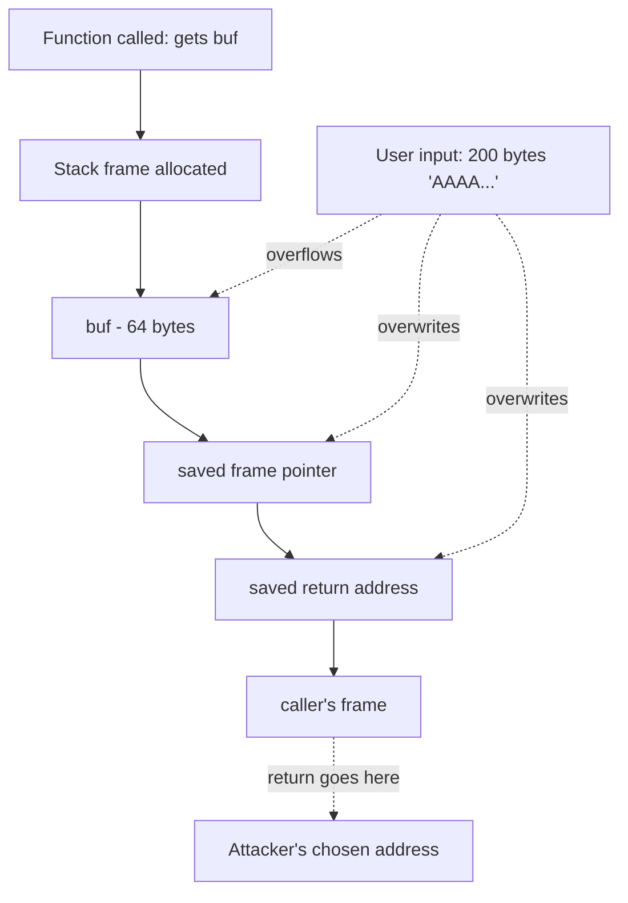
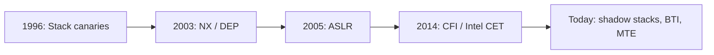

# Lab 38 — Smash The Stack: Memory Corruption, Shellcode, And Modern Mitigations

> "Smashing The Stack For Fun And Profit."
> — **Aleph One**, *Phrack* magazine #49, 1996 — the most-cited security paper in computing history

**Time budget:** ~2 weeks for the core lab, with extension challenges that grow it to 3–5 weeks.
**Preferred stack:** Linux VM (Ubuntu / Kali / Debian), `gcc`, `gdb`, **`pwntools` (Python)**, **picoCTF** / **pwn.college** / **OverTheWire** as exercise targets.
**Working style:** solo, or in a team of up to 3 people.

---

## ⚠ Read this first — Ethics, Legality, Sandbox

This lab teaches the techniques behind real-world security exploits. **Every technique you learn here is illegal to use against systems you don't own or have explicit, written permission to test.** Misuse isn't just an ethics issue — under Ukrainian law (Article 361), the EU Cybercrime Directive, the UK Computer Misuse Act, and the US Computer Fraud and Abuse Act, unauthorized access carries criminal penalties up to multi-year prison sentences.

**The non-negotiable rules of this lab:**

1. **All work happens inside a VM** (VirtualBox, VMware, UTM, or a cloud lab). Your host machine is never the target.
2. **All targets are either:** (a) deliberately-vulnerable training programs you compiled yourself, (b) public CTF infrastructure (picoCTF, pwn.college, OverTheWire, HackTheBox), or (c) systems you own and have written permission to test.
3. **Never test against any production system, anyone else's system, your university's infrastructure, or the public internet.** Ever.
4. **The motive is defense.** Every exploit you write should make you a better defender. Every Advanced side quest involves *also* writing the patch.

If you're not comfortable with these rules, this lab isn't for you. If you are — welcome to one of the most interesting domains in computing.

---

## The hook

In November 1988, a Cornell graduate student named **Robert Tappan Morris** released the first internet worm. It exploited a single classic bug: **a buffer overflow in the Unix `fingerd` service.** The worm crashed about 10% of the entire internet (which, at the time, was 6,000 hosts). Morris was the first person ever convicted under the new US Computer Fraud and Abuse Act. The bug class he used — *the buffer overflow* — would, over the next 25 years, account for roughly **half of all serious software vulnerabilities ever published**, including SQL Slammer, Code Red, Blaster, Heartbleed, EternalBlue, and countless zero-days in iOS, Android, the Linux kernel, web servers, and avionics firmware.

In 1996, an anonymous hacker named **Aleph One** wrote a paper for *Phrack* magazine called [**"Smashing The Stack For Fun And Profit"**](http://phrack.org/issues/49/14.html). It explained, in clean, patient prose, *exactly* how a buffer overflow becomes arbitrary code execution. That paper is, by general agreement, the single most important document ever written about security. Generations of researchers have learned the field by reading it. **You're going to read it.** And then you're going to *do* it — write code that overflows a buffer, redirects execution to your own bytes, and runs your shellcode.

By the end of this lab you'll understand, *deeply*, how a memory-corruption bug becomes a full system compromise. You'll know what `\x90\x90\x90` does in a payload. You'll see what an attacker actually sees when they `gdb` a vulnerable binary. **And you'll know exactly why every C function in `<string.h>` ending in `cpy` was a mistake** — knowledge that, once you have it, will make you a better engineer in *every* domain that touches C, C++, embedded firmware, or any unsafe-by-default language.

If you want a perfect appetizer, read [**"Smashing The Stack For Fun And Profit"**](http://phrack.org/issues/49/14.html) — *the* paper, free, ~30 minutes. Then watch [**LiveOverflow's *Binary Exploitation* YouTube series**](https://www.youtube.com/c/LiveOverflow) — the gentlest, most-current intro to the topic on the internet. For systematic practice, [**pwn.college**](https://pwn.college/) (Arizona State University, free) is the gold standard.

---

## Why this is worth your time

- **Memory-corruption bugs are still everywhere.** In 2024 alone, Microsoft, Apple, Google, and the Linux kernel all shipped emergency patches for stack/heap-overflow bugs. C and C++ remain unsafe by default. *People who understand these bugs are paid extraordinary salaries to find them.*
- **Defense and aerospace specifically need this skill.** Pixhawk firmware has had real CVEs. Boeing 787's network had a documented stack-overflow vulnerability. **Ukraine's defense-tech industry hires offensive-security engineers as quickly as it can find them.**
- The skills (**gdb mastery, assembly reading, ROP, ASLR/NX/canary mechanics, fuzzing intuition**) are deeply transferable to **debugging, performance work, reverse engineering, and any low-level systems job.**
- **CTF performance is verifiable, public, and recruiter-readable.** A picoCTF / HackTheBox / Root-Me profile with solved problems is one of the most signal-rich items a junior security CV can have.
- **Connects directly to [Lab 35](lab-35-rtos-mini-autopilot.md) (RTOS), [Lab 36](lab-36-embedded-linux-from-inside.md) (kernel), [Lab 21](lab-21-rest-api-auth.md) (services).** Once you can write exploits, you can find — and patch — vulnerabilities in your own labs.

---

## The target

> **Instructor TODO:** add picoCTF / pwn.college reference solutions to `docs/`.

**Basic — "I Smashed The Stack"**
Inside a Linux VM, with **all modern mitigations disabled** (`-fno-stack-protector -no-pie -z execstack`), you've:
- exploited a **classic stack buffer overflow** to redirect execution to a function the program normally never calls (e.g., the famous `give_shell()` pattern),
- exploited a **format-string vulnerability** to leak memory and overwrite a variable,
- demonstrated each in `gdb` with annotated screenshots,
- written a `pwntools` exploit script that automates each.

**Standard — "I Bypassed Mitigations (in toy cases)"**
Everything from Basic, plus:
- **Stack canaries:** explain what they are, demonstrate how a leak-then-overwrite bypass works on a vulnerable example,
- **NX / DEP:** explain why "shellcode on the stack" no longer works, and write a **Return-Oriented Programming (ROP)** chain that calls `system("/bin/sh")` instead,
- **ASLR:** explain it, and use a memory-leak primitive to defeat it on a toy program,
- solved at least **15 picoCTF / pwn.college / OverTheWire binary-exploitation challenges** (with writeups in `solutions/`),
- written a **defender's report** for each technique: the patch in C, the compiler flag, the modern mitigation that prevents it.

**Advanced — "I Found It In My Own Code"**
You've added something serious: **fuzzed your own code** with **AFL++** or **libFuzzer** and found a real bug, **exploited a deliberately-vulnerable RTOS task** ([Lab 35](lab-35-rtos-mini-autopilot.md)) or **kernel module** ([Lab 36](lab-36-embedded-linux-from-inside.md)) you wrote yourself, **written a kernel-level ROP chain** in a controlled environment, **solved a Heap challenge** (tcache poisoning, House of Force), or **placed in the top half of a real CTF event**.

---

## The big idea, in two diagrams

### What a stack overflow does



The CPU doesn't know that 200 bytes shouldn't fit in a 64-byte buffer. It just writes them. The overwritten **return address** is the prize: when the function returns, the CPU jumps wherever the attacker says.

### Mitigations as layers



Each layer raised the cost of exploitation. None made it impossible. **Modern exploits chain bypasses for *all* of these** — which is why fuzzing, memory-safe languages (Rust, Zig), and formal verification matter so much in 2026.

---

## Two-week plan with milestones

**Week 1 — Smash the stack**

- **Day 1 — Set up the VM.** Ubuntu 22.04 (or Kali) in VirtualBox/UTM. Install `gcc`, `gdb`, `gdb-pwndbg` (a critical gdb upgrade), `python3`, `pwntools`, `binutils`. Compile your first vulnerable program with `-fno-stack-protector -no-pie -z execstack -m32` or `-m64`.
- **Day 2 — Read Aleph One.** Read the original *Phrack* paper. Take notes. Re-read on Day 8.
- **Day 3 — First overflow.** A C program with `gets(buf)` and a `give_shell()` function that's never called from `main`. Overflow `buf` to overwrite the saved return address with the address of `give_shell`. Get a shell. *Milestone: your first exploit.* Take a screenshot of the spawned `$`.
- **Day 4 — pwntools.** Rewrite Day 3's exploit as a `pwntools` Python script. `p.sendline(payload)`, `p.interactive()`. *Milestone: a reproducible automated exploit.*
- **Day 5 — Format strings.** A program that calls `printf(user_input)` directly. Use `%x` and `%n` to leak the stack and write to memory. Demonstrate overwriting a variable's value via format string.
- **Day 6 — Read assembly.** Spend 4 hours reading x86-64 assembly. `objdump -d` your binaries. Understand the function prologue, epilogue, the role of `rbp`, `rsp`, `rip`. This day is the hardest unlock of the whole lab.
- **Day 7 — Five picoCTF problems.** Solve at least 5 binary-exploitation challenges from picoCTF. Write up each.

**At this point you've completed the Basic level.**

**Week 2 — Defeat mitigations**

- **Day 8 — Stack canaries.** Recompile *with* `-fstack-protector-all`. Watch your old exploit fail. Learn the canary-leak-then-overwrite pattern. Bypass it on a vulnerable example.
- **Day 9 — NX & ROP.** Recompile *without* `-z execstack`. Watch your shellcode-on-stack exploit fail. Learn ROP. Find gadgets with `ROPgadget`. Build a chain that calls `system("/bin/sh")`.
- **Day 10 — ASLR.** Recompile with PIE. Use a `printf` leak to find libc's base address. Use it in a ROP chain.
- **Day 11 — Patch each one.** For every exploit, write the patch in C. Document the modern compiler flag / language feature that makes the bug structurally impossible.
- **Day 12 — Pick a side quest.**
- **Day 13 — Polish, README, screenshots, exploit videos.**
- **Day 14 — Buffer.**

---

## Levels

### Basic — "I Smashed The Stack" (~14–18 hours)
- VM configured, toolchain installed
- working stack-buffer-overflow exploit (control flow hijacked)
- working format-string exploit (memory leak + write)
- annotated `gdb` screenshots
- pwntools automation

### Standard — "I Bypassed Mitigations" (~18–28 hours)
- everything from Basic
- canary-bypass demo (with a leak)
- ROP chain to `system("/bin/sh")`
- ASLR-bypass demo via leak
- 15+ picoCTF / pwn.college / OverTheWire problems solved with writeups
- defender's report (patches + flags + memory-safe-language analysis)

### Advanced — "Side Quests" (each ~3–10h)

- **AFL++ Fuzzing.** Fuzz a program (yours or an open-source target with permission). Find a real crash. Triage it.
- **Heap Exploitation.** Solve a tcache poisoning challenge or a House of Force / House of Spirit challenge.
- **Reverse Engineering.** Use **Ghidra** (free NSA tool) to reverse a small binary. Find a vulnerability *without* having source.
- **Real CTF.** Compete in a public CTF (CSAW, Google CTF, picoCTF Annual, DEF CON Quals). Place. Document.
- **[Lab 35](lab-35-rtos-mini-autopilot.md) (RTOS).** Add a deliberately-vulnerable task to your RTOS firmware. Exploit it from another task. Patch it.
- **[Lab 36](lab-36-embedded-linux-from-inside.md) (Kernel).** Add a deliberately-vulnerable ioctl to your kernel module. Exploit it from user-space. Patch it.
- **Shellcode Craft.** Write your own minimal shellcode for x86-64 Linux (no NULL bytes, position-independent). Compare to the standard `execve("/bin/sh")` shellcode.
- **Memory-Safe Comparison.** Re-implement one of your vulnerable C programs in Rust. Show that the same input that crashed C cleanly errors in Rust. Write the analysis.
- **Static Analysis.** Run `cppcheck`, `clang-tidy`, **CodeQL**, or commercial tools (Klocwork, Coverity trial) on your vulnerable code. Document what each catches and misses.
- **Hardware Side-Channel (advanced).** A toy timing-attack against a password-comparison function (`strcmp`). Demonstrate constant-time comparison as the fix.

---

## Extension challenges (3–5 weeks)

- **Combine with [Lab 35](lab-35-rtos-mini-autopilot.md).** A deliberately-vulnerable RTOS firmware. Document a complete exploit (from input to control hijack), then a complete defender's response (canary, MPU, memory-safe rewrite).
- **Combine with [Lab 36](lab-36-embedded-linux-from-inside.md).** Write a vulnerable kernel module *and* a clean exploit for it from user-space. Then patch. *Wildly* impressive — almost no juniors do real kernel exploit dev.
- **Combine with [Lab 21](lab-21-rest-api-auth.md).** Find a memory-corruption-class bug in a third-party C library you depend on (with permission, and via a CVE-style write-up if it's already known). Patch your own service to detect it.
- **A complete Aleph One re-write.** Re-do Aleph One's 1996 paper, but in 2026 — same patient prose, same structure, but covering modern mitigations and bypasses. *Genuinely viral* technical writing if you do it well.
- **picoCTF top 100.** Place in the top 100 of picoCTF Annual. *Verifiable* portfolio item.
- **CVE.** With a maintainer's permission, audit a small open-source project; find, report, and help patch a real bug. Get your name on a CVE. *Career-defining.*

---

## Make it yours (required)

The techniques are universal. The *target program* and the *defender's narrative* are yours.

- **A vulnerable text-based game.** Build a tiny C "adventure game" with a deliberate bug; exploit it; patch it; ship the patched version.
- **A vulnerable file parser.** Write a tiny PNG/PPM/CSV/INI parser in C with a deliberate bug; exploit it via a malformed file; patch it.
- **A vulnerable network service.** A simple TCP server with a deliberate bug. Exploit it over localhost. Patch it.
- **An RTOS-style firmware target** ([Lab 35](lab-35-rtos-mini-autopilot.md) link).
- **A kernel-module target** ([Lab 36](lab-36-embedded-linux-from-inside.md) link).
- **A retro emulator-target.** Pick an old Linux distribution image, find a known CVE, write the exploit yourself, then read the public exploit. Compare. (Educational.)
- **A "MAVLink-style" parser.** A binary protocol parser in C with a deliberate bug. Aviation-flavored. Connects to [Lab 37](lab-37-px4-mavlink-drone-stack.md).

You'll defend why you chose your target.

---

## Working solo or in a team

Solo: viable. Security work is deeply *individual* — most insights come from staring at the binary alone.

Team:
- *By technique:* one person owns Basic (overflow, format string); the other owns Standard (canary, ROP, ASLR); if 3 — third person owns Advanced (AFL, heap, real CTF).
- *By role:* one person plays attacker (writing exploits); the other plays defender (writing patches + the defensive analysis).
- *Across labs:* one team member's [Lab 35](lab-35-rtos-mini-autopilot.md) firmware or [Lab 21](lab-21-rest-api-auth.md) service becomes the other's target.

Two team rules: **git from day one** and **list who did what.** Each member must demonstrate one full exploit live and write its patch.

---

## Tooling and platform tips

**The VM**
- **Ubuntu 22.04 server** in VirtualBox / VMware / UTM. Lightweight. Or **Kali Linux** if you want everything pre-installed.
- Snapshot before every experiment. Restoring is one click; reinstalling is an hour.

**Toolchain**
- **`gdb` + [`pwndbg`](https://github.com/pwndbg/pwndbg)** — `pwndbg` adds essential views for exploit dev (registers, stack, disassembly all at once). Install it the day you start.
- **`pwntools`** — `pip install pwntools`. The de facto exploit-writing library. Read the [docs](https://docs.pwntools.com/).
- **`ROPgadget`** — finds ROP gadgets in a binary.
- **`one_gadget`** — finds the magic offsets in libc that pop a shell.
- **`checksec`** — tells you which mitigations a binary has enabled.
- **`Ghidra`** (free, NSA-released) — reverse engineering. Use after you understand the basics.

**Practice platforms**
- **[picoCTF](https://picoctf.org/)** — beginner-friendly, free, runs annually with year-round practice problems.
- **[pwn.college](https://pwn.college/)** — Arizona State University's structured curriculum. Free. Excellent.
- **[OverTheWire](https://overthewire.org/wargames/)** — Bandit (linux basics) → Narnia / Behemoth (binary exploitation).
- **[Root-Me](https://www.root-me.org/)** — French platform, lots of CTF-style challenges.
- **[HackTheBox](https://www.hackthebox.com/)** — more advanced; great after the basics.

**Anyone**
- **Disable mitigations only on your toy targets**, not system-wide. Compile with the explicit `-fno-stack-protector -no-pie -z execstack` flags on the *target binary only*.
- **Read disassembly daily.** It's the muscle that takes the longest to build.
- **Always write the patch.** "I broke it" is half a lab; "I broke it, here's how to prevent it" is the whole lab.
- **Don't memorize exploit recipes.** Understand the *reason* each step works. Recipes break across mitigations; understanding generalizes.

---

## Suggested project structure

```txt
binary-exploitation/
  README.md                       # the central writeup
  ETHICS.md                       # the rules-of-engagement
  vm/
    setup.md                      # how to recreate the lab VM
  exploits/
    01-stack-overflow/
      vuln.c
      Makefile                    # disables mitigations
      exploit.py                  # pwntools script
      README.md                   # technique + patch + lessons
    02-format-string/
    03-canary-bypass/
    04-rop-chain/
    05-aslr-bypass/
  ctf-solutions/
    picoctf-binary-exploit-1/
    pwn-college-babymem/
    ...
  defender-report.md              # combined patches + mitigations
  docs/
    architecture.png
    aleph-one-notes.md
    screenshots/
```

---

## When you get stuck

- **Exploit works locally, fails on the CTF server.** Different libc version. Use `pwninit` or extract the server's libc; use `LD_PRELOAD` or build a `pwntools.process(env=...)` setup that matches.
- **`gdb` shows a different address than my exploit uses.** ASLR or PIE. Disable both in your toy program (`-no-pie`, `setarch -R`), or use a leak-then-craft approach.
- **My shellcode contains NULL bytes.** Most input vectors stop at `\x00`. Use position-independent shellcode without zeros (or generate one with `pwntools.shellcraft`).
- **`pwntools` connects but no interaction.** Wrong process spawn or wrong line endings (`\n` vs `\r\n`). Try `process()` vs `remote()`.
- **ROP chain crashes immediately.** Check 16-byte stack alignment before `system()`. Modern Ubuntu requires it; add a `ret` gadget.
- **Heap challenges are confusing.** They are. Spend a day on **how2heap**'s tcache module before tackling heap CTF problems.

If stuck for 30+ minutes: **break the exploit into the smallest possible step that still demonstrates progress.** First control `rip`. Then control where it points. Then write the payload. Each layer separately.

---

## Submission checklist

- [ ] **VM setup** is reproducible from `vm/setup.md`.
- [ ] All exploits run end-to-end in the VM with `make` + `python3 exploit.py`.
- [ ] **`ETHICS.md`** is present and comprehensive.
- [ ] Every exploit has a **patch** in C and a defender's note.
- [ ] At least 15 CTF problem solutions in `ctf-solutions/` with writeups.
- [ ] **Annotated `gdb` screenshots** for each technique.
- [ ] A 30-second video of one full exploit (overflow → shell).
- [ ] No exploits target real-world systems, public infrastructure, or anyone else's code.
- [ ] No private data, IPs, hostnames, or other people's flag values committed.
- [ ] CTF profile (picoCTF / HackTheBox / pwn.college) linked in README.

---

## What recruiters look at

- **Defense / dual-use / cybersecurity recruiters open this lab first if they see it.** Real exploit writeups + patches are *uniquely* valuable — almost no junior portfolios have them.
- **They look at your CTF profile.** picoCTF / HackTheBox / pwn.college standings are objective, public, and instantly readable. *Especially powerful* if your handle has an active history.
- **They look at the defender's notes.** "I broke it AND fixed it" is the framing that distinguishes a future security engineer from a future criminal. *This signals everything.*
- **They look at the ETHICS.md.** Mature treatment of legality and rules-of-engagement is itself a hireable signal — security teams won't hire someone who reads sloppy.
- **They look at the cross-lab combinations.** Exploiting your own RTOS or kernel module is *senior-level* work at junior scale.
- **For Ukrainian recruiters specifically:** mention defense-tech / dual-use openness in the README. The local cybersecurity industry is hiring fast.

---

## What to put in your README

1. Project name + tagline.
2. **`ETHICS.md` link prominently at the top.**
3. **A 30-second exploit video** (in a sandbox VM).
4. Tech stack: VM image, kernel version, gcc version, mitigations disabled / enabled.
5. **For each exploit:** the bug class, the technique, the patch, the modern mitigation that prevents it.
6. **Defender's report** — the unified analysis.
7. CTF profile link + count of solved problems.
8. How to recreate the VM and run any exploit.
9. Cross-lab integrations completed.
10. Honest limitations: what you didn't get to (heap, kernel, real-world fuzzing).
11. If team: who attacked what; who patched what.

---

## Reflection

Be ready to:

1. **Live demo** one exploit, in the VM, on the projector. Spawn a shell.
2. **Walk through the stack frame** in `gdb` at the moment of overflow.
3. **Show me the same program with `-fstack-protector-all` enabled.** Why does the canary stop your exploit? How does the leak-then-overwrite bypass work?
4. **Why doesn't NX make exploitation impossible?** Walk through ROP.
5. **What's the difference** between a buffer overflow, a use-after-free, a double-free, and a type-confusion bug?
6. **What makes Rust memory-safe?** What can it not protect against?
7. **What was the hardest exploit** you built — what unblocked you?
8. **For your defender's report** — pick one bug; walk through the patch *and* the modern mitigation that would have prevented it structurally.

---

## Showcase

End-of-semester gallery — anonymous voting for **most elegant exploit**, **best defender's report**, and **most professional ethics framing**. Bring a laptop with the VM running; recruiters and classmates may ask you to demo a specific technique on the spot.

---

## Going further

- **Aleph One — *Smashing The Stack For Fun And Profit*** (1996). The paper.
- **LiveOverflow** YouTube channel — the gentlest current intro.
- **pwn.college** structured curriculum.
- **how2heap** by shellphish — heap-exploitation reference.
- *Hacking: The Art of Exploitation* by Jon Erickson — the classic textbook (with hands-on VM included in the second edition).
- *The Shellcoder's Handbook* by Anley et al. — the deeper dive.
- *A Bug Hunter's Diary* by Tobias Klein — short, narrative, brilliant.
- *Practical Binary Analysis* by Dennis Andriesse — modern, cleanly written.
- **CTFtime.org** — every CTF, all year, all skill levels.
- **Project Zero blog** (Google) — world-class writeups of real-world exploits.

---

## A final word

There's a moment in this lab — usually around Day 3 or 4 — when your overflow finally redirects execution and a `$` appears in your terminal. *You* spawned that shell. Not from running the program normally. By feeding it bytes that broke its assumptions. For a second, the world tilts: *every* C program you've ever written, every binary you've ever run, every microcontroller, every kernel — they're all subject to the same physics. **Most of them are unpatched.** That feeling is the beginning of a worldview.

What you do with it is up to you. Use it to make systems harder. Use it to find bugs before attackers do. Use it to argue, at every architectural meeting in your future, for memory-safe languages, for fuzzing, for review. The world has too many attackers and not enough defenders who *understand* attackers. Be one of those defenders.
