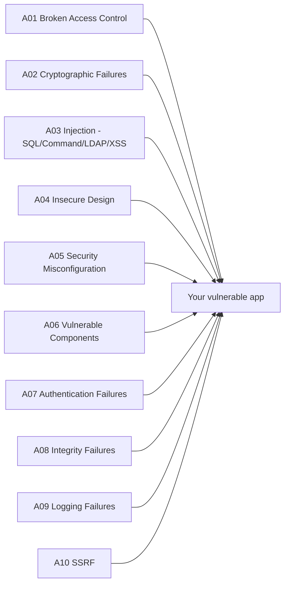

# Lab 39 — Hack Your Own Stack: Web Security By Breaking The OWASP Top 10

> "The best way to learn how to defend a web app is to attack one — *that you wrote*."
> — adapted from Troy Hunt, founder of *Have I Been Pwned*

**Time budget:** ~2 weeks for the core lab, with extension challenges that grow it to 3–5 weeks.
**Preferred stack:** any web framework you already know — **Node.js (Express/Fastify)**, **C# (ASP.NET Core)**, **Python (FastAPI/Flask)**, or **Go**. Plus **Burp Suite Community**, **OWASP ZAP**, **`curl`**, **`sqlmap`**, and a Linux VM.
**Working style:** solo, or in a team of up to 3 people.

---

## ⚠ Read this first — Ethics, Legality, Sandbox

This lab teaches the techniques behind real-world web attacks. **Every technique you learn here is illegal to use against any web application you don't own or have written permission to test.** Bug bounty programs (HackerOne, Bugcrowd, Intigriti) exist *precisely* to give you a legal channel — use them. Outside of them, attacking a website is a criminal offense in essentially every country.

**The non-negotiable rules of this lab:**

1. **All targets are either:** (a) the deliberately-vulnerable web app *you* wrote, (b) the deliberately-vulnerable training apps **OWASP Juice Shop**, **DVWA**, **WebGoat**, **PortSwigger Web Security Academy** labs, or (c) targets within a public **bug bounty program** that explicitly authorizes the techniques you're using.
2. **Never test against any production system, your university's site, anyone else's site, or the public internet** outside an authorized program.
3. **The motive is defense.** Every vulnerability you exploit you also patch — and the patched version of your app is what you ship.
4. **Responsibly disclose** any real bug you accidentally find. Never weaponize, never sell, never sit on it.

If you respect those rules, this lab is one of the most directly-employable two weeks of your degree.

---

## The hook

In 2017 a single misconfigured **Apache Struts server** at Equifax leaked the personal data of **147 million people**. In 2021, a **SQL injection** at T-Mobile leaked 76 million records. In 2023, an **IDOR** at Optus exposed 9.8 million Australians. *Every year*, the **OWASP Top 10** publishes a list of the bug classes responsible for the majority of these breaches — and *every year*, the list barely changes. **The bugs that broke Equifax in 2017 are the same bugs breaking startups in 2026.** Why? Because each new generation of developers has to learn them the hard way.

You're going to short-circuit that cycle. You're going to **build a deliberately-vulnerable web application from scratch** — your own miniature *Damn Vulnerable Web App*. Every single one of the OWASP Top 10 will be in there. Then you're going to **break it ten different ways** with `curl`, Burp Suite, and SQL-injection tooling — taking screenshots and writing exploits along the way. **And then you're going to fix it.** Each vulnerability gets a clean patch, a regression test that re-exploits it (and fails on the patched version), and a defender's note explaining the structural fix.

By the end, you'll have done the *exact* exercise that every senior security engineer wishes every junior backend dev had done before being let near a production system. **You'll know — viscerally, not abstractly — why prepared statements matter, why CSRF tokens exist, why the same-origin policy is sacred, and why "we'll add auth later" is the most dangerous sentence in software.** It's the kind of lab that makes you genuinely angry at half the apps you use, and grateful for the other half.

If you want a perfect appetizer, spend an evening on the **[PortSwigger Web Security Academy](https://portswigger.net/web-security)** — free, world-class, and made by the company behind Burp Suite. Then read the **[OWASP Top 10 (2021)](https://owasp.org/Top10/)** quickstart.

---

## Why this is worth your time

- **Web apps are the universal attack surface.** *Every* company has a web app. Every web app has at least some of these bugs. **Junior backend devs who can find and fix them are immediately more valuable to their team.**
- **Bug-bounty income is real.** A clean OWASP Top 10 walkthrough on your GitHub plus a HackerOne / Intigriti profile with even a handful of valid reports is a credible second income — and a remarkable CV item.
- **The OWASP Top 10 maps almost 1:1 to CV-readable skills.** "I understand SQL injection / SSRF / IDOR / JWT issues" is what hiring managers literally ask in interviews.
- **It transfers to AppSec, DevSecOps, and red team careers** — three of the highest-paid junior tracks in tech.
- **It connects to [Lab 21](lab-21-rest-api-auth.md) (REST API + auth)** — your own service is the perfect vulnerable target. Many students skip the rebuild and reuse [Lab 21](lab-21-rest-api-auth.md) with toggleable vulnerabilities.

---

## The target

**Basic — "I Built And Broke A Vulnerable App"**
You've shipped a small but realistic web app — a tiny social-network or note-sharing or lab-portal-style site — with **at least 8 of the 10 OWASP categories** deliberately introduced. For each, you've:
- written an exploit (`curl` script or `Burp` request),
- captured screenshots / a short clip of the exploit working,
- written the patch,
- written a 1–2-paragraph defender's note explaining the *structural* fix (parameterized queries, output encoding, content-security-policy, etc.).

**Standard — "I Wrote A Pentest Report"**
Everything from Basic, plus:
- **all 10** OWASP categories covered,
- **a full pentest report PDF** in the style of a professional security firm — executive summary, methodology, findings (CVSS-scored), reproduction steps, recommendations,
- **automated tests** that re-attempt each exploit on each commit (so the regression tests fail on the broken commit and pass on the patch),
- **at least 30 PortSwigger Academy labs solved** (each tagged in the README),
- **secure-by-default version of the app deployed publicly** (Vercel/Render/Fly.io), with the *vulnerable* version *only* runnable locally.

**Advanced — "I Found It In The Wild"**
You've added something serious: **CTF-grade web challenges solved**, **a verified bug-bounty submission**, **chained vulnerabilities** (low-severity + low-severity → critical), or **an open-source contribution** to OWASP Juice Shop or a similar project.

---

## The OWASP Top 10 — your scope

You'll cover at least 8 of these (Standard: all 10). Each gets the *exploit-then-patch* treatment.



For each, you'll demonstrate **at least one concrete exploit**, then patch it. Suggested mappings:

- **A01 — Broken Access Control:** an **IDOR** that lets user A read user B's notes by changing a URL parameter (`/notes/123` → `/notes/124`). Patch: object-level authorization check.
- **A02 — Cryptographic Failures:** passwords stored as MD5 / plain SHA-256. Patch: `bcrypt`/`argon2` with per-user salts.
- **A03 — Injection:** classic **SQL injection** in a search field (`' OR 1=1 --`). Plus a **stored XSS** in a profile field. Plus optionally a **command injection** in an "export" feature. Patch: parameterized queries, contextual output encoding, no `exec(userInput)` ever.
- **A04 — Insecure Design:** a "forgot password" flow that emails the password back in plaintext, or a 4-digit reset code with no rate limit. Patch: redesign the flow.
- **A05 — Security Misconfiguration:** debug endpoint enabled in "production", default admin credentials, missing security headers. Patch: each.
- **A06 — Vulnerable Components:** intentionally pin an old `lodash` / `Newtonsoft.Json` / `jinja2` / similar with a known CVE. Show the vulnerability. Upgrade. Add **`npm audit` / `dotnet list package --vulnerable` / `pip-audit`** to CI.
- **A07 — Authentication Failures:** no rate-limiting on login (online password-spraying attack), JWT signed with `none` algorithm or with a weak HMAC secret, "remember me" cookie that never expires. Patch: each.
- **A08 — Software & Data Integrity Failures:** insecure deserialization (e.g., `pickle.loads(user_input)` in Python), or signed-but-not-validated client-side state. Patch: replace with safe formats; validate signatures.
- **A09 — Logging & Monitoring Failures:** no audit log for failed logins, no alert on 100 failed logins/minute. Patch: structured logging + simple Prometheus alert.
- **A10 — SSRF (Server-Side Request Forgery):** a "fetch this URL on the server" feature you can point at internal services (`http://localhost:6379`, `http://169.254.169.254/`). Patch: allow-list, DNS rebinding protection, network egress controls.

---

## Two-week plan with milestones

**Week 1 — Build vulnerable, exploit it**

- **Day 1 — Pick the app premise.** A tiny notes app, a minimal Twitter clone, a "lab portal" for the institute (mock!), a vulnerable e-shop. Decide your stack. Stand up a hello-world.
- **Day 2 — Build the bones.** Auth (login/register), users, one resource (notes / posts / items), CRUD, a search. Don't worry about security yet — that's the point.
- **Day 3 — Inject A01 + A03 (SQL injection + IDOR).** Deliberately. Document the bugs. *Milestone: exploit each from `curl`. Record a 20-second demo.*
- **Day 4 — Inject A02 + A07 (crypto + auth).** Plaintext / weak hash. JWT with `none`. No rate limits.
- **Day 5 — Inject A03 (XSS) + A05 (misconfig).** Stored XSS in a comment field. Debug endpoint, default credentials, missing security headers.
- **Day 6 — Inject A06 + A08 + A10 (vulnerable component, deserialization, SSRF).**
- **Day 7 — `BurpSuite` & `sqlmap` day.** Install Burp Community. Intercept your own traffic. Run `sqlmap` against your own search field. *Milestone: every vulnerability has a working exploit script in `exploits/`.*

**Week 2 — Patch, harden, report**

- **Day 8 — Patch A01–A03.** Parameterized queries (or ORM with safe defaults). Object-level auth checks. Output encoding for XSS.
- **Day 9 — Patch A04–A07.** `bcrypt` + salts. Proper JWT (`HS256` with strong secret, or `RS256` with a keypair). Login rate limit. Security headers (`Helmet`, `Content-Security-Policy`, `X-Frame-Options`).
- **Day 10 — Patch A08–A10.** Safe deserialization. Audit log. SSRF allow-list / network controls.
- **Day 11 — CI tests.** Each exploit becomes a regression test that *fails* on the broken commit and *passes* on the patched commit. Run on every PR.
- **Day 12 — Pentest report.** Write the PDF. Real format. Executive summary, scope, methodology, each finding with CVSS.
- **Day 13 — PortSwigger Academy.** Solve as many labs as you can fit. Link them all in the README.
- **Day 14 — Buffer + showcase.**

---

## Levels

### Basic — "I Built And Broke A Vulnerable App" (~16–20 hours)
- working vulnerable app, all in one repo, with a `vulnerable` git branch
- exploits for at least 8 of the OWASP Top 10 (script + screenshot/clip per bug)
- patches for each, on a `secure` branch, with a clear README diff

### Standard — "I Wrote A Pentest Report" (~22–32 hours)
- everything from Basic
- all 10 categories
- pentest report PDF (CVSS-scored findings)
- regression tests in CI
- at least 30 PortSwigger Academy labs solved + linked
- *secure* version deployed publicly; *vulnerable* version local-only with prominent warnings in README

### Advanced — "Side Quests" (each ~3–10h)

- **OWASP Juice Shop full clear.** Solve every challenge in OWASP Juice Shop. Score visible.
- **CTF web problems.** Solve 10 web-category problems on picoCTF, HackTheBox, or CTFtime events.
- **Bug bounty submission.** Submit a *valid, accepted* report to a HackerOne, Intigriti, or Bugcrowd program. Even a low-severity acceptance is a real CV item.
- **Chained vulnerability.** Combine two low-severity bugs in your own app into a critical-severity result. Document the chain.
- **Add CSRF + clickjacking** as bonuses — both subtle, both common, both not officially in the Top 10 but heavily tested.
- **Pen-test [Lab 21](lab-21-rest-api-auth.md).** With your own permission, attack your [Lab 21](lab-21-rest-api-auth.md) service. Document gaps. Patch.
- **Pen-test [Lab 22](lab-22-spa-frontend.md) / [Lab 23](lab-23-realtime-multiplayer.md) / [Lab 27](lab-27-multiplayer-browser-game.md).** Different attack surfaces (frontend XSS, WebSocket auth, real-time game cheating).
- **Add WAF + bypass.** Stand up Cloudflare's free WAF or `ModSecurity` in front of your app; bypass it; document the lessons.
- **Threat modeling.** Run a STRIDE threat-modeling session on your own app (write the document).
- **Container hardening.** Dockerize the app, run `trivy` and `dockle`; fix the findings.
- **OAuth2 / OIDC** correctly implemented as a follow-on. Many real breaches happen here.

---

## Extension challenges (3–5 weeks)

- **Combine with [Lab 21](lab-21-rest-api-auth.md).** Take your [Lab 21](lab-21-rest-api-auth.md) service; intentionally remove protections; pen-test it; restore them; produce a *pentest-of-your-own-service* writeup. *Genuinely useful* output for any backend team.
- **Combine with [Lab 22](lab-22-spa-frontend.md).** Add a deliberate XSS vector to your [Lab 22](lab-22-spa-frontend.md) SPA frontend; exploit it; patch it with CSP and proper encoding.
- **Combine with [Lab 23](lab-23-realtime-multiplayer.md) / [Lab 27](lab-27-multiplayer-browser-game.md).** Multiplayer game security — duplication exploits, client trust, anti-cheat. *Surprisingly* deep rabbit hole.
- **Combine with [Lab 38](lab-38-binary-exploitation.md).** When the web service is implemented in C/C++ (e.g., a small custom backend), web bugs become memory-corruption bugs. Demonstrate.
- **Build a tool.** Write a small custom scanner for one bug class (e.g., a JWT-`none`-detector or an open-redirect scanner). Even a 100-line tool is portfolio gold.
- **HackTheBox / Root-Me ranking.** Climb to a verifiable rank on a public platform.
- **Join a CTF team.** Compete in a public web-focused CTF. Document your solves.

---

## Make it yours (required)

The OWASP Top 10 is universal. The *application context* is yours.

- **A retro fan forum** — XSS in posts, SQL injection in search.
- **A tiny e-commerce shop** — broken price logic, IDOR on orders, SSRF in image-import.
- **A "mock institute portal"** — IDOR on grades, broken auth on admin.
- **A delivery / order tracker** — server-side request forgery via tracking-URL fetch.
- **A weather/IoT dashboard** that ingests data — SSRF, deserialization.
- **A meme-board** — stored XSS, CSRF, file-upload mayhem.
- **A drone-fleet operator console** (mock!) — connects to [Lab 37](lab-37-px4-mavlink-drone-stack.md), broken access control on flight commands. *Important caveat: this is a mock, never a live system.*

You'll defend why you chose it.

---

## Working solo or in a team

Solo: viable. Most pen-testing is solo work.

Team:
- *By role:* one person plays *developer* (writing the vulnerable app and the patches), the other plays *attacker* (writing the exploits and the report). Switch on Day 7 if up for it. *This pairs beautifully.*
- *By bug class:* split the 10 categories into 5+5 or 4+3+3.
- *Across labs:* one team's [Lab 21](lab-21-rest-api-auth.md) service becomes the other's pen-test target.

Two team rules: **git from day one** and **list who did what.** Each member must be able to live-demo at least 4 vulnerabilities and explain their patches.

---

## Tooling and platform tips

**Sandbox**
- A **Linux VM** (Kali / Ubuntu / Debian) for the attacking tools. Snapshots before experiments.
- Your app runs **only on `localhost`** unless deployed publicly *in patched form*.

**Attack toolkit**
- **[Burp Suite Community](https://portswigger.net/burp/communitydownload)** — the universal proxy. Learn the *Repeater* tab; it'll change how you understand HTTP.
- **[OWASP ZAP](https://www.zaproxy.org/)** — fully open-source alternative.
- **`curl`** — never underestimate it. Most exploits start as a `curl -H ...` line.
- **`sqlmap`** — automated SQL injection. Educational to watch its workflow.
- **[Postman](https://www.postman.com/)** / **[httpie](https://httpie.io/)** — friendly API testing.
- **[jwt.io](https://jwt.io/)** — paste tokens, see headers and payloads, test signing.
- **`nmap`**, **`nikto`**, **`dirb`/`gobuster`** — light recon tools.

**Defense / build**
- **OWASP Cheat Sheet Series** — your reference manual.
- **`Helmet.js`** (Node) / equivalent in your stack — security headers as middleware.
- **`bcrypt`**, **`argon2`**, **`scrypt`** — password hashing. Never `md5`.
- **`zod` / `joi` / FluentValidation** — input validation as code.
- **`npm audit` / `pip-audit` / `dotnet list package --vulnerable` / `cargo audit`** — dependency scanning in CI.
- **`semgrep`** — fast static analysis; great rules for OWASP Top 10.

**Practice platforms**
- **[PortSwigger Web Security Academy](https://portswigger.net/web-security)** — free, world-class, structured.
- **[OWASP Juice Shop](https://owasp.org/www-project-juice-shop/)** — gamified vulnerable app, runs locally.
- **[DVWA](http://www.dvwa.co.uk/)** — classic vulnerable PHP app.
- **[WebGoat](https://owasp.org/www-project-webgoat/)** — OWASP's training app.
- **[HackTheBox](https://www.hackthebox.com/)** + **[TryHackMe](https://tryhackme.com/)** — gamified, with a free tier.

**Bug bounty (when ready)**
- **[HackerOne](https://hackerone.com/)**, **[Intigriti](https://www.intigriti.com/)**, **[Bugcrowd](https://www.bugcrowd.com/)** — read the **scope** of any program *carefully* before you touch it.

---

## Suggested project structure

```txt
web-security/
  README.md
  ETHICS.md
  app/
    src/                          # the application itself
    package.json / .csproj / etc
    branches:
      vulnerable                  # default git branch
      secure                      # patched
  exploits/
    a01-idor/
      exploit.sh                  # curl-based POC
      README.md                   # technique + patch + lessons
      screenshot.png
    a02-crypto/
    a03-sqli/
    a03-xss/
    a07-jwt-none/
    ...
  pentest-report.pdf
  pentest-report.md               # source of the PDF
  ci/
    regression-tests/             # each exploit re-run as a test
  docs/
    architecture.png
    portswigger-solutions/        # links + notes for each lab solved
    threat-model.md
```

---

## When you get stuck

- **My SQL injection doesn't work.** Modern ORMs prevent it by default; that's a feature. Try a *raw query* path or build the vulnerability with deliberate string concatenation.
- **My XSS payload is escaped.** Different contexts need different payloads. Try inside an attribute (`" onmouseover=alert(1) x="`) vs inside a `<script>` block. Use [PortSwigger's XSS cheat sheet](https://portswigger.net/web-security/cross-site-scripting/cheat-sheet).
- **Burp can't intercept my traffic.** Browser proxy not set, or HTTPS without Burp's CA installed. Walk the [setup guide](https://portswigger.net/burp/documentation/desktop/getting-started).
- **JWT `none` exploit fails.** Some libraries reject `alg: none` outright (good!) — pick a different vulnerable library, or HMAC with a weak secret you'll bruteforce with `hashcat`.
- **SSRF is blocked.** That's because modern stacks pre-validate URLs. Loosen your validation deliberately for the *vulnerable* branch.
- **Regression test passes when it should fail.** Make sure the vulnerable code path is actually being exercised. Add a logging line.

If stuck for 30+ minutes: **flip the perspective.** If the exploit isn't working, *break* the patch first; then it'll work; then re-derive the patch.

---

## Submission checklist

- [ ] **`ETHICS.md`** is present, clear, and at the top of the README.
- [ ] Two clean branches: `vulnerable` and `secure`.
- [ ] At least 8 (Basic) / 10 (Standard) categories covered.
- [ ] Every vulnerability has a working exploit *and* a working patch *and* a defender's note.
- [ ] Regression tests in CI fail on `vulnerable`, pass on `secure`.
- [ ] Pentest report PDF (Standard).
- [ ] PortSwigger Academy labs linked in the README (Standard).
- [ ] Vulnerable version is **local-only** with a clear `README` warning.
- [ ] Secure version is deployed publicly (Standard).
- [ ] No real-world targets, ever.
- [ ] No leaked secrets, real user data, or third-party site references in commits.

---

## What recruiters look at

- **AppSec / DevSecOps / backend recruiters open this lab first.** A self-built vulnerable app + patches is the *clearest* possible demonstration of "this person understands web security from both sides."
- **They look at the pentest report.** Professionalism of presentation maps directly to "could this person ship a deliverable to a client?"
- **They look at the patches and defender's notes.** Anyone can run `sqlmap`. *Understanding* the structural fix is the rarer skill.
- **They look at PortSwigger Academy progress.** It's the closest thing to a standardized exam in web security.
- **They look at bug-bounty profile.** Even a single accepted report is a credibility multiplier.
- **They look at CI integration.** Regression tests for security are a senior-level practice.
- **For Ukrainian recruiters specifically:** mention defense-tech / dual-use openness. Local AppSec teams are growing fast.

---

## What to put in your README

1. Project name + tagline.
2. **`ETHICS.md` link prominently at the top.**
3. A clear note: *"The `vulnerable` branch must never be deployed publicly."*
4. Public live URL (the *secure* branch only).
5. Tech stack and architecture diagram.
6. **For each vulnerability:** category, exploit (in `exploits/`), patch, defender's note.
7. Pentest report PDF.
8. PortSwigger Academy progress + links.
9. Cross-lab integrations.
10. Honest limitations (what you didn't get to).
11. If team: who attacked / who patched / who reported.

---

## Reflection

Be ready to:

1. **Live demo** at least 3 exploits on the vulnerable branch — then live-demo the patches blocking them on the secure branch.
2. **Walk through your pentest report.** Explain CVSS scoring for at least 2 findings.
3. **Why does parameterized SQL prevent injection?** Walk through *why*, not just *that it does*.
4. **What's the difference between stored, reflected, and DOM-based XSS?** Show one of each.
5. **Walk through your JWT vulnerabilities.** What's `alg: none`? What's the `kid` injection?
6. **What does a `Content-Security-Policy` header buy you?** What does it not?
7. **Why is plaintext password storage *worse* than weak hashing?** Why is unsalted *worse* than salted?
8. **What's the structural difference** between IDOR and a normal access-control bug? Hint: predictable identifiers.
9. **For your hardest patch** — what trade-off did it cost you (latency, UX, complexity)?

---

## Showcase

End-of-semester gallery — anonymous voting for **best-built vulnerable app**, **most readable pentest report**, and **cleanest patches**. Bring a laptop with both branches running locally; classmates and recruiters will ask you to demo specific findings.

---

## Going further

- **OWASP Top 10** (always read the latest year's version).
- **PortSwigger Web Security Academy** — the textbook of the field.
- *The Web Application Hacker's Handbook* (Stuttard & Pinto) — the classic.
- *Real-World Bug Hunting* by Peter Yaworski — actual disclosed reports, narrative.
- *Bug Bounty Bootcamp* by Vickie Li.
- *Black Hat Python* (3rd ed.) — for tooling.
- **OWASP Cheat Sheet Series** — your reference forever.
- **Troy Hunt's blog** — incident-driven, practical, narrative.
- **HackerOne Hacktivity** — public reports; read 5/week to learn how senior researchers think.
- **Project Discovery** tools (`nuclei`, `subfinder`) — modern recon ecosystem.
- **PNPT / OSCP** certifications — when you're ready to commit.

---

## A final word

In every web-security course there's the same pivotal moment: the student spins up `curl`, sends a single crafted request, and watches their own app return data the user was never supposed to see. It feels like cheating. *It's not* — that's the app. That's how it actually works. That's how it works for *every* app, all the way up to multi-billion-dollar SaaS platforms, until somebody puts in the patch you're about to write.

Most apps in the world do not have that patch. Some of them are processing your medical records, your bank balance, your messages, your country's government services. You *can* be one of the people who quietly, steadily, makes those apps safer. The world has too many breaches and not nearly enough engineers who understand both how to build the app and how to break it. You can be one of those engineers — and the next two weeks are how you start.
