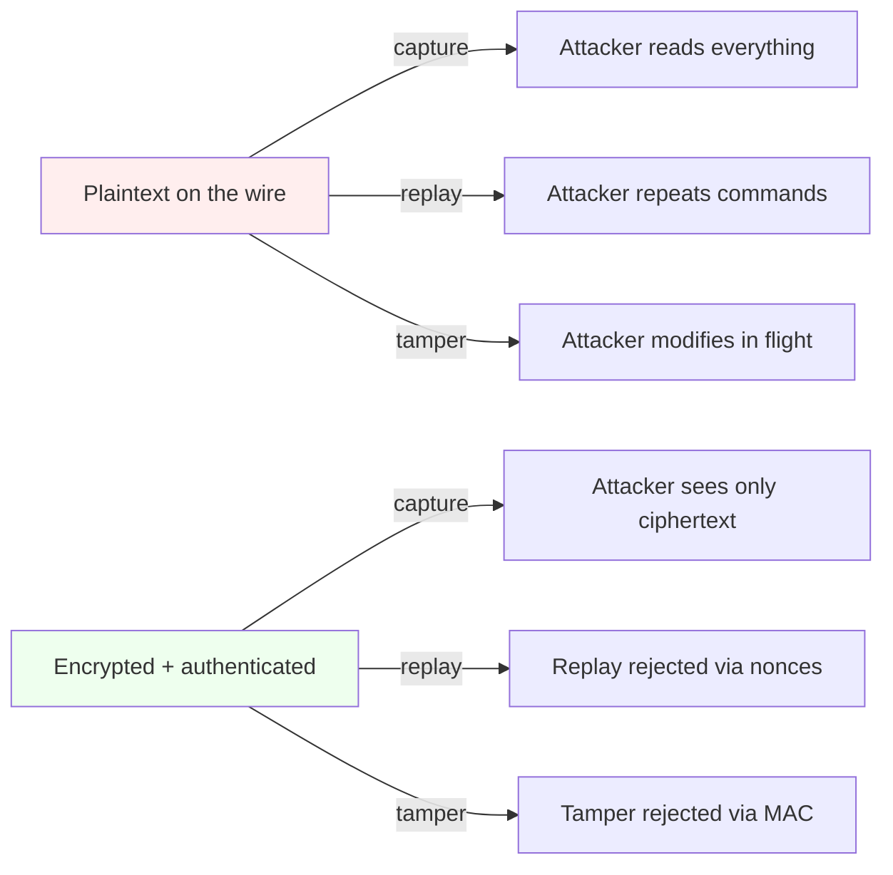

# Lab 40 — Wires And Waves: Network, Wireless, And Drone-Link Security

> "If you can capture the packet, you own the system. If you can encrypt the packet, you protect the system. Most engineers can do neither."
> — paraphrased from countless DEF CON talks

**Time budget:** ~2 weeks for the core lab, with extension challenges that grow it to 3–5 weeks.
**Preferred stack:** **Wireshark**, **tcpdump**, **`nmap`**, **Aircrack-ng suite**, **`hashcat`**, plus a Linux VM (Kali strongly recommended). Optionally a **USB Wi-Fi adapter that supports monitor + injection mode**, plus the SDR-curious can add an **RTL-SDR** dongle ($25). For the drone-link section: **MAVLink**, **`pymavlink`**, **PX4 SITL** (reuses [Lab 37](lab-37-px4-mavlink-drone-stack.md) setup), **libsodium** or **WireGuard** for the secure version.
**Working style:** solo, or in a team of up to 3 people.

---

## ⚠ Read this first — Ethics, Legality, Sandbox

This lab teaches you to read, manipulate, and (where appropriate) defend traffic on networks. **Doing any of this on networks you don't own — including your dorm Wi-Fi, university Wi-Fi, public Wi-Fi at cafés, or your neighbor's network — is illegal almost everywhere on Earth.** Ukrainian Article 361 / 361¹ penalties apply. The same applies in every EU country, the US (Wiretap Act, CFAA), the UK (Investigatory Powers Act + CMA), and so on.

**Even worse — and unique to this lab — radio attacks against drones, aviation, or critical infrastructure are governed by separate, much stricter laws.** Jamming, spoofing, or injecting commands into *any* live aircraft, drone you don't own, or government / commercial radio service is a serious offense — in some jurisdictions, a felony or even a national-security matter. **Don't do it. Ever. Not "to test." Not "as a joke." Not "just briefly."**

**The non-negotiable rules of this lab:**

1. **Wired-network experiments** happen on a network *you set up yourself* (a virtual lab, a separate router you own, or a hotspot from your phone you control).
2. **Wi-Fi experiments** happen against an **access point you own** that is **not connected to the internet** during testing — typically a cheap travel router or a spare phone hotspot.
3. **Drone-link experiments** happen **entirely in simulation** (PX4 SITL + virtual MAVLink). **No real aircraft, ever.** Even "your own" drone — too easy to lose control, too risky for bystanders.
4. **No spectrum-broadcasting attacks** without an amateur-radio license and a controlled environment. Receiving (with an SDR) is generally legal; transmitting is not.
5. **The motive is defense.** Every attack you implement, you also implement the defense — and that's the version that ships.

If you respect those rules, this is one of the most directly-applicable labs in the entire program — particularly for the Ukrainian defense-tech, aerospace, and critical-infrastructure industries.

---

## The hook

In December 2009, Iran captured a US RQ-170 Sentinel stealth drone. Open-source reporting suggests they did it by **GPS spoofing** — a stronger, fake satellite signal that convinced the drone it was somewhere it wasn't. In 2011, security researcher **Ang Cui** showed that printers — *printers* — were full of remotely exploitable network bugs. In 2017, the **WPA2 KRACK** attack let researchers decrypt traffic from millions of "secure" Wi-Fi networks. In 2022 and into the ongoing war, **electronic-warfare jamming and spoofing** have become a defining feature of every battlefield, with Ukrainian and Russian engineers waging a daily back-and-forth that determines whether drones come home or fall out of the sky.

Network and radio security used to be a niche. **It is now a frontline domain — economically and, for Ukraine, literally.** And yet most computer-science graduates have never opened Wireshark on a packet they themselves captured. They've never seen what their own login looks like on the wire. They have *no* intuition for what attackers see.

You're going to fix that. In two weeks you'll **capture, read, and replay your own traffic**, **set up an attacker-vs-defender Wi-Fi lab against an AP you own**, **eavesdrop on (and then secure) a drone telemetry link in simulation**, and **write the defender's playbook** — including modern protections, post-quantum awareness, and the lessons of the 2022–2026 EW war. You'll come out understanding *exactly* what `tcpdump -n -i eth0` reveals about a system, why HTTPS, WireGuard, and authenticated encryption matter so much, and how you'd actually harden a drone link if your country's air force asked you to.

If you want a perfect appetizer, watch [**"How To Capture Packets" — David Bombal / Wireshark**](https://www.youtube.com/c/DavidBombal) videos, or read [**"Practical Packet Analysis"** by Chris Sanders](https://nostarch.com/packetanalysis3) (3rd ed., No Starch Press) — it's the gentlest, clearest book in the field and Chapter 1 is everything you need.

---

## Why this is worth your time

- **The skill is *deeply* defensive.** Once you can read packets, you can debug, diagnose, harden, and secure. *Most engineers can't.*
- **Defense and aerospace need this skill, immediately.** Ukrainian defense-tech is hiring engineers who understand RF, MAVLink, and signal-level security. Western primes (Anduril, L3Harris, BAE) are hiring globally for the same.
- **It pairs unbelievably well with previous labs.** [Lab 37](lab-37-px4-mavlink-drone-stack.md)'s drone simulator becomes a security target. [Lab 39](lab-39-web-security-owasp.md)'s web app becomes the protocol you analyze on the wire. [Lab 16](lab-16-smart-telemetry-beacon.md)'s telemetry beacon becomes a real radio-security exercise.
- **It teaches cryptography in the way that sticks.** "AES-GCM matters" hits different when you've just decrypted your own unauthenticated UDP packets and read the MAVLink commands.
- **CTF + community.** DEF CON's Aviation Village, RF Village, and Wireless Village publish accessible challenges every year.
- **It teaches *modesty*.** After this lab you'll never again say "but it's encrypted, so it's fine" without checking what it actually is.

---

## The target

**Basic — "I See The Wire And The Air"**
You've shipped:
- a **wired-network** capture lab — running services in containers / VMs, capturing their traffic with Wireshark/tcpdump, demonstrating **what a plaintext protocol leaks** vs **what TLS protects** (e.g., HTTP vs HTTPS, FTP vs SFTP, telnet vs SSH),
- a **Wi-Fi capture lab** — against a Wi-Fi AP you own, captured a 4-way handshake, cracked a known weak passphrase with `aircrack-ng` or `hashcat`,
- a **drone-link analysis lab** — captured MAVLink traffic between PX4 SITL and a ground station; demonstrated that you can read commands and telemetry; demonstrated a basic *replay* attack in simulation,
- annotated screenshots and short clips for each.

**Standard — "I Defended Each Of Them"**
Everything from Basic, plus:
- TLS-only configuration of every service in the wired lab,
- WPA3 + strong passphrase migration on the Wi-Fi side, plus a comparison report of WPA2-PSK / WPA2-Enterprise / WPA3,
- **secured MAVLink link** — using `mavlink-routerd`'s authentication, or **wrapping the link in a WireGuard tunnel**, or implementing a tiny **AES-GCM authenticated-encryption layer** with `libsodium`. Show the attack from Basic *failing* on the secured version,
- a **defender's report** for each attack type, with concrete recommendations,
- at least 10 wireless / network CTF challenges solved (e.g., **DEF CON Wireless Village** practice problems, **picoCTF networking**, **HackTheBox** boxes that focus on networking),
- the **secure** versions of all three labs are reproducible from a single `make` command.

**Advanced — "I Built The Aviation-Defense Mini-Stack"**
You've added something serious: **GPS-spoofing simulation** (entirely in `gpssim` / SDR replay against your own receiver), **anti-jam strategies in PX4** simulation, **MAVLink2 message-signing**, **post-quantum-aware key exchange**, **a real DEF CON CTF placement**, or **published a writeup that genuinely teaches the field**.

---

## The big idea



Three properties give you *real* security, not the appearance of it:

1. **Confidentiality** — encryption (AES-GCM, ChaCha20-Poly1305).
2. **Integrity + authentication** — MACs / AEAD.
3. **Replay resistance** — nonces, sequence counters, time-bound tokens.

This lab makes those three things *physical* instead of abstract.

---

## Two-week plan with milestones

**Week 1 — Capture, read, attack**

- **Day 1 — VM setup.** Kali in VirtualBox/UTM. Snapshot before everything. Install Wireshark, tcpdump, `nmap`, the `aircrack-ng` suite, `hashcat`. If you bought a USB Wi-Fi adapter (Alfa AWUS036ACH or AWUS036NHA): test monitor + injection.
- **Day 2 — First capture.** Run a tiny app that talks HTTP to itself. Capture the traffic. Find your login. *Milestone: a screenshot of your own password in cleartext.* Switch to HTTPS. Capture again. *Milestone: same exchange, now encrypted gibberish.*
- **Day 3 — Wireshark deep dive.** Filters (`http`, `tcp.port == 443`, `ip.addr == 192.168.1.1`). Follow a TCP stream. Decode an unencrypted protocol of your choice end-to-end (FTP, SMTP, DNS, MQTT).
- **Day 4 — `nmap` and `arp-scan`.** Map the *virtual* network you set up. Practice OS detection, version detection, scripting (`-sV`, `--script vuln`). Document what each scan tells you.
- **Day 5 — Wi-Fi lab setup.** Set up a separate Wi-Fi AP you own (a phone hotspot or a $15 travel router) with a deliberately weak passphrase. Disconnect it from any production network. *Milestone: monitor mode confirmed, channel hopping working.*
- **Day 6 — WPA2 handshake capture + crack.** Force a re-association on a device you own. Capture the 4-way handshake. Crack the (weak) passphrase with `aircrack-ng` or `hashcat`. Document time-to-crack vs passphrase entropy.
- **Day 7 — MAVLink capture (sim).** Bring up PX4 SITL ([Lab 37](lab-37-px4-mavlink-drone-stack.md) setup reused). Capture the MAVLink stream between SITL and QGroundControl with Wireshark's MAVLink dissector. *Milestone: read live drone commands and telemetry.*

**At this point you've completed the Basic level.**

**Week 2 — Defend, harden, report**

- **Day 8 — Replay attack on MAVLink (sim).** With `pymavlink`, replay a captured "arm + takeoff" command against SITL. *Show it works.*
- **Day 9 — Secure the MAVLink link.** Pick one: (a) wrap in WireGuard, (b) enable MAVLink2 message signing, (c) implement a thin libsodium AEAD layer in `pymavlink`. Re-run the replay attack. *Show it fails.*
- **Day 10 — Harden the wired lab.** TLS everywhere. Mutual TLS for service-to-service. Capture again — confirm only metadata leaks now.
- **Day 11 — Migrate to WPA3.** Document the WPA2-PSK / WPA2-Enterprise / WPA3 trade-offs. Talk about the **KRACK** and **Dragonblood** attacks.
- **Day 12 — Pick a side quest.**
- **Day 13 — Defender's report + showcase prep.**
- **Day 14 — Buffer.**

---

## Levels

### Basic — "I See The Wire And The Air" (~16–22 hours)
- a wired capture lab (HTTP vs HTTPS, FTP vs SFTP, etc.)
- a Wi-Fi capture-and-crack lab (against your own AP, weak passphrase)
- a MAVLink capture + replay in PX4 SITL
- annotated screenshots / short clips for each

### Standard — "I Defended Each Of Them" (~22–32 hours)
- everything from Basic
- TLS / mTLS hardened wired lab
- WPA3 migration + trade-off analysis
- secured MAVLink link (WireGuard / MAVLink2 signing / libsodium AEAD)
- defender's report (full document)
- 10+ networking/wireless CTF challenges solved

### Advanced — "Side Quests" (each ~3–10h)

- **GPS spoofing in simulation.** Use `gps-sdr-sim` or a software GPS receiver on a virtual signal. Demonstrate the spoof. *Don't transmit on real frequencies.*
- **Real SDR receive.** With an RTL-SDR ($25) and an antenna, listen to **ADS-B aircraft beacons** (`dump1090`) — *receive only*; this is legal and fascinating. Visualize aircraft around you.
- **Bluetooth Low-Energy capture.** Sniff a BLE handshake (your own headphones / smart bulb) and document what's in the clear vs encrypted.
- **Anti-jam reasoning.** Document, with code, frequency-hopping / spread-spectrum strategies in PX4 sim. Compare RF resilience choices.
- **MAVLink2 signing in production-style.** Implement the full key-rotation mechanism. Document the user-experience trade-offs of secure operation.
- **WireGuard everywhere.** Stand up a WireGuard mesh between virtual nodes. Use it as the carrier for MAVLink, video, and command links. Benchmark latency and throughput.
- **Combine with [Lab 16](lab-16-smart-telemetry-beacon.md).** Your IoT telemetry beacon: capture + replay it; then secure it.
- **Combine with [Lab 35](lab-35-rtos-mini-autopilot.md) / 37.** Your own RTOS firmware speaking secured MAVLink.
- **Combine with [Lab 39](lab-39-web-security-owasp.md).** Capture HTTP traffic of your own intentionally-vulnerable web app on the wire — show the same SQL injection request and JWT in plaintext.
- **DEF CON CTF.** Compete in a public wireless / network CTF and document your solves.
- **Post-quantum aware.** Replace one of your secured links with a hybrid key-exchange (e.g., ML-KEM via `liboqs`). Document compatibility and performance.
- **Forensics writeup.** Take a publicly-available PCAP from MalwareTrafficAnalysis.net; write a full incident-investigation report.

---

## Extension challenges (3–5 weeks)

- **Combine with [Lab 37](lab-37-px4-mavlink-drone-stack.md).** Build a *full secure-MAVLink reference implementation* on top of your PX4 SITL stack. Replay attack → fails. Tamper attack → fails. Eavesdrop → only metadata. *Genuinely useful for the Ukrainian defense-tech sector.*
- **Combine with [Lab 35](lab-35-rtos-mini-autopilot.md).** Run secured MAVLink on your RTOS firmware. Profile cryptographic overhead. Demonstrate it fits within the real-time budget.
- **Combine with [Lab 16](lab-16-smart-telemetry-beacon.md).** Build *secure IoT telemetry from the chip*. WireGuard or a tiny AEAD layer end-to-end.
- **Combine with [Lab 39](lab-39-web-security-owasp.md).** A complete pentest on a small *networked* deployment of your [Lab 39](lab-39-web-security-owasp.md) app — TLS audit, header audit, SSRF testing on the AWS-metadata endpoint analog.
- **A "Drone-Link Security Threat Model"** doc that an actual aviation team could reference — specific to a real platform (Pixhawk + companion + RC). *Possibly publishable.*
- **A real CVE.** With a maintainer's permission, audit a small open-source MAVLink-adjacent or networking-adjacent project. Find, report, help patch.

---

## Make it yours (required)

The techniques are universal. The *target system you build and defend* is yours.

- **A "smart office" lab** — IoT devices on a local network you protect.
- **A mock telemedicine app** — what does its traffic look like in flight?
- **A drone fleet operator console** (sim) — connects to [Lab 37](lab-37-px4-mavlink-drone-stack.md); you secure the entire link.
- **A meshed sensor network** for a "smart border" or "smart farm" — all secured.
- **A retro protocol analyzer** — a chosen historical or game protocol you reverse and document.
- **A radio-security history walkthrough** — KRACK, Dragonblood, GPS spoofing, FlySky/SBus mistakes — recreated in simulation.
- **A custom secured drone link** — your own AEAD layer, your own key-rotation.

You'll defend why you chose it.

---

## Working solo or in a team

Solo: viable. Most network analysis happens to one person at a keyboard.

Team:
- *By layer:* one person owns the wired lab, one the Wi-Fi lab, one the drone-link lab.
- *By phase:* everyone does Basic together; split for Standard (attacker / defender / reporter).
- *Across labs:* one team's [Lab 37](lab-37-px4-mavlink-drone-stack.md) SITL is the other's MAVLink target; one team's [Lab 39](lab-39-web-security-owasp.md) service is the other's wired-lab target.

Two team rules: **git from day one** and **list who did what.** Each member must demonstrate one capture and one defense live and explain it.

---

## Tooling and platform tips

**Sandbox**
- A **Linux VM** (Kali / Ubuntu / Debian) — Kali if you want everything pre-installed.
- For Wi-Fi: a **dedicated AP you own** (cheap travel router, an old phone hotspot, or a software AP with `hostapd`). **Keep it disconnected from the internet during testing.**
- For drone work: PX4 SITL + Gazebo + QGroundControl ([Lab 37](lab-37-px4-mavlink-drone-stack.md) install is enough).

**Capture and analysis**
- **[Wireshark](https://www.wireshark.org/)** — your microscope. Learn the display filters; they will save you hours.
- **`tcpdump`** — Wireshark's command-line ancestor; what you'll use over SSH on real systems.
- **`tshark`** — Wireshark scripting from the CLI.
- **`nmap`** — `nmap -sV --script=vuln` will teach you a lot about a host you own.
- **`Bettercap`** — modern MITM and analysis framework; *only on networks you own.*

**Wi-Fi**
- USB adapter that supports monitor + injection: **Alfa AWUS036ACH**, **Alfa AWUS036NHA**, **TP-Link TL-WN722N v1** (v2/v3 don't work). Check chipset before buying.
- **Aircrack-ng suite** — `airmon-ng`, `airodump-ng`, `aireplay-ng`, `aircrack-ng`.
- **`hashcat`** — GPU-accelerated cracking (CPU mode works, slowly).

**Drone link / RF**
- **`pymavlink`** + **MAVSDK-Python** — for capture, replay, and your secure layer.
- **MAVLink Wireshark dissector** — built in; just pick port 14550.
- **`mavlink-router`** — proxy / multiplex MAVLink traffic.
- **RTL-SDR** dongle ($25) — for receiving (ADS-B, FM, etc.); *not for transmitting*.
- **`gps-sdr-sim`** — generate GPS signals *for your own receiver in a controlled environment*.

**Crypto / defense**
- **WireGuard** — modern VPN; trivial to set up in a virtual lab; often the right answer.
- **libsodium** / **NaCl** — clean, hard-to-misuse cryptography library; use for your own AEAD layer.
- **OpenSSL / `mkcert`** — TLS certs for your wired lab.

**Practice platforms**
- **HackTheBox** networking-focused machines.
- **TryHackMe** networking + wireless rooms.
- **DEF CON Aviation / RF / Wireless Village** archives.
- **MalwareTrafficAnalysis.net** — packet captures with stories.

---

## Suggested project structure

```txt
network-and-radio-security/
  README.md
  ETHICS.md
  vm/
    setup.md
    snapshots.md
  wired-lab/
    docker-compose.yml          # services: insecure + secure
    captures/
      http-login.pcap
      https-login.pcap
      ftp-vs-sftp.pcap
    notes/
  wifi-lab/
    setup.md                    # which AP you used, how to recreate
    captures/
      wpa2-handshake.pcap
    notes/
  drone-link-lab/
    sitl-setup.md               # links to Lab 37 setup
    insecure/
      capture-and-replay.py
      capture.pcap
    secure/
      wireguard.conf
      OR mavlink2-signing-config/
      OR aead-layer/             # libsodium-based, your own code
    notes/
  defender-report.md
  defender-report.pdf
  ctf-solutions/
  docs/
    architecture.png
    threat-model.md
    screenshots/
```

---

## When you get stuck

- **Wireshark shows nothing.** Wrong interface, or the traffic is on a switched network so you only see broadcasts. Run on the host generating traffic, or run in a VM bridged to the right interface.
- **Monitor mode fails.** Your USB adapter doesn't support it (most laptop built-ins don't reliably). Confirm chipset before buying. **Check the VM's USB passthrough is on.**
- **Captured handshake won't crack.** Often the capture is incomplete (need EAPOL frames 1+2 *or* 2+3). Re-deauth and recapture. Check your wordlist.
- **MAVLink replay doesn't fire.** Wrong UDP port, stream not running, sequence-number rejection. Capture *both* directions during a real session for reference.
- **WireGuard tunnel up but no traffic.** Allowed-IPs on the wrong end, or routing not pointing through the tunnel. `wg show` is your friend.
- **AEAD layer breaks SITL.** Watch your timing: PX4 has heartbeats with strict expectations. Buffer-and-batch, don't add per-packet latency.

If stuck for 30+ minutes: **swap the experiment for the simplest version that still teaches the lesson.** If MAVLink replay is fighting you, do an HTTP-replay first; the *concept* transfers.

---

## Submission checklist

- [ ] **`ETHICS.md`** is present, clear, prominently linked.
- [ ] All experiments are reproducible from `vm/setup.md` + each lab's setup.
- [ ] Wired lab: working insecure + secure variants; PCAPs in repo.
- [ ] Wi-Fi lab: only against AP you own; PCAPs sanitized (no neighbor SSIDs / clients).
- [ ] Drone-link lab: capture, replay, *and* secured version; replay fails on secured.
- [ ] **Defender's report** PDF.
- [ ] At least 10 CTF problem solutions (Standard).
- [ ] No PCAPs of third-party / public networks.
- [ ] No transmissions on real RF without a license.
- [ ] No commands sent to any real aircraft, drone, or production system.
- [ ] Cross-lab integrations documented (which prior labs feed in).

---

## What recruiters look at

- **Ukrainian defense-tech, aviation, and critical-infrastructure recruiters open this lab first.** A *secured* MAVLink link with replay-resistance and a defender's report is a portfolio item that *very* few juniors anywhere have.
- **They look at the Wireshark literacy.** Senior engineers can read a packet capture; juniors usually can't. *Show* yours.
- **They look at the threat model.** A clearly-scoped, plausible threat-model document is a senior practice at junior scale.
- **They look at the cross-lab combos.** [Lab 37](lab-37-px4-mavlink-drone-stack.md) + Lab 40 in particular tells a complete drone-stack story.
- **They look at your CTFs.** DEF CON Aviation Village, Wireless Village, and HackTheBox networking ranks are objective signals.
- **They look at the ethics framing.** Anyone who treats RF / network attacks casually is unhireable in this field; mature framing is itself a credibility signal.
- **For Ukrainian recruiters specifically:** mention dual-use / defense openness in the README. The hiring channel is open and active.

---

## What to put in your README

1. Project name + tagline.
2. **`ETHICS.md` link prominently at the top.**
3. Architecture diagrams (3 — wired, wireless, drone-link).
4. Tech stack and how to recreate the VM + each lab.
5. Capture-and-defense narrative for each lab (with screenshots / clips).
6. Defender's report PDF.
7. CTF profile + solved problems.
8. Cross-lab integrations.
9. Honest limitations: what you didn't get to (real SDR transmit, GPS spoofing in the wild).
10. If team: who attacked / who patched / who reported.

---

## Reflection

Be ready to:

1. **Live demo** capturing your own HTTP login, then HTTPS login. *Show the difference.*
2. **Walk through your Wi-Fi handshake capture.** Why does the 4-way handshake leak enough for offline cracking?
3. **Why doesn't WPA2 stop offline brute-force on weak passphrases?** Why does WPA3 (SAE)?
4. **What's the difference between encryption, integrity, and replay-resistance?** Show me where each lives in your secured MAVLink link.
5. **Demonstrate the replay attack on insecure MAVLink.** Then on secured. Why does it fail?
6. **What does GPS spoofing look like at the signal level?** Why is it hard to detect from inside the receiver?
7. **What were the 2022–2026 Ukrainian/Russian EW lessons** that a drone-link engineer should internalize?
8. **For your hardest challenge** — what did you learn?

---

## Showcase

End-of-semester gallery — anonymous voting for **most readable Wireshark walkthrough**, **most realistic threat model**, and **best defender's report**. Bring your VM and demo on the projector.

---

## Going further

- *Practical Packet Analysis* (3rd ed.) by Chris Sanders — your starting book.
- *Wireshark Network Analysis* (2nd ed.) by Laura Chappell — the deeper dive.
- *Hacking Exposed Wireless* (3rd ed.) — wireless attacks reference.
- *Real-World Cryptography* by David Wong — the modern crypto book; perfect alongside this lab.
- **DEF CON archives** — Aviation Village, Wireless Village, RF Village.
- **PX4 + MAVLink security** docs — official, sparse, but essential.
- **WireGuard whitepaper** — short, clear, educational.
- **MAVLink2 message signing** spec.
- **CISA / ENISA advisories on UAS / drone security** — current threat landscape.
- *Cryptography Engineering* (Ferguson, Schneier, Kohno) — older but foundational.

---

## A final word

There's a moment in this lab where you watch your *own* MAVLink link flow across Wireshark — every command, every position update, every status flag — perfectly readable, completely unauthenticated, completely replayable. And then you stand up the secure version, and *the same attacker tools* see noise. *That* is the lesson — not as theory, but as something you *did*. You added confidentiality. You added integrity. You added replay-resistance. The attacker is still capturing packets — they just don't get anything useful anymore.

That's the entire field, in microcosm. **Most systems in the world don't have those three properties.** Some of them are flying. Some of them are guarding our power grid. Some of them are running our hospitals. The next decade will be defined, in no small part, by engineers who can quietly, steadily, ship those three properties into the systems that need them. Be one of those engineers. The country needs you. The world does too.
