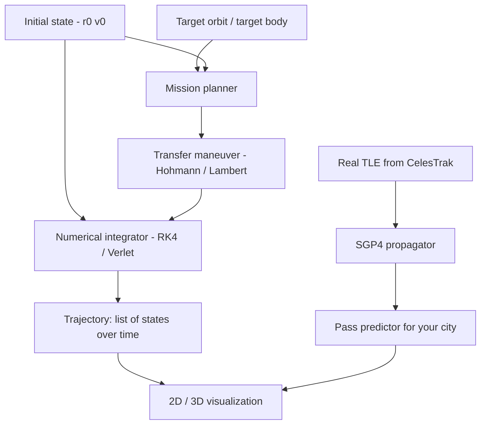

# Lab 41 — Mostly Harmless: Orbital Mechanics And A Mission To Anywhere

> "Space is big. You just won't believe how vastly, hugely, mind-bogglingly big it is. I mean, you may think it's a long way down the road to the chemist's, but that's just peanuts to space."
> — Douglas Adams, *The Hitchhiker's Guide to the Galaxy*

> "If anybody is listening at all, don't bother to listen, just call us."
> — Slartibartfast

**Time budget:** ~2 weeks for the core lab, with extension challenges that grow it to 3–5 weeks (or an entire summer if you go full Voyager Grand Tour).
**Preferred stack:** **Python** + **NumPy** + **matplotlib / plotly** as the math-and-viz spine, with **`poliastro`**, **`astropy`**, and **`Skyfield`** as physics libraries when you want them. Optional **Three.js / Babylon.js / Unity / Godot** for a 3D viewer; optional **Rust / C++** for raw integrator performance.
**Working style:** solo, or in a team of up to 3 people.

---

## The hook

In 1977, NASA launched two probes towards the outer planets. They were aimed using a once-every-176-years planetary alignment that let one trajectory swing past Jupiter, Saturn, Uranus, *and* Neptune — using each planet's gravity to slingshot itself faster and further. **The trajectory was planned with software running on machines weaker than the smartwatch on your wrist.** Today, *Voyager 1* is the most distant human-made object in the universe, currently 24 billion kilometers from Earth, still beaming back data — running on 1970s firmware, slowly cooling, slowly fading, but *still going*. Every command sent to Voyager today takes more than 22 hours to arrive at light speed.

You will not match Voyager in two weeks. But by the end of this lab, **you will plan the same kind of mission.** You'll write code that, given a starting body, a target body, and a date, computes the trajectory that gets you from one to the other — accurately enough to land the *concept* even if not the spacecraft. You'll plot a transfer to Mars, a transfer to the Moon, a transfer to *anywhere you want in the solar system*. You'll fetch real satellite Two-Line Element sets from CelesTrak and predict, to the second, when the ISS will pass over your city. You'll feel — *physically* feel — the relationship between Newton's two laws and a thousand kilograms of metal arriving at another world.

This is one of those labs where the math is pure, the visuals are stunning, and the result is something you'll have on your laptop forever — your own little orbital simulator that, with three clicks, plans a Hohmann transfer to Mars.

If you want a perfect appetizer:
- watch [**"Newton's three-body problem explained"** by Numberphile](https://www.youtube.com/c/numberphile) and any video on the *Voyager Grand Tour*,
- read the legendary free book [**"Fundamentals of Astrodynamics"** by Bate, Mueller, and White](https://www.dover.com/) (the "BMW" book — every aerospace engineer of the last 50 years has it on their shelf),
- read any single chapter of [**"Orbital Mechanics for Engineering Students"** by Howard Curtis](https://www.elsevier.com/) — kindly written, full of worked examples,
- explore [**Kerbal Space Program**](https://www.kerbalspaceprogram.com/) for one evening (the most accidentally-effective intuition pump for orbital mechanics ever made),
- and skim the [**poliastro tutorial gallery**](https://docs.poliastro.space/) — it's a tour of every plot you'll soon make yourself.

---

## Why this is worth your time

- **Aerospace and space-tech are *real* hiring sectors right now.** Globally: SpaceX, RocketLab, Maxar, Skyroot, ISRO, ESA, JAXA, Astranis, Astroscale, Vast, Varda, Anduril Space, hundreds more. **In Ukraine specifically:** Firefly Aerospace (Ukrainian-founded, employs Ukrainians directly), **Promin Aerospace**, **Skyrora** (Scotland, Ukrainian engineering team), **EOS Data Analytics**, **Kurs Orbital**, plus the deep heritage of **Yuzhmash** and **Yuzhnoye Design Bureau**. The skill of "I can model an orbit and write a propagator" is *immediately* useful in every one of those companies.
- **The math is universal across domains.** A six-degree-of-freedom rigid-body propagator is — algebraically — the same animal as a robot-arm dynamics simulator, an aircraft autopilot model, a ship navigation system, a missile-defense simulator, and a video-game physics engine. The intuition you build here transfers everywhere.
- **It plays beautifully with the rest of your portfolio.** [Lab 13](lab-13-physics-sandbox.md) (physics sandbox) — same integrators. [Lab 3](lab-03-ray-tracer.md) (ray tracer) — same rendering pipeline. [Lab 32](lab-32-neural-net-from-scratch.md) (neural net) — RL controllers for low-thrust trajectories. [Lab 35](lab-35-rtos-mini-autopilot.md) / 37 (RTOS / drone autopilot) — *literally the same control loop*, scaled up. [Lab 2](lab-02-ray-casting-engine.md) / 25 (rendering / games) — your viz can be a small game.
- **It's a "famous" lab.** Hohmann transfer plots and gravity-assist diagrams are visually iconic. Recruiters who've never opened a tax form will linger on a beautiful trajectory plot.
- **It's *fun* in a way few labs are.** It's hard to explain until you've spent an evening pointing a probe at Mars and watching it arrive — and then it's hard to forget.

---

## The target

**Basic — "Earth Orbit"**
You've shipped:
- a working **two-body propagator** (Newtonian gravity, single primary, point masses) you wrote yourself, integrating with **RK4** or **Verlet**,
- a 2D plot of an Earth orbit from initial state vectors (`r₀`, `v₀`) — circular, elliptical, and a simulated escape trajectory,
- a **Hohmann transfer plotter** — given two circular orbits, computes the two burns, total Δv, and transfer time,
- a small CLI or notebook that takes a starting orbit + target orbit and produces a trajectory plot.

**Standard — "Solar System"**
Everything from Basic, plus:
- **patched conics** — model an interplanetary mission as Earth-centered → heliocentric → target-centered phases (each with its own propagator and sphere-of-influence rules),
- a **mission planner**: pick a launch date and a target planet (Moon / Mars / Venus / Jupiter); compute and plot the transfer trajectory,
- **3D visualization** of at least one mission (Three.js / Plotly 3D / matplotlib 3D / Unity / Godot — your choice),
- **TLE-based satellite tracking**: fetch a Two-Line Element set from CelesTrak, propagate it with `sgp4`, predict the next 5 ISS passes over your city (azimuth + elevation + time),
- a **defender's check** — your propagator's results within a documented tolerance of `poliastro` / `Skyfield` for at least 3 reference orbits,
- a polished UI (web / desktop / notebook) with a "Plan Mission" button that produces the full plot.

**Advanced — "Don't Panic, And Bring Snacks"**
You've added something serious: a **3-body or N-body integrator**, a **Lambert solver** for arbitrary porkchop plots, a **gravity-assist trajectory** (Voyager-style), a **low-thrust trajectory** with an optimization routine (or RL agent — [Lab 32](lab-32-neural-net-from-scratch.md) link!), or a **closed-loop guidance** that actually flies your trajectory in PX4 SITL ([Lab 37](lab-37-px4-mavlink-drone-stack.md) link).

---

## The big idea, in one diagram



Three core capabilities:

1. **Propagate** — given a state, predict the future.
2. **Plan** — given a desire, compute the maneuver.
3. **Connect to reality** — track real satellites, validate against published ephemerides, plug into a real autopilot.

If you do all three, you've built the core of a real flight-dynamics workstation.

---

## Two-week plan with milestones

**Week 1 — Math, integrator, two-body**

- **Day 1 — Set up.** Python ≥ 3.11, NumPy, matplotlib, Jupyter, optional `poliastro` / `astropy` / `Skyfield`. Hello-world: integrate a freely-falling apple under Earth gravity for 10 seconds. Plot height vs time. *Milestone: your first physics simulation.*
- **Day 2 — Read the math.** Two-body problem: Newton's law of gravitation, the conservation of energy and angular momentum, conic-section orbits (circle, ellipse, parabola, hyperbola). The first chapter of Curtis, or any equivalent. **Take notes.**
- **Day 3 — RK4.** Implement Runge-Kutta 4 from scratch (about 30 lines of NumPy). Use it to integrate a 2D Earth orbit. *Milestone: a circular orbit that stays circular over 100 revolutions.* Compare with Euler integration — watch Euler diverge in minutes.
- **Day 4 — Eccentricity, perihelion, aphelion.** Vary `v₀`. Plot a family of conic sections. Find the parabolic escape velocity numerically; compare to the analytical `v_escape = √(2GM/r)`.
- **Day 5 — Hohmann transfer.** Two circular orbits → two impulsive burns → transfer ellipse. Compute the two Δv values analytically; verify numerically by integrating the post-burn states. Plot the transfer. *Milestone: a clean Hohmann transfer figure suitable for a portfolio.*
- **Day 6 — Earth → Moon.** Stretch your Hohmann transfer to the Moon (with a simplified circular-Moon-orbit assumption). Watch the spacecraft arrive in the Moon's neighborhood.
- **Day 7 — Polish + side quest pick.** Clean up your code into modules: `bodies.py`, `integrators.py`, `maneuvers.py`, `viz.py`. Pick a Standard milestone to focus on next week.

**At this point you've completed the Basic level.**

**Week 2 — Solar system, real satellites, mission planner**

- **Day 8 — Patched conics.** Define Spheres of Influence (SOIs). Implement a simple "phase switcher": Earth-centered → heliocentric → Mars-centered.
- **Day 9 — Earth → Mars Hohmann.** Pick a real launch window (e.g., "next 2026 Mars window"). Plot the transfer in heliocentric frame. Compare arrival date with reality / `poliastro`. *Milestone: you have planned a Mars mission.*
- **Day 10 — TLE + SGP4.** Fetch the ISS TLE from CelesTrak. Use `sgp4` (or implement the simplest portion yourself if you're feeling brave). Predict the next 5 ISS passes over your city. *Milestone: the next time the ISS is overhead, your script tells you to look up.*
- **Day 11 — 3D visualization.** Pick a tool. Render at least one of your trajectories in 3D — interactive if web-based, animated if matplotlib. *This becomes your portfolio screenshot.*
- **Day 12 — Validate.** Compare your propagator to `poliastro` for ≥3 reference orbits. Document the residuals. Where does your integrator drift? RK4 vs RK45? Symplectic integrators vs RK?
- **Day 13 — Mission-planner UI.** Wrap everything in something a non-coder can use: a Jupyter widget, a Streamlit app, a small Vue/React page, or a Godot/Unity scene with sliders.
- **Day 14 — Buffer, polish, README, screenshots, video.**

---

## Levels

### Basic — "Earth Orbit" (~14–20 hours)
- 2-body propagator with RK4 / Verlet
- elliptical / circular / escape orbit plots
- Hohmann transfer plotter (Δv, transfer time, plot)
- clean modular code

### Standard — "Solar System" (~20–32 hours)
- patched conics with SOI handling
- Earth → Mars (and at least one more target) mission planner
- 3D visualization
- real ISS / Starlink / NOAA pass predictor
- validation report against `poliastro`/`Skyfield`
- a polished UI

### Advanced — "Side Quests" (each ~3–10h)

- **Lambert solver.** Given two positions and a transfer time, compute the required velocities. Build a **porkchop plot** for a launch window (2D Δv as function of departure & arrival date). *Visually iconic.*
- **Gravity assist.** Add a flyby phase to your patched-conic planner. Recreate **Voyager 2's Grand Tour** as accurately as you can.
- **Three-body sims.** Earth-Moon-spacecraft. Find Lagrange points. Simulate a halo orbit at L2 — where JWST lives.
- **N-body sim.** Pure Newton, all 8 planets + sun + spacecraft. Use a symplectic integrator (Yoshida, Wisdom-Holman). *Requires more reading; very rewarding.*
- **Low-thrust trajectory.** Continuous-thrust ion-drive style. Optimize fuel consumption with `scipy.optimize` or — *[Lab 32](lab-32-neural-net-from-scratch.md) link* — a small RL agent that learns the throttle curve.
- **GPU it.** Reimplement the integrator in Rust / C++ / CUDA / WGSL. Benchmark.
- **CelesTrak constellation.** Track all of Starlink (~6,000 sats) for an hour and render as a 3D animation. *Genuinely beautiful.*
- **Kepler's equation.** Solve `M = E - e sin E` for `E` with Newton-Raphson. Compare convergence at high eccentricity.
- **Real ground-station controller.** Take your pass predictor and (in simulation) drive a 2-axis tracker — compute az/el commands, plot the antenna's required motion. *[Lab 35](lab-35-rtos-mini-autopilot.md) / 37 link if you want it on real motors.*
- **Connect to PX4 SITL.** Pipe your trajectory into PX4 as setpoints; let the autopilot try to fly it. *Doesn't have to be physically realistic — it's the integration that's interesting.*
- **Astronomical-scale visualizer ("Total Perspective Vortex").** A log-scale viewer from your apartment to the observable universe. Render planets, stars, galaxies, voids, with proper scale labels. *Shock value: high.*
- **Aviation-style HUD.** Build a flight-data display for a probe in transit — CSS-styled like a 1970s NASA console.
- **TLE-based collision detection.** For two satellites, find their closest approach over the next 24 hours.

---

## Extension challenges (3–5 weeks, or longer)

- **Combine with [Lab 13](lab-13-physics-sandbox.md).** Your physics sandbox gains an "orbital" mode. Watch students drag-and-launch projectiles into orbit.
- **Combine with [Lab 3](lab-03-ray-tracer.md).** Render your trajectories with your own ray tracer — proper specular planets and lit space.
- **Combine with [Lab 32](lab-32-neural-net-from-scratch.md).** Train a small neural net or RL agent to fly low-thrust trajectories, beating an analytical baseline.
- **Combine with [Lab 33](lab-33-object-detection-tracking.md).** Detect and track satellites in *amateur telescope footage* with your object-detection pipeline. *Genuinely novel.*
- **Combine with [Lab 35](lab-35-rtos-mini-autopilot.md) / 37.** Run your guidance algorithm on PX4 SITL. The drone "thinks" it's a probe.
- **Combine with [Lab 22](lab-22-spa-frontend.md) / 23.** A multiplayer "trajectory game" — two teams compete to plot the most efficient transfer.
- **The Voyager Grand Tour.** Recreate it. End-to-end. Multi-planet gravity-assist trajectory through Jupiter, Saturn, Uranus, Neptune. Compare your solution to historical data. *Career-grade portfolio piece.*
- **A tiny CubeSat mission proposal.** Pick a real-ish CubeSat mission concept (Earth observation, in-orbit experiment, etc.). Write the orbit and lifetime study. Open up a possibility of a real connection to a Ukrainian space-tech employer.

---

## Make it yours (required)

The math is universal. The *mission you plan* is yours.

- **"To Mars and back"** — a full round-trip with synodic-period analysis.
- **"To Magrathea"** — a fictional planet in the asteroid belt; use ceres' orbital elements with a fictional radius. *HHGTTG-flavored.*
- **"The Heart Of Gold"** — implausibility-budget UI: every trajectory shows both Δv *and* a fictional "improbability" score.
- **"Slartibartfast's Fjord-Inspection Tour"** — a polar Earth-orbit pass predictor that finds the best lighting conditions over named coastlines. *Bonus points for fjords.*
- **"Don't Panic" Pass Notifier** — a phone notification 60 seconds before the ISS is visible from your window.
- **"Astronaut Alarm Clock"** — wake up to ISS overhead passes only.
- **A real CubeSat orbital lifetime study** — pick an altitude, a drag model, and a launch year; predict re-entry date.
- **"Yuzhmash heritage"** — recreate the orbits of historical Ukrainian-built rockets and their payloads.
- **A *Kerbal*-style learning game** — minimal physics, maximum onboarding clarity.
- **A planetarium app** — overlay your propagated satellite positions on a star chart.

You'll defend why you chose it.

---

## Working solo or in a team

Solo: viable. The math is the heaviest part; once you have it, it's mostly a single coder's flow.

Team:
- *By layer:* one person owns physics (integrators, maneuvers), one owns viz (3D rendering, UI), one owns connection-to-reality (TLEs, validation).
- *By mission:* each member plans a different mission (Mars, Moon, Voyager Grand Tour) sharing the same engine.
- *By stack:* one writes the engine in Python, another wraps it for the web, another for a desktop app.

Two team rules: **git from day one** and **list who did what.** Each member must demonstrate at least one trajectory live and explain the math behind it.

---

## Tooling and platform tips

**Math + physics**
- **NumPy** for everything. **SciPy** for `solve_ivp` (a tested adaptive integrator) — but write your own RK4 once before you reach for it.
- **`poliastro`** — astrodynamics in Python. Beautifully written. Use as a *reference*; don't import-and-call without writing your own first.
- **`astropy`** — units, time, coordinate frames. Once you have UTC ↔ TDB ↔ TT in your codebase, your code is suddenly 10× more correct.
- **`Skyfield`** — high-precision ephemerides; for real ISS / Hubble / Hipparcos catalogs.
- **`sgp4`** — the standard TLE propagator; `pip install sgp4`.

**Visualization**
- **matplotlib + `mpl_toolkits.mplot3d`** — fastest path to a publishable plot.
- **plotly** — interactive 3D in a notebook.
- **Three.js / Babylon.js** — for browser-native 3D viz (link with [Lab 22](lab-22-spa-frontend.md) / 23).
- **Unity / Godot** — if you want a "Kerbal-like" real game.
- **Blender + Python** — if you want film-quality renders.

**Data**
- **[CelesTrak](https://celestrak.org/)** — free TLEs for thousands of active satellites.
- **[NASA HORIZONS](https://ssd.jpl.nasa.gov/horizons/)** — gold-standard ephemerides for any solar-system body.
- **[Skyfield Almanac](https://rhodesmill.org/skyfield/)** — sun/moon rise, planet positions, eclipses.

**Performance (Advanced)**
- **`numba`** for JIT-ing your integrator — 10–50× speedups for free.
- **Rust** with `nalgebra` — when you've outgrown Python.
- **CUDA / WGSL** — for N-body sims with thousands of bodies.

---

## Suggested project structure

```txt
mostly-harmless/
  README.md                       # the central writeup, with a Don't Panic banner
  src/
    bodies.py                     # gravitational bodies, masses, SOIs
    integrators.py                # RK4, Verlet, Yoshida if Advanced
    orbits.py                     # state vectors, classical elements, conversions
    maneuvers.py                  # Hohmann, Lambert, gravity assist
    propagator.py                 # high-level "propagate this for T seconds"
    tle.py                        # SGP4 wrapper
    mission_planner.py            # the user-facing entry point
    viz/
      plot2d.py
      plot3d.py
      web/                        # optional Three.js viewer
  notebooks/
    01-two-body.ipynb
    02-hohmann.ipynb
    03-mars-mission.ipynb
    04-iss-passes.ipynb
  validation/
    poliastro_comparison.md       # residual analysis vs reference
  missions/
    mars-2026/                    # one folder per planned mission
      params.toml
      trajectory.csv
      plot.png
  docs/
    architecture.png
    math-notes.md                 # your derivations
    screenshots/
```

---

## When you get stuck

- **My orbit drifts and goes hyperbolic over 100 orbits.** Probably Euler. Switch to RK4 or, better, a symplectic integrator (Verlet, Yoshida). Symplectic means energy stays bounded over long simulations.
- **My Mars transfer arrives at the wrong place.** Did you account for Mars's motion during transfer time? Hohmann assumes the target is *where it will be*, not *where it is now*. Solve for the right phase angle.
- **Patched conics show a discontinuity at SOI handoff.** State vectors must be transformed (subtract the new primary's velocity, change frame origin). Easy to get one sign wrong; visualize the handoff explicitly.
- **`sgp4` returns positions in TEME, not ECI.** TEME ≈ ECI for casual uses; for accurate ground-station math, convert via `astropy`'s built-in transforms.
- **My 3D viz looks tiny compared to the planet.** Scale issues. Render planet at scale, but exaggerate spacecraft size 1000× — and *say so* in the legend.
- **Floating-point error blows up at high eccentricity.** Switch to f-anomaly formulations or use an adaptive integrator (`solve_ivp` with `method='DOP853'`).
- **Newton-Raphson on Kepler's equation diverges at e≈1.** Use a better initial guess (Mikkola or Markley); these are textbook fixes, very satisfying.

If stuck for 30+ minutes: **fall back to the simplest version of your problem that still teaches the lesson.** Two-body before patched conics. Circular before elliptical. 2D before 3D. Reproducing a textbook example before inventing your own.

---

## Submission checklist

- [ ] Your own RK4 (or Verlet) integrator — *not* a wrapper of `solve_ivp` for the Basic level.
- [ ] At least one Hohmann transfer plot, suitable for a portfolio.
- [ ] At least one mission demo (Mars / Moon / etc.) at Standard level.
- [ ] At least one real-satellite pass predictor that *runs* against today's TLEs.
- [ ] 3D viz screenshot (Standard).
- [ ] Validation report against `poliastro` (Standard).
- [ ] Modular code (not one giant notebook).
- [ ] README with `Don't Panic` banner and clear *Plan Your Mission* instructions.
- [ ] A 60-second video showing your mission planner in action.
- [ ] Honest limitations: what you simplified, what you didn't model (drag, J2, third-body perturbations…).

---

## What recruiters look at

- **Aerospace and space-tech recruiters open this lab first.** A working orbital propagator with a Mars-mission plot is in the top 5% of junior-portfolio items, period.
- **They look at the math.** Real derivations in `math-notes.md`, validated against a published reference, separates *"I read about it"* from *"I can do it."*
- **They look at the visualization.** Trajectory plots are visually iconic — a beautiful one is your best CV picture.
- **They look at TLE / `Skyfield` integration.** It's the *can-this-person-talk-to-real-data* signal.
- **They look at the Voyager / gravity-assist / Lambert side quests.** They distinguish "can integrate Newton" from "can plan a mission."
- **For Ukrainian recruiters specifically:** mention space-tech / dual-use openness. Firefly, Promin, Skyrora, EOS Data Analytics, Kurs Orbital are real local pipelines.
- **For the AI-curious:** [Lab 32](lab-32-neural-net-from-scratch.md) + Lab 41 (RL controller for low-thrust transfer) is genuinely *novel* at junior scale. Recruiters in trajectory-optimization will notice immediately.

---

## What to put in your README

1. Project name + tagline. *Don't Panic* banner welcome.
2. A hero plot — your best mission visualization.
3. Short narrative: *"Plan a mission to anywhere."*
4. *Plan Your Mission* — a 3-step quickstart.
5. Architecture diagram + module overview.
6. Sample missions (Mars 2026, Moon, ISS pass tonight).
7. The math notes (`docs/math-notes.md`) — your derivations.
8. Validation report.
9. Cross-lab integrations.
10. Honest limitations and future work.
11. If team: who-did-what.

---

## Reflection

Be ready to:

1. **Live demo** a Mars transfer. Pick a launch date. Compute Δv. Show the trajectory.
2. **Walk me through your RK4.** Why is RK4 better than Euler? What is a symplectic integrator and when is it the right choice?
3. **Why does a Hohmann transfer use *exactly two* burns?** Why is it (usually) optimal between circular orbits? When is it *not* optimal?
4. **What is a Sphere of Influence and how do you handle the handoff?** Walk me through the discontinuity.
5. **What is a Two-Line Element set?** What's in those two lines?
6. **Predict the next ISS pass over our classroom.** Right now. Live, in your terminal.
7. **Where does your propagator drift compared to `poliastro`?** Why?
8. **For your hardest milestone** — what unblocked you?

---

## Showcase

End-of-semester gallery — anonymous voting for **most beautiful trajectory plot**, **most ambitious mission**, and **most accurate propagator**. Bring a laptop with your planner running; you may be asked to plan an arbitrary mission live.

---

## Going further

- *Fundamentals of Astrodynamics* (Bate, Mueller, White) — the BMW book; cheap, classic, every aerospace shelf has it.
- *Orbital Mechanics for Engineering Students* (Howard Curtis) — the patient textbook; full of worked examples.
- *Spacecraft Dynamics and Control* (Kluever) — modern follow-on.
- *An Introduction to the Mathematics and Methods of Astrodynamics* (Battin) — the deep one; for when you've fallen in love.
- **[NASA HORIZONS](https://ssd.jpl.nasa.gov/horizons/)** — every ephemeris of every body.
- **[CelesTrak](https://celestrak.org/)** — TLEs.
- **[poliastro docs](https://docs.poliastro.space/)** — gallery of every plot you'll want to make.
- **[Random Astronomy](https://www.youtube.com/c/scottmanley) (Scott Manley) — YouTube; the friendly voice of orbital mechanics.**
- **Kerbal Space Program** + the *Realism Overhaul* mod — surprisingly serious physics intuition.
- **The Planetary Society** podcast — keeps you connected to the field.

---

## A final word

*Voyager 1* is, as you read this, somewhere in interstellar space, beyond the heliopause. It is alone. It is dying — its plutonium battery weakens by a couple of watts every year. By 2035 or so, it will have nothing left to broadcast. But it will keep moving. **It will be moving when you are not.** It will be moving when this institute is not. It will be moving when the city you live in is not. In about 40,000 years it will pass within 1.6 light-years of a small, unnamed star in the constellation Camelopardalis — a flyby of a system no human will ever visit, by a probe whose entire mission was planned by people sitting at desks like the one you are sitting at, with software written in languages older than this lab manual.

You're not going to launch your own *Voyager* in two weeks. But you'll write the math that flies it. And once you understand that math — the deep, breathtakingly clean math — *space stops being mysterious.* It becomes a place you can plan a route to. It becomes a place you can send things. *That* is the point of this lab. That, and a small homage to the dolphins, who, when the world ended, said only: "**So long, and thanks for all the fish.**"
